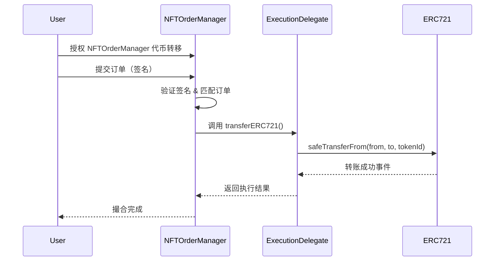

# 陈奕隆

**GitHub ID:** CYL12345

**Telegram:** @ElonCYL

## Self-introduction

我是WEB2转WEB3的开发学习者

## Notes

<!-- Content_START -->
# 2025-08-20

# 今天完成了集群订单的测试

、、、
// SPDX-License-Identifier: MIT
pragma solidity ^0.8.28;

import "forge-std/Test.sol";
import "../contracts/NftToken_Management/NFTOrderManager.sol";
import "../contracts/TestERC721.sol";
import "../contracts/NftToken_Management/struct/OrderStruct.sol";
import "../contracts/NftToken_Management/utils/EIP712.sol";
import "../contracts/NftToken_Management/ExecutionDelegate.sol";
import "../contracts/NftToken_Management/policyManage/PolicyManager.sol";
import "../contracts/NftToken_Management/policyManage/interfaces/IMatchingPolicy.sol";
import "../contracts/NftToken_Management/policyManage/matchingPolices/StandardPolicyERC721.sol";

contract NFTOrderManagerBulkTest is Test, EIP712{
    // 核心合约
    NFTOrderManager public nftOrderManager;
    ExecutionDelegate public executionDelegate;
    PolicyManager public policyManager;
    TestERC721 public nft;
    StandardPolicyERC721 public standardPolicyERC721;

    // 测试账户
    uint256 public sellerPK1 = 0xac0974bec39a17e36ba4a6b4d238ff944bacb478cbed5efcae784d7bf4f2ff80;
    uint256 public sellerPK2 = 0x59c6995e998f97a5a0044966f0945389dc9e86dae88c7a8412f4603b6b78690d;
    uint256 public sellerPK3 = 0x5de4111afa1a4b94908f83103eb1f1706367c2e68ca870fc3fb9a804cdab365a;
    uint256 public buyerPK1 = 0x7c852118294e51e653712a81e05800f419141751be58f605c371e15141b007a6;
    address public seller1;
    address public seller2;
    address public seller3;
    address public buyer1;
    address public owner;

    // 常量
    uint256 public constant TOKEN_ID1 = 1;
    uint256 public constant TOKEN_ID2 = 2;
    uint256 public constant TOKEN_ID3 = 3;
    uint256 public constant PRICE1 = 100000000000000000 wei;
    uint256 public constant PRICE2 = 200000000000000000 wei;
    uint256 public constant PRICE3 = 300000000000000000 wei;
    address public constant WETH = 0xC02aaA39b223FE8D0A0e5C4F27eAD9083C756Cc2;

    function setUp() public{
        seller1 = vm.addr(sellerPK1);
        seller2 = vm.addr(sellerPK2);
        seller3 = vm.addr(sellerPK3);
        buyer1 = vm.addr(buyerPK1);
        owner = address(this);
        //部署依赖合约
        standardPolicyERC721 = new StandardPolicyERC721();
        address[] memory whiteList = new address[](1);
        whiteList[0] = address(standardPolicyERC721);
        policyManager = new PolicyManager(owner,whiteList);
        executionDelegate = new ExecutionDelegate(owner);
        vm.prank(owner);
        nft = new TestERC721("XYD","XYD",owner);

        //初始化OrderManage
        nftOrderManager = new NFTOrderManager();
        nftOrderManager.initialize(
            address(this),
            IPolicyManager(address(policyManager)),
            IExecutionDelegate(address(executionDelegate))
        );

        nft.mint(seller1);
        nft.mint(seller2);
        nft.mint(seller3);
        //授权执行代理转移
        vm.prank(seller1);
        nft.approveALL(address(executionDelegate),true);
        vm.prank(seller2);
        nft.approveALL(address(executionDelegate),true);
        vm.prank(seller3);
        nft.approveALL(address(executionDelegate),true);
    }

    /**
     * 测试批量执行两个订单
     */
    function testBulkExecuteSuccess() public {
         // 1. 卖家1创建卖单（TOKEN_ID1，0.1 ETH）
        Order memory sell1 = createSellOrder(
            seller1,
            address(nft),
            TOKEN_ID1,
            AssetType.ERC721,
            PRICE1,
            1
        );
        Input memory sellInput1 = signOrder(sellerPK1,sell1, SignatureVersion.Single);
         // 2. 卖家2创建卖单（TOKEN_ID2，0.2 ETH）
        Order memory sell2 = createSellOrder(
            seller2,
            address(nft),
            TOKEN_ID2,
            AssetType.ERC721,
            PRICE2,
            1
        );
        Input memory sellInput2 = signOrder(sellerPK2, sell2, SignatureVersion.Single);

        // 3. 卖家3创建卖单（TOKEN_ID3，0.3 ETH）
        Order memory sell3 = createSellOrder(
            seller3,
            address(nft),
            TOKEN_ID3,
            AssetType.ERC721,
            PRICE3,
            1
        );
        Input memory sellInput3 = signOrder(sellerPK3, sell3, SignatureVersion.Single);

        //买家同时购买多个卖单
        Order memory buy1 = createBuyOrder(
            buyer1, // 同一买家地址
            address(nft),
            TOKEN_ID1,
            AssetType.ERC721,
            PRICE1, // 匹配卖家1价格
            1
        );

        Order memory buy2 = createBuyOrder(
            buyer1, // 同一买家地址
            address(nft),
            TOKEN_ID2,
            AssetType.ERC721,
            PRICE2, // 匹配卖家2价格
            1
        );

        Order memory buy3 = createBuyOrder(
            buyer1, // 同一买家地址
            address(nft),
            TOKEN_ID3,
            AssetType.ERC721,
            PRICE3, // 匹配卖家3价格
            1
        );
        //构建merkle树
        bytes32[] memory buyOrderHashes = new bytes32[](3);
        buyOrderHashes[0] = nftOrderManager._hashOrder(buy1, nftOrderManager.nonces(buyer1) + 0); // nonce按顺序递增
        buyOrderHashes[1] = nftOrderManager._hashOrder(buy2, nftOrderManager.nonces(buyer1) + 1);
        buyOrderHashes[2] = nftOrderManager._hashOrder(buy3, nftOrderManager.nonces(buyer1) + 2);

        (bytes32 merkleRoot, bytes32[][] memory merklePaths) = buildMerkleTree(buyOrderHashes);

        //买家对merkle根签名
        bytes32 rootHashToSign = nftOrderManager._hashToSignRoot(merkleRoot);
        (uint8 v, bytes32 r, bytes32 s) = vm.sign(buyerPK1, rootHashToSign);
        //构造买家买单的Input（使用Bulk签名版本+Merkle路径）
        Input memory buyInput1 = Input({
            order: buy1,
            v: v,
            r: r,
            s: s,
            extraSignature:  abi.encode(merklePaths[0]),
            signatureVersion: SignatureVersion.Bulk,
            blockNumber: block.number
        });

        Input memory buyInput2 = Input({
            order: buy2,
            v: v,
            r: r,
            s: s,
            extraSignature: abi.encode(merklePaths[1]),
            signatureVersion: SignatureVersion.Bulk,
            blockNumber: block.number
        });

        Input memory buyInput3 = Input({
            order: buy3,
            v: v,
            r: r,
            s: s,
            extraSignature: abi.encode(merklePaths[2]),
            signatureVersion: SignatureVersion.Bulk,
            blockNumber: block.number
        });

        Execution[] memory executions = new Execution[](3);
        executions[0] = Execution({sell: sellInput1, buy: buyInput1});
        executions[1] = Execution({sell: sellInput2, buy: buyInput2});
        executions[2] = Execution({sell: sellInput3, buy: buyInput3});
        //给买家充值ETH
        uint256 totalPrice = PRICE1 + PRICE2 + PRICE3;
        vm.deal(buyer1,totalPrice);
        vm.prank(buyer1);
        nftOrderManager.blukExecute{value: totalPrice}(executions);
        // 验证结果
        // 所有订单标记为已完成
        bytes32 sellHash1 = nftOrderManager._hashOrder(sell1, nftOrderManager.nonces(seller1) - 1);
        bytes32 sellHash2 = nftOrderManager._hashOrder(sell2, nftOrderManager.nonces(seller2) - 1);
        bytes32 sellHash3 = nftOrderManager._hashOrder(sell3, nftOrderManager.nonces(seller3) - 1);
        bytes32 buyHash1 = buyOrderHashes[0];
        bytes32 buyHash2 = buyOrderHashes[1];
        bytes32 buyHash3 = buyOrderHashes[2];
        
        assertEq(nftOrderManager.cancelOrFilled(sellHash1), true);
        assertEq(nftOrderManager.cancelOrFilled(sellHash2), true);
        assertEq(nftOrderManager.cancelOrFilled(sellHash3), true);
        assertEq(nftOrderManager.cancelOrFilled(buyHash1), true);
        assertEq(nftOrderManager.cancelOrFilled(buyHash2), true);
        assertEq(nftOrderManager.cancelOrFilled(buyHash3), true);

        // 买家收到NFT，卖家收到款项
        assertEq(nft.ownerOf(TOKEN_ID1), buyer1);
        assertEq(nft.ownerOf(TOKEN_ID2), buyer1);
        assertEq(nft.ownerOf(TOKEN_ID3), buyer1);
        assertEq(seller1.balance, PRICE1);
        assertEq(seller2.balance, PRICE2);
        assertEq(seller3.balance, PRICE3);
        assertEq(buyer1.balance, 0);

    }

    /**
     * 工具函数
     */
    function createSellOrder(
        address trader,
        address nftContract,
        uint256 tokenId,
        AssetType assetType,
        uint256 price,
        uint256 quantity
    ) internal view returns(Order memory){
        return Order({
            trader: trader,
            side: Side.Sell,
            nftContract: nftContract,
            tokenId: tokenId,
            AssetType: assetType,
            price: price,
            amount: quantity,
            validUntil: block.timestamp + 1 hours,
            createAT: block.timestamp,
            paymentToken: address(0), // 使用 ETH 支付
            matchingPolicy: address(policyManager),
            fees: new Fee[](0), // 无额外费用
            extraParams: "",
            nonce: nftOrderManager.nonces(trader)
        });
    }


    function createBuyOrder(
        address trader,
        address nftContract,
        uint256 tokenId,
        AssetType assetType,
        uint256 price,
        uint256 quantity
    ) internal view returns (Order memory) {
        return Order({
            trader: trader,
            side: Side.Buy,
            nftContract: nftContract,
            tokenId: tokenId,
            AssetType: assetType,
            price: price,
            amount: quantity,
            validUntil: block.timestamp + 1 hours,
            createAT: block.timestamp,
            paymentToken: address(0), // 使用 ETH 支付
            matchingPolicy: address(policyManager),
            fees: new Fee[](0), // 无额外费用
            extraParams: "",
            nonce: nftOrderManager.nonces(trader)
        });
    }

    function buildMerkleTree(bytes32[] memory leaves)
    internal
    pure 
    returns(bytes32 root, bytes32[][] memory paths){
        uint256 leafCount = leaves.length;
        paths = new bytes32[][](leafCount); // 初始化路径数组（每个叶子对应一个路径数组）
        // 初始化每个叶子的路径为空数组
        for (uint256 i = 0; i < leafCount; i++) {
            paths[i] = new bytes32[](0);
        }
        bytes32[] memory current = leaves;
        while (current.length > 1) {
            uint256 nextLength = (current.length + 1) / 2;
            bytes32[] memory next = new bytes32[](nextLength);

            for (uint256 i = 0; i < current.length; i += 2) {
                uint256 j = i / 2;
                bytes32 left = current[i];
                bytes32 right = (i + 1 < current.length) ? current[i + 1] : left;
                next[j] = keccak256(abi.encodePacked(left, right));

                // 记录路径（按索引顺序存储到paths数组）
                if (i < leafCount) {
                    paths[i] = push(paths[i], right);
                }
                if (i + 1 < leafCount) {
                    paths[i + 1] = push(paths[i + 1], left);
                }
            }
            current = next;
        }
        root = current.length > 0 ? current[0] : bytes32(0);
    }

    function signOrder(uint256 privateKey, Order memory order,SignatureVersion signtureVersion)internal view returns(Input memory){
        bytes32 orderHash = nftOrderManager._hashOrder(order,order.nonce);
        bytes32 domain = nftOrderManager.getDOMAIN_SEPARATOR();
        bytes32 hashToSign = keccak256(abi.encodePacked("\x19\x01",domain,orderHash));
        
        (uint8 v,bytes32 r,bytes32 s) = vm.sign(privateKey,hashToSign);
        return Input({
            order: order,
            v:v,
            r:r,
            s:s,
            extraSignature: "",
            signatureVersion: signtureVersion,
            blockNumber: block.number
        });
    }

     // 辅助函数：向数组添加元素
    function push(bytes32[] memory arr, bytes32 value) internal pure returns (bytes32[] memory) {
        bytes32[] memory newArr = new bytes32[](arr.length + 1);
        for (uint256 i = 0; i < arr.length; i++) {
            newArr[i] = arr[i];
        }
        newArr[arr.length] = value;
        return newArr;
    }
}
、、、

# 2025-08-18

Chainlink VRF（Verifiable Random Function）即可验证随机函数，是Chainlink提供的一种去中心化随机数生成服务，专为智能合约设计。以下是详细介绍：
- **核心特点**：
    - **可验证性**：随机数附带加密证明，任何人都可通过验证函数确认其真实性。
    - **不可预测性**：基于区块链数据（如区块哈希）和私钥生成随机数，无法被提前预测。
    - **链上验证**：随机数的验证过程在链上完成，确保透明和可信。
    - **灵活性**：支持以太坊、Polygon、币安智能链等多种区块链和智能合约平台。
- **工作原理**：
    - **请求随机数**：智能合约（消费者合约）向Chainlink VRF协调器发送请求，指定所需随机数数量等参数，请求中包含唯一的requestId，且需支付LINK代币作为服务费用。
    - **履行随机数请求**：Chainlink预言机在链下生成随机数，并用私钥对其签名，然后将随机数和密码学证明一起发送到消费者合约。合约使用预言机的公钥验证证明，若证明有效则接受随机数，随后根据随机数执行相应逻辑，如抽奖、分配NFT等。
- **主要版本及优势**：
    - **Chainlink VRF v2**：相比传统RNG方案，开发者可更轻松地配置并扩展随机数请求。其推出订阅管理智能合约应用，可提前充值，VRF请求的gas费最多可降低60%。还能灵活设置随机数回调的gas费上限，最高可达200万个gas。用户可自行定义区块确认数，范围为3到200个区块，能平衡安全性和性能。此外，单次链上交易可请求多个随机数，且多个随机数可在一笔交易中发回，降低成本和响应延时。还允许最多100个智能合约地址向同一个LINK订阅合约充值并支付随机数请求，简化付款流程。
    - **Chainlink VRF v2.5**：已在Arbitrum、Avalanche、BNB Chain、Ethereum和Polygon主网等上线。引入了低摩擦计费方式，支持用LINK或原生代币支付费用，定价更可预测，还能无缝升级到未来版本，实现了约2秒的端到端延迟，可支持多种需要高速响应的新用例。
- **应用场景**：
    - **NFT领域**：为NFT的铸造和发行保障安全性，可公平地分配NFT的特征、属性和稀缺性，还能用于随机空投NFT。
    - **区块链游戏**：保障游戏公平性，如决定对战中暴击的效力、玩家配对等，还可用于确定游戏中的随机事件结果。
    - **抽奖活动**：各类彩票、抽奖和赠品活动可利用Chainlink VRF从众多参与者中选出中奖者，确保过程透明、公平，避免人为操纵。
    - **DeFi和DAO治理**：可用于随机分配奖励、决定交易顺序，以及在DAO治理中随机选择提案投票者等场景。

# 2025-08-17

### 一、文件架构：项目目录与工具实践
1. **目录结构与依赖管理**  
   - 以Uniswap V4 Core为例，核心目录包括`lib`（依赖）、`src`（源码）、`test`（测试）等。依赖管理推荐使用`soldeer`（类似npm，通过`soldeer.lock`锁定版本），替代Foundry默认的git modules，更高效。  
   - 避免使用`remappings.txt`，转而在`foundry.toml`中配置remappings，明确依赖路径。

2. **测试相关目录与工具**  
   - `snapshots`目录：存储测试中的gas消耗数据，用于验证代码修改的gas优化效果，需通过`vm.startSnapshotGas`等手动记录。  
   - 测试工具：`echidna`用于不变量测试，Uniswap V4较少使用；推荐关注Recon的`create-chimera-app`框架及相关入门文章。  
   - `test`目录细节：  
     - `bin`文件夹：存储版本不兼容合约的字节码（如Uniswap V3合约，因Solidity版本与V4冲突），通过`create2`部署，需在`foundry.toml`配置文件读取权限。  
     - `js-scripts`/Python脚本：用于数学计算等效性测试（如tick与price转化、EMA算法），通过Foundry的`ffi`特性在测试中调用，需注意`ffi`会拖慢测试速度，需限制fuzz次数。


### 二、开发架构：组合优先于继承的实践
1. **核心原则：组合替代继承**  
   现代Solidity开发倾向减少继承，优先通过“自定义类型+library”实现功能，避免复杂的C3线性化问题。

2. **自定义类型的应用**  
   - 用`solidity`的自定义类型语法（如`type Currency is address`）定义专属类型，底层为基础类型（如address、bytes32），但提供类型安全，避免误操作（如利率类型`InterestRate`不提供运算符重载，防止错误计算）。  
   - 可通过`wrap`/`unwrap`转换与基础类型的关系，或通过内联汇编直接生成（如`PoolId`由`keccak256`结果强转），ABI中会自动转为底层类型。

3. **library的关键作用**  
   - 作为组合的核心，通过存储指针（如`Position storage self`）访问和修改合约状态，支持复杂结构体操作（如Uniswap V4的`Pool.sol`处理`State`结构体，包含mapping等嵌套类型）。  
   - 调用方式：`internal`函数通过JUMP跳转，`public`/`view`函数通过delegatecall/staticcall，需注意部署与调用成本（如AAVE v3的library用`public`避免合约体积过大）。

4. **继承的使用原则**  
   - 避免多层级继承，`override`仅用于父合约需获取子合约数据的场景（如Uniswap V4中`_getPool`函数重写，方便协议手续费修改）。


### 三、现代合约特性：效率与灵活性优化
1. **Extsload合约：替代view函数**  
   当状态变量为`internal`时，通过`Extsload`合约提供的函数（如`extsload(bytes32 slot)`）直接访问存储槽，避免编译器生成大量view函数导致合约体积膨胀，支持单槽、多槽（结构体）、批量槽读取。

2. **单体架构：按需选择**  
   - Uniswap V4采用单体架构，优势在于优化链式兑换（减少cold合约调用的gas消耗）、配合Flash Account降低成本；  
   - Licredity因跨池操作少，未采用，避免开发成本增加。

3. **Balance Delta机制：高效清算**  
   类似金融轧差机制，在transit storage中记录用户与协议的资产负债（如用户提取资产时记为负数负债），支持用户多笔交互后统一清算，减少gas消耗，避免Uniswap V3的“callback地狱”。

4. **unlock与终局原子性：灵活交互**  
   - 用户交互需先调用`unlock`，再执行操作，最终通过`unlockCallback`检查核心状态（如Licredity检查头寸健康度，Uniswap V4检查资产是否清算完毕）。  
   - 优势：用户可任意顺序交互，仅需保障最终状态合规，提升灵活性；缺点是需通过外围合约（如Licredity的`LicredityAccount.sol`）转发交互，EOA无法直接交互。

5. **transit storage支撑**  
   为上述特性（如Balance Delta、unlock）提供交易内可访问的临时存储，简化复杂递归逻辑的编写。

# 2025-08-14

# 汇编语言
### mload
从指定的内存地址读取32字节（256）的数据，并压入栈顶
```
 let memPointer := mload(0x40)
```
EVM规定 0X40 位置存着“空闲内存的起始地址”。
memPointer 可以安全存储数据的地方

### calldataload()
直接从calldata中指定的偏移量读取32字节数据，并压入栈顶
```
calldataload(offset)
```
从calldata的offset位置开始，读取32字节的数据
若offset超出calldata的实际长度，超出部分会被视为0

##### ·关键特性
1、calldata 无法被修改，长度开始便固定，只能读取，与memory不同
2、gas成本低

### add
取出栈顶元素，计算它们的和，压回栈顶
```
let result := add(a,b)
```
等价于
```
push a;
push b;
add;
pop result;
```
#### ·关键特性
1、add处理的是无符号整数
2、a+b若超过256位，仅保留256位作为结果，不会报错
```
push 0xffffffffffffffffffffffffffffffffffffffffffffffffffffffffffffffff  // 2^256 - 1
push   1                                                                   // 1
add                                                                      // 结果为 0（溢出后截断）
```
3、gas成本很低，仅仅消耗3gas

### mul
取出栈顶两元素，计算它们的乘积。压回栈顶
#### ·关键特性
1、无符号运算
2、溢出静默 ：乘积超过256位，仅保留256位
3、gas成本，消耗5gas

```
  let order_location := calldataload(add(executions.offset, mul(i, 0x20)))
```
executions.offset 数组在calldata中的起始偏移地址
获取数组元素在calldata的32位数据
（在复杂数据中，如结构体，calldata中存储的是偏移量）
如
```
                let order_location := calldataload(add(executions.offset, mul(i, 0x20)))
                let order_pointer := add(executions.offset, order_location)
```
order_location 是得到的结构体数组这个元素在calldata的偏移量
order_pointer 再通过加上偏移量获取实际的数据

### sub
取出栈顶两元素，做减法，压回栈顶

### mstore 
向内存（memory）写入数据，将一个256位的值写入内存
（mstore）写入的是完整的32字节数据，内存地址有数据也会被完全覆盖

执行流程：
1.从栈顶弹出两个值，一个是内存地址（offsert,字节单位），第二个是要写入的值
2.从内存的offset位置开始， 连续写入32字节，将value按字节拆分写入
3.操作完成后，栈顶两个元素被消耗（栈深度-2），无返回值

#### 关键特性
1、内存自动扩展：若写入的offset超过当前已使用的范围，EVM会自动扩展内存，按256位的倍数扩展。但扩展会消耗额外的gas
2、32字节自动对齐：mstore总是会写入32位。若不足32位会自动在高位补0，
例如：写入0x12 s实际内存会存储 0x000...0012（共 32 字节）
3、覆盖写入：若offset位置有数据，会直接覆盖，不会追加

EVM中还有个类似的  ，mstore8 
两者核心区别就是写入长度，mstore8hi只写1字节

### calldatacopy
从 calldata 指定位置复制一段连续的字节数据到内存的指定位置。复制长度自定
caldatacopy是三操作数指定
1、栈顶弹出3个值
    mem_offset：内存中的目标起始位置（复制到内存的位置）
    calldata_offset:calldata中的源起始位置（从calldata的该位置开始复制）
    length:复制的长度
2、从 calldata 的 calldata_offset 位置开始，复制 length 字节的数据，写入内存的 mem_offset 位置。
3、操作完成后，栈顶的三个元素被消耗（栈深度-3）无返回值

关键特性：
1、边界处理：calldata_offset+length超过calldata总长度，超出部分以9填充
2、内存自动扩展，memory超出已分配范围，EVM会自动扩展
3、length为0,不执行操作
4、gas成本：每复制32字节 消耗3gas，不足32也算3gas

### delegatecall
保留调用者的上下文（如 msg.sander,msg.value和存储storage）执行另一个合约的代码

多操作数指令。
```
[gas, target, inputOffset, inputSize, outputOffset, outputSize]
```
参数说明
gas:分配给本次调用的gas
target:被调用的目标合约地址
inputOffset:内存中输入数据（调用参数，按ABI编码）的起始偏移量
inputSize：输入的字节数据长度 
outputOffset:内存中存储返回数据的起始偏移量
outputsize:期望返回数据的字节长度（超出部分会截断）

执行流程：
1、从栈顶抛出上述6个参数
2、以当前合约的上下文执行target合约中与输入数据匹配的函数代码
3、执行成功时，将返回值写入内存的outputOffset位置，并向栈压入1(成功)，失败则是0

```
let result := delegatecall(gas(),address(),memPointer,add(size,0x04),0,0)
```
gas()：剩余的所有gas
address():当前合约地址
memPointer: 内存里的执行指令
add(size,0x04)传参数据的字节长度+函数选择器
最后两个0表示不接收返回数据

### 案例分析
```
assembly {
                let memPointer := mload(0x40)

                let order_location := calldataload(add(executions.offset, mul(i, 0x20)))
                let order_pointer := add(executions.offset, order_location)

                let size
                switch eq(add(i, 0x01), executionsLength)
                case 1 {
                    size := sub(calldatasize(), order_pointer)
                }
                default {
                    let next_order_location := calldataload(add(executions.offset, mul(add(i, 0x01), 0x20)))
                    let next_order_pointer := add(executions.offset, next_order_location)
                    size := sub(next_order_pointer, order_pointer)
                }

                mstore(memPointer, 0xe04d94ae00000000000000000000000000000000000000000000000000000000) // _execute
                calldatacopy(add(0x04, memPointer), order_pointer, size)
                // must be put in separate transaction to bypass failed executions
                // must be put in delegatecall to maintain the authorization from the caller
                let result := delegatecall(gas(), address(), memPointer, add(size, 0x04), 0, 0)
            }
```
1、先获取内存空余位置 memPoint
2、获取结构体存储在calldate数据在memory的地址偏移量 order_localtion
3、通过order_localtion 通过executions.offset+order_localtion得到内存地址
4、计算内存存储数据的字节长度 如果最后一个订单就是整个结构体的数据字节长度-这单个元素的数据起始地址 其他的就是获取下一个订单的calldata中的数据偏移量，通过offset + 下一个订单偏移量，减去这个订单的起点，得到数据字节大小
5、将函数选择器加入空余的内存地址
6、calldatacopy复制参数字节数据到函数选择器后面
7、delegatecall目标函数

# 2025-08-13

# NFT 订单撮合与执行系统 - 技术文档

## 1. 项目简介
该项目实现了一个基于 EIP-712 签名验证的 NFT 交易撮合系统，支持 ERC-721 资产的挂单、匹配和执行。
系统由三个核心合约组成：
- **NFTOrderManager**：订单管理与撮合逻辑
- **EIP712**：用于结构化数据签名与验证
- **OrderStruct**：订单数据结构定义

该系统支持透明代理模式（Transparent Proxy），可通过 OpenZeppelin Upgrades 实现合约升级。

---

## 2. 核心合约说明

### 2.1 NFTOrderManager.sol
负责订单的创建、匹配、执行，并与 ExecutionDelegate 合约交互完成 NFT 资产的转移。
主要功能：
- 订单上链与撮合
- EIP-712 签名验证
- 调用 ExecutionDelegate 执行资产转移
- 检查 MatchingPolicy 白名单

### 2.2 EIP712.sol
实现 EIP-712 规范的结构化数据哈希与签名验证。
- `DOMAIN_SEPARATOR`：EIP-712 域分隔符
- `hashOrder`：对订单进行结构化哈希
- `verify`：验证订单签名有效性

### 2.3 OrderStruct.sol
定义订单结构体及相关枚举类型：
- `Order`：包含交易双方、NFT 信息、价格、时间戳、签名等
- `AssetType`：资产类型枚举（ERC721、ERC1155 等）
- `Side`：订单方向（买单 / 卖单）

---

## 3. 数据结构与枚举

### Order
| 字段名 | 类型 | 说明 |
| --- | --- | --- |
| `trader` | address | 订单创建者地址 |
| `side` | uint8 | 0=Sell, 1=Buy |
| `matchingPolicy` | address | 匹配策略合约地址 |
| `nftContract` | address | NFT 合约地址 |
| `tokenId` | uint256 | NFT 代币 ID |
| `amount` | uint256 | 数量（ERC1155 可用） |
| `price` | uint256 | 价格（单位 Wei） |
| `listingTime` | uint256 | 挂单时间戳 |
| `expirationTime` | uint256 | 过期时间戳 |
| `createAT` | uint256 | 创建时间（撮合比较用） |
| `v, r, s` | bytes / uint8 | 签名参数 |

### AssetType 枚举
```solidity
enum AssetType {
    ERC721,
    ERC1155
}
```

---

## 4. 核心方法说明

### `createOrder(Order calldata order)`
创建新订单，需附带签名，存储在链上。

### `matchOrders(Order calldata sell, Order calldata buy)`
撮合买单和卖单：
1. 检查 MatchingPolicy 白名单
2. 验证签名有效性
3. 调用 ExecutionDelegate 执行转移

### `cancelOrder(bytes32 orderHash)`
取消指定订单。

### `isPolicyWhitelisted(address policy)`
检查匹配策略是否在白名单中。

---

## 5. 交互流程



---

## 6. 注意事项
- 用户必须授权 **ExecutionDelegate** 才能完成 NFT 转移（即使已授权 NFTOrderManager）
- MatchingPolicy 必须在白名单中，否则撮合会失败
- 系统运行在透明代理模式下，升级时需保留存储布局

# 2025-08-12

### 方法参数（ethers.js v6）
`signTypedData` 由 `Signer`（如 `Wallet`）调用，语法如下：
```javascript
await signer.signTypedData(domain, types, value)
```

参数详解：
1. **domain（域信息）**  
   用于防止跨域重放攻击，定义签名的生效上下文。  
   必选字段：`name`（应用名称）、`version`（版本）、`chainId`（链ID）、`verifyingContract`（验证合约地址）。  
   可选字段：`salt`（用于更细粒度的隔离，较少使用）。  
   示例：
   ```javascript
   const domain = {
     name: "DeFiSwap", // 应用名
     version: "2.0", // 版本
     chainId: 1, // 以太坊主网（链ID）
     verifyingContract: "0xabcdef1234567890abcdef1234567890abcdef12" // 验证合约地址
   };
   ```

2. **types（类型定义）**  
   描述 `value` 的数据结构（类似“schema”），需以键值对形式定义所有涉及的类型（包括主类型和自定义嵌套类型）。  
   - 主类型：通常命名为 `Message`（也可自定义，如 `Order`、`Vote`），是 `value` 对应的类型。  
   - 字段：每个字段需包含 `name`（字段名）和 `type`（类型，如 `address`、`uint256`、自定义类型等）。  
   示例：
   ```javascript
   const types = {
     // 主类型：对应 value 的结构
     Order: [
       { name: "token", type: "address" }, // 代币地址
       { name: "amount", type: "uint256" }, // 数量
       { name: "buyer", type: "address" }, // 买家
       { name: "metadata", type: "Metadata" } // 嵌套自定义类型
     ],
     // 自定义嵌套类型
     Metadata: [
       { name: "expiry", type: "uint256" }, // 过期时间戳
       { name: "discount", type: "uint8" } // 折扣比例（0-100）
     ]
   };
   ```

3. **value（待签名数据）**  
   实际要签名的结构化数据，必须与 `types` 中定义的主类型（如上述 `Order`）结构完全匹配（字段名、类型、嵌套关系均需一致）。  
   示例：
   ```javascript
   const value = {
     token: "0x1f9840a85d5af5bf1d1762f925bdaddc4201f984", // UNI 地址
     amount: ethers.parseEther("10"), // 10 ETH（v6 中用 parseEther 替代 BigNumber）
     buyer: "0x70997970c51812dc3a010c7d01b50e0d17dc79c8",
     metadata: {
       expiry: 1720000000, // 过期时间
       discount: 5 // 5% 折扣
     }
   };
   ```


### 完整使用示例（ethers.js v6）
```javascript
import { ethers } from "ethers"; // v6 推荐使用 ES 模块导入

// 初始化签名者（私钥或连接钱包）
const privateKey = "0x你的私钥"; // 注意保密！
const signer = new ethers.Wallet(privateKey); // 本地钱包签名者
// 若连接浏览器钱包（如 MetaMask），可通过：
// const provider = new ethers.BrowserProvider(window.ethereum);
// const signer = await provider.getSigner();

// 1. 定义 domain
const domain = {
  name: "DeFiSwap",
  version: "2.0",
  chainId: 1,
  verifyingContract: "0xabcdef1234567890abcdef1234567890abcdef12"
};

// 2. 定义类型
const types = {
  Order: [
    { name: "token", type: "address" },
    { name: "amount", type: "uint256" },
    { name: "buyer", type: "address" },
    { name: "metadata", type: "Metadata" }
  ],
  Metadata: [
    { name: "expiry", type: "uint256" },
    { name: "discount", type: "uint8" }
  ]
};

// 3. 定义待签名数据
const value = {
  token: "0x1f9840a85d5af5bf1d1762f925bdaddc4201f984",
  amount: ethers.parseEther("10"), // 转换为 wei（uint256 类型）
  buyer: "0x70997970c51812dc3a010c7d01b50e0d17dc79c8",
  metadata: {
    expiry: 1720000000,
    discount: 5
  }
};

// 4. 执行签名
async function signData() {
  try {
    const signature = await signer.signTypedData(domain, types, value);
    console.log("签名结果:", signature); 
    // 输出格式：0x + 64字节r + 64字节s + 2字节v（共132字符）
  } catch (error) {
    console.error("签名失败:", error);
  }
}

signData();
```


### 签名验证（v6 内置方法）
v6 提供了 `verifyTypedData` 方法，可直接通过签名、原始数据恢复签名者地址，无需手动实现：
```javascript
// 验证签名示例
async function verifySignature(signature) {
  try {
    const recoveredAddress = ethers.verifyTypedData(
      domain, // 与签名时一致的 domain
      types,  // 与签名时一致的类型定义
      value,  // 与签名时一致的原始数据
      signature // 待验证的签名
    );
    console.log("恢复的签名者地址:", recoveredAddress);
    console.log("是否匹配原签名者:", recoveredAddress === signer.address); // 应返回 true
  } catch (error) {
    console.error("验证失败:", error);
  }
}

// 调用验证（需先获取 signature）
// verifySignature(signature);
```


### v6 与 v5 的核心差异
| 特性                | v5                          | v6                          |
|---------------------|-----------------------------|-----------------------------|
| 方法名              | `signTypeData`              | `signTypedData`             |
| 类型定义参数        | 直接传类型对象              | 需显式以键值对定义所有类型  |
| 验证方法            | 需手动实现或依赖第三方      | 内置 `verifyTypedData` 方法 |
| 大数处理            | `ethers.BigNumber`          | 推荐用 `parseEther` 等工具函数（返回 `bigint`） |
| 导入方式            | 支持 CommonJS（`require`）  | 推荐 ES 模块（`import`）    |


### 注意事项
1. **类型严格匹配**  
   `value` 的字段名、类型、嵌套结构必须与 `types` 完全一致（如 `uint256` 不能用 `number` 直接传递，需用 `bigint` 或字符串）。

2. **domain 安全性**  
   - `chainId` 必须正确（防止跨链重放）。  
   - `verifyingContract` 需指定实际验证签名的合约地址（防止跨合约复用）。  

3. **异步操作**  
   签名涉及私钥处理，必须用 `async/await` 或 `.then()` 处理异步逻辑。

4. **大数处理**  
   对于 `uint256` 等数值类型，v6 推荐使用 `ethers.parseEther`（转换 ETH 到 wei）、`BigInt()` 或字符串，避免 JavaScript 数字精度丢失（如 `1000000000000000000` 需写成 `1000000000000000000n` 或 `"1000000000000000000"`）。

5. **嵌套类型**  
   自定义嵌套类型（如示例中的 `Metadata`）必须在 `types` 中显式定义，否则签名会报错。


##

# 2025-08-11

## 一、核心流程概览  
流程图以 `execute()` 方法为起点，围绕 **订单交易执行** 展开，关键步骤包括：  
1. **参数校验与签名验证**：区分 `Single`/`Bulk` 订单类型，通过哈希计算、签名解析验证交易合法性；  
2. **订单匹配与状态处理**：校验订单可匹配性，标记交易取消/完成状态；  
3. **资金与手续费流转**：处理 ETH/Token 转账，拆分平台手续费、订单手续费；  
4. **NFT 资产交互**：兼容 ERC721/ERC1155 标准，最终触发链上事件（`emit EVENT`）。  


## 二、关键节点说明  
### 1. 签名验证分支（Single vs Bulk）  
- **Single 订单**：生成 `orderHash`，通过 `_hashToSign(orderhash)` 计算签名哈希，直接验证签名有效性；  
- **Bulk 订单**：从签名数据解析 Merkle 树根哈希，通过 `hashToSign(root)` 计算最终哈希，适配批量交易的多签/默克尔树验证逻辑。  

### 2. 资金转移核心逻辑  
- **ETH 余额校验**：通过 `balanceETH = price` 确保支付能力，覆盖最大平台费扣除场景；  
- **手续费拆分**：区分 **平台手续费**（`_transferFees` 转账至 `feesAddr`）与 **订单手续费**（买卖双方撮合扣费）；  
- **Token 转账适配**：通过 `_transferTo()` 处理支付，支持 `price - sellerFee` 扣减逻辑，兼容 NFT 资产类型判断。  


## 三、适用场景与扩展  
- **智能合约开发**：对齐 Solidity 代码逻辑，可直接关联 `validateSignatures` `executeFundTransfer` 等方法，辅助合约调试；  
- **业务流程文档**：向产品、运营侧说明链上交易闭环，补充 “手续费计算规则”“NFT 铸造条件” 等业务规则；  
- **审计与合规**：标记 `revert` 回退节点、资产转移路径，便于排查交易失败场景、资金安全风险。  


## 四、文件使用建议  
1. **编辑器兼容**：推荐用支持 Mermaid 的工具（如 VSCode + Mermaid 插件、Obsidian）直接渲染流程图；  
2. **逻辑对齐代码**：若需与智能合约完全映射，可补充方法参数、事件参数（如 `emit EVENT` 携带的订单哈希、资产类型）；  
3. **扩展业务规则**：在关键节点（如 “判断支付 Token 类型”）补充注释，说明具体支持的 Token 列表、手续费比例等。

# 2025-08-10

## 主要Gas优化措施

### 1. 内联汇编优化ETH转账

Blur在`_returnDust()`函数中使用内联汇编来返回剩余的ETH，这比标准的Solidity调用更节省gas

### 2. 批量订单处理

Blur支持批量签名验证机制，使用Merkle Tree来验证多个订单，这样可以在单次交易中处理多个订单，分摊gas成本 

### 3. 免Gas取消订单机制

通过Oracle Authorization机制，Blur实现了免gas取消Bid订单的功能。用户不需要发送链上交易来取消订单，只需要通过Blur的中心化服务器停止对订单的签名即可 

### 4. 优化的重入保护

使用`isInternal`标志和`setupExecution`修饰符来防止重入攻击，这比传统的重入锁更节省gas 

### 5. 高效的订单状态管理

通过`nonces`映射实现批量取消订单功能，用户只需调用一次`incrementNonce()`就能取消所有使用该nonce的订单，避免逐个取消的gas消耗 

### 6. 专用支付代币系统

BlurPool作为专门的支付代币，其`transferFrom()`函数只能被特定合约调用，减少了不必要的权限检查，提高了转账效率 

### 7. 内联汇编解析签名数据

在Oracle Authorization验证中，使用内联汇编直接从calldata中提取签名参数，避免了ABI解码的开销 。

# 2025-08-09

##### 构造调用数据
```
        bytes memory data = abi.encodeWithSelector(IERC20.transferFrom.selector, from, to, amount);
        bytes memory returndata = token.functionCall(data);
```
    IERC20.transferFrom.selector
    这是 transferFrom（(address,address,uint256)的4字节函数选择器（function selector）。
    selector 是编译器自动生成的常量，等于
    bytes4(keccak256("transferFrom(address,address,uint256)"))

    abi.encodeWithSelector()
    ·把选择器和参数一起编码成ABI数据
    
#### 发起安全低级调用
```
bytes memory returndata = token.functionCall(data);
```
·token是ERC20合约地址
· funtionCall(data)是OpenZeppelin Address 库的一个扩展方法，内部：
    1、用call发起低级调用
    2、检查token是合约地址
    3、如果调用失败，会revert并返回异常信息
    4、返回合约的原始returndata
因为一些ERC20的代币实现并不标准，不会返回bool或者返回方式奇怪
使用functionCall 可以保证调用失败会revert 而不是返回false导致安全隐患
safeERC20也是如此实现

# 2025-08-08

## 核心验证流程

Blur的交易验证机制在`_execute()`方法中实现，包含以下关键步骤： 
### 1. 订单哈希计算与参数验证

系统首先计算买卖订单的哈希值，并验证订单参数的有效性： 

订单哈希通过`_hashOrder()`方法生成，结合订单数据和用户的nonce值：

### 2. 签名验证机制

Blur支持两种主要的签名验证方式： 

#### User Authorization
- **单一签名（Single）**：直接对订单哈希进行签名验证
- **批量签名（Bulk）**：使用Merkle Tree技术，允许用户一次签名多个订单 

#### Oracle Authorization  
这是Blur的创新功能，实现免gas取消订单： 

当订单的`extraParams[0] = 0x01`时，需要Oracle签名验证，这使得用户可以通过链下方式取消订单而无需支付gas费用。 

### 3. 订单匹配验证

通过`_canMatchOrders()`方法验证买卖订单是否可以匹配： 

系统会检查：
- 交易策略是否在PolicyManager白名单中
- 调用相应的MatchingPolicy进行具体匹配验证

### 4. 状态管理与防重放

验证通过后，系统将订单标记为已完成，防止重复执行： 

`cancelledOrFilled`映射记录已取消或已完成的订单，`nonces`映射支持批量取消用户所有订单。 [10](#0-9) 

## 安全保护机制

### 重入攻击防护
使用`isInternal`标志和`setupExecution`修饰符防止重入攻击： (#0-10) 

### 访问控制
- `isOpen`开关控制交易的开启和关闭
- 区块高度限制（`blockRange`）确保Oracle签名的时效性 

## Notes

Blur的验证机制设计巧妙地结合了链上安全性和链下便利性。特别是Oracle Authorization机制，通过链下服务器控制签名生成，实现了免gas取消订单的创新功能，这是Blur相比OpenSea等传统NFT交易平台的重要优势。系统支持三种交易策略：StandardPolicyERC721（普通和oracle版本）以及SafeCollectionBidPolicyERC721，分别服务于不同的交易场景。

# 2025-08-07

# blur的交易策略

### 数据结构
```
using EnumerableSet for EnumerableSet.AddressSet;
EnumerableSet.AddressSet private _whitelistedPolicies;
```
OpenZeppelin 的 EnumerableSet.AddressSet 存储白名单策略地址，这是一种高效的集合数据结构：
·确保地址唯一
·支持快速查询、添加、删除操作
·可枚举（查看所有白名单策略）

交易input : buy 和 sell
1、验证buy和sell的参数（order的参数和订单是否在取消列表内）
2、验证buy和sell的签名
（1）先验证订单是集合还是单独
    独立订单，将订单哈希转为EIR712格式哈希，再还原签名作对比
    集合订单，通过merkle树获得根节点，用根节点还原签名作对比


### 标准策略

#### StandardPolicyERC721 标准策略
比较买卖单建立时间，判断卖单和买单谁是挂单方，谁是吃单方，价格已挂单为准

### StandardPolicyERC721_1 Oracle标准
Oracle标准订单会有专门参数extraParams 如果有且第一个数据为"\x01"便是Orecle订单则需要Oracle签名，双重签名

### SafeCollectionBidPolicyERC721 
BID模式，买家对一个系列NFT出价，因此不会有卖单优先的情况，只能由卖家接受出价，这个模式不会校验tokenId

# 2025-08-06

## 我今天研究了blur交易平台的合约，了解其交易策略，根据策略2开一次交易所代码
## BID策略与普通策略的核心区别

在Blur系统中，主要有三种匹配策略，其中BID策略（`SafeCollectionBidPolicyERC721`）与普通策略有显著差异： [1](#9-0) 

### 1. 策略类型对比

**普通策略**：
- `StandardPolicyERC721`（normal）：支持常规NFT买卖交易
- `StandardPolicyERC721`（oracle）：支持Oracle授权的交易

**BID策略**：
- `SafeCollectionBidPolicyERC721`：专门用于Blur Bid功能

### 2. 核心功能差异

#### TokenId验证机制
BID策略最重要的特点是**不对tokenId进行校验**：

这意味着：
- 普通策略：必须指定具体的tokenId进行交易
- BID策略：可以使用`tokenId = 0`对整个collection进行出价

#### 方法支持差异
BID策略在方法支持上有严格限制： 

- `canMatchMakerBid()`：正常执行，支持买家出价场景
- `canMatchMakerAsk()`：直接revert，**不支持卖家挂单**

### 3. 实际应用场景

#### 普通策略应用
用于传统的NFT交易：
- 卖家挂单（listing）：指定具体tokenId和价格
- 买家购买：针对特定NFT进行购买

#### BID策略应用
专门用于Blur Bid功能： 

- 买家对整个collection出价，而非单个NFT
- 卖家可以接受任意符合条件的出价
- 支持无gas取消订单

### 4. 实际交易案例分析

在文档提供的Blur Bid交易案例中： 

可以看到：
- 使用`SafeCollectionBidPolicyERC721`策略
- `tokenId`设置为0（表示对整个collection出价）
- 需要Oracle授权（`extraParams = 0x01`）

### 5. 无Gas取消机制

BID策略结合Oracle授权实现了创新的无gas取消功能： 

- 普通策略：取消订单需要链上交易，消耗gas
- BID策略：通过停止Oracle签名即可取消，无需gas费用

```
// SPDX-License-Identifier: MIT
pragma solidity ^0.8.28;

import "@openzeppelin/contracts-upgradeable/proxy/utils/Initializable.sol";
import "@openzeppelin/contracts-upgradeable/access/Ownable2StepUpgradeable.sol";
import "@openzeppelin/contracts-upgradeable/utils/ReentrancyGuardUpgradeable.sol";
import "@openzeppelin/contracts-upgradeable/utils/PausableUpgradeable.sol";
import "@openzeppelin/contracts-upgradeable/access/AccessControlUpgradeable.sol";
import "@openzeppelin/contracts/token/ERC721/IERC721.sol";
import "@openzeppelin/contracts/token/ERC1155/IERC1155.sol";
import "@openzeppelin/contracts/utils/Strings.sol";
import "@openzeppelin/contracts/utils/Base64.sol";

contract NFTVerificationRegistry is
    Initializable,
    Ownable2StepUpgradeable,
    ReentrancyGuardUpgradeable,
    PausableUpgradeable,
    AccessControlUpgradeable
{
    bytes32 public constant VERIFIER_ROLE = keccak256("VERIFIER_ROLE");
    bytes32 public constant OPERATOR_ROLE = keccak256("OPERATOR_ROLE");

    enum NFTType {
        ERC721,
        ERC1155
    }

    struct NFTInfo {
        address contractAddress;
        uint256 tokenId;
        address owner;
        string metadataUri;
        bytes32 metadataHash;
        NFTType nftType;
        bool isRegistered;
        bool isVerified;
        uint256 registerTime;
        uint256 lastUpdateTime;
        uint256 verificationTime;
    }

    //blacklist Prohibited NFT addresses for registration
    mapping(address => bool) public blacklistedContract;
    //contractId + tokenId => NFTinfo
    mapping(bytes32 => NFTInfo) public nftRegistry;
    // NFT address => NFT Account
    mapping(address => uint256) public registeredCount;

    event NFTRegistered(
        address indexed contractAddress,
        uint256 indexed tokenId,
        address indexed owner,
        NFTType nftType,
        string metadataUri,
        bytes32 metadataHash
    );

    event NFTVerified(
        address indexed contractAddress,
        uint256 indexed tokenId,
        address indexed verifier
    );

    event NFTOwnerUpdated(
        address indexed contractAddress,
        address indexed tokenId,
        address indexed oldOwner,
        address newOwner
    );

    event NFTMetadataUpdate(
        address indexed contractAddress,
        uint256 indexed tokenId,
        string oldMatedataUri,
        string newMateDateUri,
        bytes32 oldMatedataHash,
        bytes32 newMatedataHash
    );

    event ContractBlackList(address indexed contractAddress);
    event ContractWriteList(address indexed contractAddress);
    //Mark the completion of batch registration and count the number of registrations.
    event BatchRegistrationComplate(
        address indexed register,
        uint256 count,
        uint256 timestamp
    );

    //init && Grant deployment to all these roles
    function initialize() external initializer {
        __Ownable2Step_init();
        __ReentrancyGuard_init();
        __Pausable_init();
        __AccessControl_init();

        _grantRole(DEFAULT_ADMIN_ROLE, msg.sender);
        _grantRole(VERIFIER_ROLE, msg.sender);
        _grantRole(OPERATOR_ROLE, msg.sender);
    }

    modifier onlyVerifier() {
        require(hasRole(VERIFIER_ROLE, msg.sender), "not a verifier");
        _;
    }

    modifier onlyOperator() {
        require(hasRole(OPERATOR_ROLE, msg.sender), "not a operator");
        _;
    }

    /**
     * Returns a unique identifier for an NFT based on its contract address and token ID.
     * @param contractAddress The address of the NFT contract.
     * @param tokenId The token ID of the NFT.
     */
    function _getNFTKey(
        address contractAddress,
        uint256 tokenId
    ) internal pure returns (bytes32) {
        return keccak256(abi.encodePacked(contractAddress, tokenId));
    }

    /**
     * Computes the hash of the metadata URL.
     * @param metadataUri The URL of the NFT metadata to be hashed.
     */
    function _computeMetadataHash(
        string calldata metadataUri
    ) internal pure returns (bytes32) {
        return keccak256(abi.encodePacked(metadataUri));
    }

    function BatchRegistrationERC721(
        address contractAddress,
        uint256[] calldata tokenIds,
        string[] calldata metadataUris
    ) external whenNotPaused nonReentrant {
        require(contractAddress != address(0), "Invaild contract address");
        require(!blacklistedContract[contractAddress], "contract is blacklist");
        require(
            tokenIds.length != 0 && tokenIds.length == metadataUris.length,
            "Invalid input lengths"
        );
        require(
            IERC165(contractAddress).supportsInterface(
                type(IERC721).interfaceId
            ),
            "Not ERC721"
        );
        IERC721 nftContract = IERC721(contractAddress);
        uint256 registered = 0;

        for (uint256 i = 0; i < tokenIds.length; i++) {
            uint256 tokenId = tokenIds[i];
            bytes32 nftKey = _getNFTKey(contractAddress, tokenId);

            if (nftRegistry[nftKey].isRegistered) continue;

            address NFTowner = nftContract.ownerOf(tokenId);
            require(NFTowner != address(0), " NFT does not exist");

            nftRegistry[nftKey] = NFTInfo({
                contractAddress: contractAddress,
                tokenId: tokenId,
                owner: NFTowner,
                metadataUri: metadataUris[i],
                metadataHash: _computeMetadataHash(metadataUris[i]),
                nftType: NFTType.ERC721,
                isRegistered: true,
                isVerified: false,
                registerTime: block.timestamp,
                lastUpdateTime: block.timestamp,
                verificationTime: 0
            });

            registeredCount[contractAddress]++;
            registered++;

            emit NFTRegistered(
                contractAddress,
                tokenId,
                NFTowner,
                NFTType.ERC721,
                metadataUris[i],
                _computeMetadataHash(metadataUris[i])
            );
        }

        emit BatchRegistrationComplate(msg.sender, registered, block.timestamp);
    }

    function BatchRegistrationERC1155(
        address contractAddress,
        uint256[] calldata tokenIds,
        string[] calldata metadataUris
    ) external whenNotPaused nonReentrant {
        require(contractAddress != address(0), "Invaild contract address");
        require(!blacklistedContract[contractAddress], "contract is blacklist");
        require(
            tokenIds.length != 0 && tokenIds.length == metadataUris.length,
            "Invalid input lengths"
        );
        require(
            IERC165(contractAddress).supportsInterface(
                type(IERC1155).interfaceId
            ),
            "Not ERC721"
        );
        IERC1155 nftContract = IERC1155(contractAddress);
        uint256 registered = 0;

        for (uint256 i = 0; i < tokenIds.length; i++) {
            uint256 tokenId = tokenIds[i];
            bytes32 nftKey = _getNFTKey(contractAddress, tokenId);

            if (nftRegistry[nftKey].isRegistered) continue;

            require(
                nftContract.balanceOf(msg.sender, tokenId) > 0,
                "Caller does not own NFT"
            );

            nftRegistry[nftKey] = NFTInfo({
                contractAddress: contractAddress,
                tokenId: tokenId,
                owner: msg.sender,
                metadataUri: metadataUris[i],
                metadataHash: _computeMetadataHash(metadataUris[i]),
                nftType: NFTType.ERC721,
                isRegistered: true,
                isVerified: false,
                registerTime: block.timestamp,
                lastUpdateTime: block.timestamp,
                verificationTime: 0
            });

            registeredCount[contractAddress]++;
            registered++;

            emit NFTRegistered(
                contractAddress,
                tokenId,
                msg.sender,
                NFTType.ERC1155,
                metadataUris[i],
                _computeMetadataHash(metadataUris[i])
            );
        }

        emit BatchRegistrationComplate(msg.sender, registered, block.timestamp);
    }

    function registrationERC721(
        address contractAddress,
        uint256 tokenId,
        string calldata metadataUri
    ) external whenNotPaused nonReentrant {
        require(contractAddress != address(0), "Invaild contract address");
        require(!blacklistedContract[contractAddress], "contract is blacklist");
        require(tokenId > 0, "Invalid token ID");
        require(
            IERC165(contractAddress).supportsInterface(
                type(IERC721).interfaceId
            ),
            "Not ERC721"
        );
        IERC721 nftContract = IERC721(contractAddress);

        bytes32 nftKey = _getNFTKey(contractAddress, tokenId);

        require(!nftRegistry[nftKey].isRegistered, "NFT already registered");

        address NFTowner = nftContract.ownerOf(tokenId);
        require(NFTowner != address(0), " NFT does not exist");

        nftRegistry[nftKey] = NFTInfo({
            contractAddress: contractAddress,
            tokenId: tokenId,
            owner: NFTowner,
            metadataUri: metadataUri,
            metadataHash: _computeMetadataHash(metadataUri),
            nftType: NFTType.ERC721,
            isRegistered: true,
            isVerified: false,
            registerTime: block.timestamp,
            lastUpdateTime: block.timestamp,
            verificationTime: 0
        });

        registeredCount[contractAddress]++;

        emit NFTRegistered(
            contractAddress,
            tokenId,
            NFTowner,
            NFTType.ERC721,
            metadataUri,
            _computeMetadataHash(metadataUri)
        );
    }

     function registrationERC1155(
        address contractAddress,
        uint256 tokenId,
        string calldata metadataUri
    ) external whenNotPaused nonReentrant {
        require(contractAddress != address(0), "Invaild contract address");
        require(!blacklistedContract[contractAddress], "contract is blacklist");
        require(tokenId > 0, "Invalid token ID");
        require(
            IERC165(contractAddress).supportsInterface(
                type(IERC1155).interfaceId
            ),
            "Not ERC721"
        );
        IERC1155 nftContract = IERC1155(contractAddress);

        bytes32 nftKey = _getNFTKey(contractAddress, tokenId);

        require(!nftRegistry[nftKey].isRegistered, "NFT already registered");

        require(nftContract.balanceOf(msg.sender, tokenId)>0,"Caller does not own NFT");

        nftRegistry[nftKey] = NFTInfo({
            contractAddress: contractAddress,
            tokenId: tokenId,
            owner: msg.sender,
            metadataUri: metadataUri,
            metadataHash: _computeMetadataHash(metadataUri),
            nftType: NFTType.ERC1155,
            isRegistered: true,
            isVerified: false,
            registerTime: block.timestamp,
            lastUpdateTime: block.timestamp,
            verificationTime: 0
        });

        registeredCount[contractAddress]++;

        emit NFTRegistered(
            contractAddress,
            tokenId,
            msg.sender,
            NFTType.ERC1155,
            metadataUri,
            _computeMetadataHash(metadataUri)
        );
    }

    function verifyNFT(
        address contractAddress,
        uint256 tokenId
    ) external whenNotPaused onlyVerifier nonReentrant {
        bytes32 nftKey = _getNFTKey(contractAddress,tokenId);
        NFTInfo storage nftInfo = nftRegistry[nftKey];
        require(nftInfo.isRegistered,"NFT NO REGISTERED");
        require(!nftInfo.isVerified, "NFT already verified");

        nftInfo.isVerified = true;
        nftInfo.verificationTime = block.timestamp;
        nftInfo.lastUpdateTime = block.timestamp;

        emit NFTVerified(contractAddress,tokenId,msg.sender);
    }

    function batchUpdateOwners(
        address contractAddress,
        uint256[] calldata tokenIds,
        address[] calldata newOwners
    )external whenNotPaused onlyOperator nonReentrant{
        require(contractAddress!=address(0),"Invaild NFT address");
        require(tokenIds.length == newOwners.length,"Input length mismatch");

        for(uint256 i;i<tokenIds.length;i++){
              //_updateOwner(contractAddress, tokenIds[i], newOwners[i]);
        }
    }
}

```

# 2025-08-05

## Seaport订单结构概述

Seaport订单包含十一个核心组件，定义了完整的交易参数： 
## 核心订单组件

### 基本参数
- **offerer**: 订单发起者，提供所有offer物品的账户
- **zone**: 可选的二级账户，具有取消订单和验证受限订单的权限
- **orderType**: 订单类型，决定订单的填充方式和执行权限
- **startTime/endTime**: 订单的生效和过期时间戳
- **salt**: 订单的随机熵源
- **counter**: 必须匹配发起者当前计数器的值

### 物品数组
- **offer**: 发起者愿意提供的物品数组
- **consideration**: 为履行订单必须接收的物品数组

每个物品包含以下字段：
- `itemType`: 物品类型（Native/ERC20/ERC721/ERC1155/带条件的变体）
- `token`: 代币合约地址
- `identifierOrCriteria`: 代币ID或条件根
- `startAmount/endAmount`: 起始和结束数量（支持线性价格变化）

### 高级参数
- **zoneHash**: 传递给zone的32字节任意值
- **conduitKey**: 指定用于代币授权的conduit合约
- **totalOriginalConsiderationItems**: 原始consideration物品总数

## 订单类型分类

订单类型基于三个维度进行分类： 

1. **填充方式**:
   - `FULL`: 不支持部分填充
   - `PARTIAL`: 允许部分填充

2. **执行权限**:
   - `OPEN`: 任何账户都可以执行
   - `RESTRICTED`: 只能由发起者、zone或经zone批准执行

3. **生成方式**:
   - `CONTRACT`: 由合约动态生成的订单

## 物品类型支持

Seaport支持多种资产类型：

| 类型 | 枚举值 | 描述 |
|------|--------|------|
| NATIVE | 0 | 原生代币（ETH等） |
| ERC20 | 1 | 同质化代币 |
| ERC721 | 2 | 非同质化代币 |
| ERC1155 | 3 | 半同质化代币 |
| ERC721_WITH_CRITERIA | 4 | 带条件的ERC721 |
| ERC1155_WITH_CRITERIA | 5 | 带条件的ERC1155 |

## 批量订单结构

对于批量订单，Seaport使用树状结构来组织多个订单：
批量订单的JavaScript类型定义展示了完整的嵌套结构，包括：
- `BulkOrder`: 包含订单树的顶层结构
- `OrderComponents`: 单个订单的所有组件
- `OfferItem/ConsiderationItem`: 物品的详细规格

## 订单验证和哈希

订单通过以下方式进行验证：

系统将OrderParameters转换为OrderComponents（添加counter），然后计算订单哈希用于签名验证。

# 2025-08-04

# BLUR 交易所学习笔记
blur 这是一个建立在ETH上的非同质化代币（NFT）去中心化交易平台
### 特色功能
1、创新竞拍机制
2、高效的交易费用
3、聚合交易功能

### 数据结构
```
// 交易方向
enum Side { Buy, Sell }
// 签名类型
enum SignatureVersion { Single, Bulk }
// 资产类型
enum AssetType { ERC721, ERC1155 }

// 收费详情
struct Fee {
    uint16 rate; // 比率
    address payable recipient; // 接收者
}

// 订单数据
struct Order {
    address trader; // 订单创建者
    Side side; // 交易方向
    address matchingPolicy; // 交易策略
    address collection; // 合约地址
    uint256 tokenId; // tokenId
    uint256 amount; // 数量
    address paymentToken; // 支付的代币
    uint256 price; // 价格
    uint256 listingTime; // 挂单时间
    /* Order expiration timestamp - 0 for oracle cancellations. */
    uint256 expirationTime; // 过期时间，oracle cancellations 的是 0
    Fee[] fees; // 费用
    uint256 salt;
    bytes extraParams; // 额外数据，如果长度大于 0，且第一个元素是 1 则表示是oracle authorization
}

// 订单和签名数据
struct Input {
    Order order; // 订单数据
    uint8 v; 
    bytes32 r;
    bytes32 s;
    bytes extraSignature; // 批量订单校验和 Oracle 校验使用的额外数据
    SignatureVersion signatureVersion; // 签名类型
    uint256 blockNumber; // 挂单时的区块高度
}

// 交易双方的数据
struct Execution {
  Input sell;
  Input buy;
}

```

### 订单执行流程
（BlurExchange.sol）
1、参数校验，确认卖单方向
2、计算订单哈希（买卖双方）、
3、验证订单参数
4、验证双方签名
5、验证订单是否匹配（ERC721 / ERC1155）
6、标记订单完成
7、转移NFT，再转移资金
8、发出事件

### 订单策略

1、标准ERC721
2  安全收藏BID策略 ：用于集合出价，买家可以购买集合中的任何一个NFT

### 签名验证

Blur两种验证机制
1、单一签名：用户对单个订单进行签名 
2、批量签名：通过merkle树，用户一次可以签名多个订单，将所有要签名的订单哈希通过merkle树聚合成一个根哈希，然后对根哈希进行签字
```

// SPDX-License-Identifier: MIT
pragma solidity ^0.8.17;

//简化的订单结构
struct Order{
    address trader;
    address nftContract;
    uint256 tokenId;
    uint256 price;
    uint256 deadline;
    bool isSellOrder;
}

//签名枚举类型
enum SignatureVersion{
    single,
    bluk
}

contract BulkSignatureDemo{
    
    /**
     * @dev 计算订单的哈希值
     * @param order 订单结构体
     * @return 订单的哈希值
     */
    function _getOrderHash(Order memory order) internal pure returns(bytes32){
        return keccak256(abi.encode(
            order.trader, 
            order.nftContract,
            order.tokenId,
            order.price,
            order.deadline,
            order.isSellOrder
        ));
    }

    function _hashToSign(bytes32 dataHash) internal pure returns(bytes32){
        return keccak256(abi.encodePacked("\x19Ethereum Signed Message:\n32", dataHash));
    }

    function _mergeHashes(bytes32 a,bytes32 b)internal pure returns(bytes32){
        return a<b?keccak256(abi.encodePacked(a,b)):keccak256(abi.encodePacked(b,a));
    } 

    function buildMerkleTree(Order[] memory orders) public pure returns(bytes32 root){
        require(orders.length>0,"order is empty");

        //计算所有叶子节点哈希
        bytes32[] memory leaves = new bytes32[](orders.length+1);
        for(uint i=0;i<orders.length;i++){
            leaves[i] = _getOrderHash(orders[i]);
        }
        return _buildMerkleTree(leaves);
    }

    function _buildMerkleTree(bytes32[] memory leaves) internal pure returns(bytes32){
        if(leaves.length == 1){
            return leaves[0];
        }

        bytes32[] memory newLeaves = new bytes32[]((leaves.length+1)/2);
         for (uint i = 0; i < newLeaves.length; i++) {
            uint j = i * 2;
            if (j + 1 < leaves.length) {
                newLeaves[i] = _mergeHashes(leaves[j], leaves[j + 1]);
            } else {
                newLeaves[i] = leaves[j];
            }
        }
        
        return _buildMerkleTree(newLeaves);
    }

    function getMerklePath(Order[] memory orders, uint256 index) public pure returns (bytes32[] memory path) {
        require(index < orders.length, "Index out of bounds");
        
        // 计算所有叶子节点哈希
        bytes32[] memory leaves = new bytes32[](orders.length);
        for (uint i = 0; i < orders.length; i++) {
            leaves[i] = _getOrderHash(orders[i]);
        }
        
        return _getMerklePath(leaves, index);
    }

     /**
     * @dev 从哈希数组计算Merkle路径
     */
    function _getMerklePath(bytes32[] memory leaves, uint256 index) internal pure returns (bytes32[] memory) {
        if (leaves.length == 1) {
            return new bytes32[](0);
        }
        
        bytes32[] memory path;
        uint256 pathIndex = 0;
        bytes32[] memory currentLeaves = leaves;
        
        while (currentLeaves.length > 1) {
            uint256 newLength = (currentLeaves.length + 1) / 2;
            bytes32[] memory newLeaves = new bytes32[](newLength);
            
            for (uint i = 0; i < currentLeaves.length; i += 2) {
                uint j = i / 2;
                if (i + 1 < currentLeaves.length) {
                    newLeaves[j] = _mergeHashes(currentLeaves[i], currentLeaves[i + 1]);
                    
                    // 记录路径
                    if (i == index || i + 1 == index) {
                        path = path.length == 0 ? new bytes32[](1) : new bytes32[](path.length + 1);
                        path[pathIndex] = i == index ? currentLeaves[i + 1] : currentLeaves[i];
                        pathIndex++;
                    }
                } else {
                    newLeaves[j] = currentLeaves[i];
                    
                    // 记录路径
                    if (i == index) {
                        path = path.length == 0 ? new bytes32[](1) : new bytes32[](path.length + 1);
                        path[pathIndex] = currentLeaves[i];
                        pathIndex++;
                    }
                }
            }
            
            index = index / 2;
            currentLeaves = newLeaves;
        }
        
        return path;
    }

    function _verifySignature(
        address signer,
        bytes32 hashTosign,
        uint8 v,
        bytes32 r,
        bytes32 s
    )internal pure returns(bool){
        address recoverdSigner = ecrecover(hashTosign,v,r,s);
        return recoverdSigner!= address(0) && recoverdSigner == signer;
    }

    function verifyOrder(
        Order memory order,
        SignatureVersion version,
        uint8 v,
        bytes32 r,
        bytes32 s,
        bytes calldata extraData
    ) external view returns(bool){
        require(block.timestamp>order.deadline,"Order expired");

        bytes32 hashToSign;

        if(version == SignatureVersion.single){
            bytes32 orderHash = _getOrderHash(order);
            hashToSign = _hashToSign(orderHash);
        }else{
            bytes32 orderHash = _getOrderHash(order);

            bytes32[] memory merklePath = abi.decode(extraData, (bytes32[]));
             // 计算根哈希
            bytes32 currentHash = orderHash;
            for (uint i = 0; i < merklePath.length; i++) {
                currentHash = _mergeHashes(currentHash, merklePath[i]);
            }
            hashToSign = _hashToSign(currentHash);
        }

        return _verifySignature(order.trader,hashToSign,v,r,s);
    }


    //辅助测试函数
    function createTestOrder(
        address trader,
        address nftContract,
        uint256 tokenId,
        uint256 price,
        uint256 deadline,
        bool isSellOrder
    ) public pure returns(Order memory){
         return Order({
            trader: trader,
            nftContract: nftContract,
            tokenId: tokenId,
            price: price,
            deadline: deadline,
            isSellOrder: isSellOrder
        });
    }

    //生成测试用例
      /**
     * @dev 生成测试用的订单数组
     */
    function createTestOrders(address trader, address nftContract) external view returns (Order[] memory) {
        Order[] memory orders = new Order[](3);
        uint256 deadline = block.timestamp + 86400; // 24小时后过期
        
        orders[0] = createTestOrder(trader, nftContract, 1, 1 ether, deadline, true);
        orders[1] = createTestOrder(trader, nftContract, 2, 2 ether, deadline, true);
        orders[2] = createTestOrder(trader, nftContract, 3, 3 ether, deadline, true);
        
        return orders;
    }
}
```


注：还有一个oracle1授权机制，用于链下取消订单

### 订单取消机制
1、单个取消:调用 cancelOrdel 将订单标记为取消
2、批次取消
3、增加nonce：增加用户NONCE使用户所有先前的订单无效

### 资产和资金转移
1、资金转移：支持ETH和WETH支付，通过_transferTo和_transferFees函数处理
2、NFT转移：通过ExecutionDelegate代理合约处理NFT的转移，支持ERC721和ERC1155
3、blur pool： 类似WETH的ETH池，只能由BlurExchange和BlurSwap调用转账


# 2025.07.29


<!-- Content_END -->
