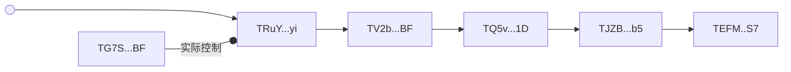

# Denglin

**GitHub ID:** Denglin001

**Telegram:** @notfound

## Self-introduction

Hi！我是邓林，base 杭州/宁波，zju 硕士生在读，web3 新手，希望和大家多多学习交流！

## Notes

<!-- Content_START -->
# 2025-08-10

### **1 状态机与计算引擎**

以太坊虚拟机（Ethereum Virtual Machine, EVM）是嵌入在每个以太坊完整节点中的核心组件。其本质上是一个完全隔离的沙盒化运行时环境，负责执行以太坊网络上的所有智能合约代码。

- **定义**：EVM是一个准图灵完备（Quasi-Turing Complete）的确定性状态机。它定义了以太坊协议中从一个区块到下一个区块状态转换的规则。
    - **确定性**：给定相同的初始状态和相同的输入（交易），EVM在任何节点上执行的结果都将完全一致。这是实现全网共识的基础。
    - **准图灵完备**：理论上，EVM可以执行任何可计算的程序。然而，其计算能力受到“Gas”机制的限制，以防止无限循环等问题耗尽网络资源，故称为“准”图灵完备。
- **功能**：EVM的主要职责是处理智能合约的部署和执行。它为开发者提供了一个可预测、安全且去中心化的计算平台，使其能够创建无需信任第三方即可自动执行的去中心化应用（DApps）。

---

### **2 EVM 架构与关键组件**

EVM采用基于栈（Stack-based）的架构，其设计简洁且高效，便于在不同硬件和操作系统上实现。主要组件包括：

- **栈 (Stack)**：
    - 一种后进先出（LIFO）的数据结构，用于存储操作的输入和输出。
    - 栈中每个元素的宽度为256位（32字节），这是为了高效处理以太坊原生的加密学计算（如Keccak-256哈希和椭圆曲线签名）。
    - 栈的最大深度为1024个元素，防止栈溢出攻击。所有操作码（Opcodes）都直接或间接地与栈进行交互。
- **内存 (Memory)**：
    - 一个线性的、可按字节寻址的读写空间。
    - 内存是非持久性的，其生命周期仅限于单次消息调用（Message Call）的执行期间。当合约执行结束时，内存中的内容会被销毁。
    - 主要用于临时存储数据，例如函数参数、动态数组以及在复杂计算中暂存变量。内存可以动态扩展，但扩展会消耗相应的Gas。
- **存储 (Storage)**：
    - 一个持久化的、键值对形式的存储空间，同样以256位为单位进行读写。
    - 存储是与每个合约账户关联的，其中的数据永久保存在以太坊区块链的状态中，除非被合约逻辑明确修改或删除。
    - 由于数据需要永久记录在所有节点上，存储操作是EVM中成本最高的操作之一。
- **程序计数器 (Program Counter, PC)**：
    - 一个指向当前将要执行的指令（操作码）的指针。在每次指令执行后，PC会自动递增，指向下一条指令，除非遇到跳转指令（`JUMP`, `JUMPI`）。
- **合约代码 (Contract Code)**：
    - 智能合约编译后生成的EVM字节码（Bytecode）。这段代码是只读的，在合约部署后不可更改。EVM逐条解释并执行这些字节码。

---

### **3 执行环境与指令集 (Opcodes)**

EVM的执行始于一笔交易。交易可以是简单的价值转移，也可以是触发合约代码执行的消息调用。

- **执行流程**：
    1. **初始化**：EVM根据交易内容创建一个新的执行环境，包括初始化内存、设置PC为0，并从交易的输入数据（Calldata）中加载参数。
    2. **指令循环**：EVM进入一个循环，不断读取PC指向的操作码，执行相应操作，并更新PC、栈、内存或存储。
    3. **终止**：执行会因以下原因终止：
        - 正常完成（`STOP`或`RETURN`指令）。
        - 异常终止（`REVERT`指令），状态回滚，但已消耗的Gas不退还。
        - 发生错误（如无效指令、栈溢出、Gas耗尽），状态回滚，Gas全部消耗。
- **操作码 (Opcodes)**：
    - EVM的指令集包含约140个操作码，每个操作码对应一个特定的底层操作。这些指令可被分为几大类：
        - **算术与逻辑运算**：`ADD`, `MUL`, `SUB`, `DIV`, `AND`, `OR`, `XOR`, `NOT`等。
        - **栈操作**：`PUSHx` (将1至32字节的数据压入栈顶), `POP`, `DUPx` (复制栈元素), `SWAPx` (交换栈元素)。
        - **内存操作**：`MLOAD` (从内存加载数据到栈), `MSTORE`, `MSTORE8` (将数据从栈写入内存)。
        - **存储操作**：`SLOAD` (从存储加载数据到栈), `SSTORE` (将数据从栈写入存储)。
        - **流程控制**：`JUMP`, `JUMPI` (有条件跳转)，用于实现循环和条件分支。
        - **环境信息**：`CALLER` (获取调用者地址), `CALLVALUE` (获取调用附带的ETH数量), `GASPRICE` (获取当前交易的Gas价格)。
        - **区块信息**：`BLOCKHASH`, `NUMBER`, `TIMESTAMP`等，用于获取当前区块的相关信息。
        - **合约交互**：`CREATE`, `CREATE2` (创建新合约), `CALL`, `DELEGATECALL`, `STATICCALL` (调用其他合约)。

# 2025-08-09

## 摘要
今天主要学习了GoLang，阅读了Go入门博客。
## 学习记录
1. rune数组
    1. 本质上就是 int32 数组。
    2. Go 中的字符串是以UTF-8编码的Bytes数组。UTF-8是一种可变长度的编码方式，如果是不同的语言，可能一个字符所占长度不一样。
    3. 如果想遍历字符串时，就会发现直接遍历可能不能正确得到一个一个的字符。
    4. 而rune就可以解决这个问题，使用int32足以保存世界上任意一种语言字符的 Unicode 码点。

| 特性 | rune | byte |
| --- | --- | --- |
| 本质 | int32 的别名 | uint8 的别名 |
| 表示 | 一个 Unicode 码点（一个“字符”） | 一个字节 |
| 大小 | 32位（4字节） | 8位（1字节） |
| 用途 | 处理 Unicode 字符，尤其适用于多语言文本 | 处理原始字节数据，如文件 I/O、网络数据流 |
1. Go的导出
    1. “导出”就是将一个标识符对外部可见的过程。
    2. 如果一个标识符（变量名、函数名、常量名、类型名、结构体字段名等）的首字母是大写的，那么它就是“导出的”（Exported），可以被其他包访问。
    3. 如果首字母是小写的，它就是“未导出的”（Unexported），只能在其定义的包内部使用。

|  | 首字母大写 (Exported) | 首字母小写 (Unexported) |
| --- | --- | --- |
| 可见性 | 对所有包可见 | 仅在定义的包内部可见 |
| 目的 | 作为包的公共 API | 作为包的内部实现细节 |
| 例子 | fmt.Println, http.Get, math.Pi | 包内部的辅助函数、私有状态变量 |
| 规则 | 供“外部”使用 | 仅供“内部”使用 |
1. defer
    1. 这个例子中，可以看到 defer 的执行顺序：后进先出。但是返回值并没有被修改，这是由于 Go 的返回机制决定的，执行 return 语句后，Go 会创建一个临时变量保存返回值，因此，defer 语句修改了局部变量 i，并没有修改返回值。那如果是有名的返回值呢？
        
        ```go
        functest()int {
        	i :=0
        deferfunc() {
        		fmt.Println("defer1")
        	}()
        deferfunc() {
        		i +=1
        		fmt.Println("defer2")
        	}()
        return i
        }
        
        funcmain() {
        	fmt.Println("return", test())
        }
        // defer2
        // defer1
        // return 0
        ```
        
    2. 这个例子中，返回值被修改了。对于有名返回值的函数，执行 return 语句时，并不会再创建临时变量保存，因此，defer 语句修改了 i，即对返回值产生了影响。
        
        ```go
        func test() (i int) {
        	i = 0
        	defer func() {
        		i += 1
        		fmt.Println("defer2")
        	}()
        	return i
        }
        
        func main() {
        	fmt.Println("return", test())
        }
        // defer2
        // return 1
        ```

# 2025-08-08

## 有关Tron

Tron，又称“波场”，最初作为基于Ethereum的代币而创建，最终在2018年迁移到自己的网络。

按照该过程的设计，投资者将Ethereum代币交易为Tron的TRX加密货币，又称“波场币”。（Ethereum代币随后被销毁。）

[**TRON**](https://www.okx.com/zh-hans/learn/what-is-tron-trx-your-complete-guide-to-the-disruptive-blockchain-network)钱包采用多重签名交易来帮助保护用户资产。

## 复盘经过

1. 地铁上刷小红书帖子，聊到最近比特币、以太坊大跌，贴主赔的非常惨。
2. 评论区有人发出自己钱包的所有提示词，说最近几天爆仓两次，不想玩了，还有130u放在钱包里，送给刷到的人。
3. 在OKX钱包中导入提示词，发现确实有130u。
4. 尝试转账到自己的钱包，但是提示TRX不足，需要补充TRX。
5. 这里感觉不太对劲（虽然本来就没有TRX），去看了欧意钱包的转账记录。
6. 发现转账都是成对的，比如转入了26TRX，那么不到一分钟后就会转出26TRX。
7. 基本可以确诊为诈骗，但是因为不太熟悉波场，觉得有可能是向那个地址转手续费（有点扯）。
8. 根据学长的建议，去看了TronScan
9. 在Google搜索类似内容，可以发现，在youtube上也有类似的骗术。

## Tron Scan

| 钱包地址 | TRuYbKRToTi43mF5519SyR2tcqDRsnRkyi |
| --- | --- |
| 实际Owner | TG7S1S2FuPPBs36j54XH1tuRcNnBA4ruBF |
| 中间地址1 | TV2b9PTQN7LM8GapyGujYqTZM18GSqzcbX |
| 中间地址2 | TQ5vtz2ixCDWzLTTPmFijvCwNrBDg8dJ1D |
| 中间地址3 | TJZBzbeeYnpiYt8jZkNMhZBDQn7e8Kqub5 |
| 最终收款地址 | TEFMHf1mWaQJFuvfsu2mmGULGSjcdPeLS7 |

赃款路线：



## 骗术解析

Tron钱包支持多重签名。对于一个多重签名钱包，创建者可以设置一个Threshold，并给所有私钥设置权重。

以阈值设置为5为例，如果要完成一笔交易，那么就需要 5个权重为1 的私钥签名；或者 1个权重为5 的私钥签名；或者 1个权重为2一个权重为3的私钥签名；总之只有参与签名的私钥权重之和要大于阈值，这笔交易才会确认完成，相当于转账才会被批准。然而，转入是不需要这个操作的。

于是，基于Tron网络的这个特性，骗子搭建了这个请君入瓮的骗局。

通常来说，骗子会公开钱包的助记词，然后号称钱包里有几百甚至上千u。此时，如果通过助记词恢复钱包，会发现确实有这些余额。就好像在马路上捡到钱了一样，大多数被骗者都会开始尝试把这些余额转到自己的账户中。

转账时候就会发现，钱包中的TRX不足以支付转u所需要的手续费。如果想把钱转出去，那就必须向钱包中转入一些TRX咯。

此时，如果真的转入了TRX，那就会发现：支付了手续费也不能把usdt转走，这笔交易需要其他人的签名；此外，如果想把TRX转出，同样也需要其他人的签名。在一两分钟之内，转到这个多签钱包的手续费就被骗子转走了。

# 2025-08-07

## 摘要

今日主要学习NFT相关内容。

## 学习内容

**1.1 定义**

非同质化代币 (Non-Fungible Token, NFT) 是一种记录在区块链（通常是公有链）上的独特数字标识符。它代表着对某一特定资产（数字或实体）的所有权或真实性证明。与比特币 (Bitcoin) 或以太坊 (Ethereum) 等同质化代币 (Fungible Tokens) 不同，每一个 NFT 都是独一无二、不可替代和不可分割的。

- **非同质化 (Non-Fungible)**：核心特性。一个 NFT 不能与另一个 NFT 等价交换，因为它们的元数据 (Metadata) 不同，代表的价值和资产也不同。这与美元或比特币等同质化资产形成对比，任何两个一美元或一比特币的价值都是相等的。
- **代币 (Token)**：在区块链上表示资产或权益的数字单位。NFT 是基于智能合约创建的一种代币。

**1.2 NFT 不是什么**

- **NFT 本身不是数字艺术品或文件**：NFT 是指向资产的元数据记录，存储在区块链上。实际的数字文件（如 JPEG、MP3、视频文件等）通常存储在链下 (off-chain) 的服务器或去中心化存储网络（如 IPFS 或 Arweave）上。NFT 包含了指向该文件位置的链接以及关于资产的描述信息。
- **不自动授予版权或知识产权**：购买一个 NFT 通常只意味着购买了该代币本身，代表了对特定版本资产的所有权记录。除非在销售条款或智能合约中明确规定，否则创作者仍然保留其作品的版权和知识产权。

**2.1 区块链与智能合约**

- **区块链 (Blockchain)**：NFT 存在于一个去中心化的、不可篡改的分布式账本上。最常见的 NFT 区块链是以太坊 (Ethereum)，但其他区块链如 Solana, Cardano, Tezos 和 Flow 也支持 NFT。区块链的去中心化特性确保了所有权记录的透明、安全和防篡改。
- **智能合约 (Smart Contracts)**：NFT 是通过在区块链上执行智能合约来“铸造” (Mint) 的。智能合约是自动执行、控制或记录法律相关事件和行为的计算机程序。对于 NFT 而言，智能合约定义了其独特性、所有权规则以及交易逻辑（例如，版税机制）。

**2.2 代币标准 (Token Standards)**

代币标准是确保不同平台和钱包之间互操作性的规则和功能集。

- **ERC-721**: 这是以太坊上第一个也是最广为人知的非同质化代币标准。
    - **核心特点**：每个代币都是绝对唯一的，拥有一个独一无二的 `tokenId`。
    - **实现方式**：每一个 ERC-721 代币都需要一个独立的智能合约进行部署和管理，这导致在批量创建或交易时成本较高（消耗更多的 Gas Fee）。
    - **适用场景**：数字艺术品、收藏品、虚拟土地等需要明确单个、独特资产所有权的场景。
- **ERC-1155**: 一种多代币标准，由 Enjin 团队开发，旨在提高效率和灵活性。
    - **核心特点**：一个智能合约可以同时管理多种类型的代币，包括同质化代币、非同质化代币甚至半同质化代币 (Semi-Fungible Tokens)。每个 `tokenId` 可以有多个副本。
    - **实现方式**：通过在一个合约中捆绑多个代币ID，极大地优化了批量铸造和交易的效率，显著降低了交易成本。
    - **适用场景**：游戏（例如，同一种类的剑可以有1000把，而一把传奇宝剑只有一个）、数字门票、捆绑资产销售等。

**2.3 铸造 (Minting) 流程**

铸造是将一个数字文件或资产转化为区块链上的数字资产（即 NFT）的过程。

1. **创建/选择资产**：创作者准备好他们想要代币化的数字文件。
2. **配置元数据**：定义 NFT 的属性，如名称、描述、以及指向链下文件的链接。
3. **上传至存储**：将数字文件上传到去中心化存储网络 (如 IPFS) 以确保其长期可访问性。
4. **部署智能合约**：通过 NFT 市场平台或直接与区块链交互，执行一个智能合约。
5. **支付交易费 (Gas Fee)**：在以太坊等网络上，需要支付一笔费用来补偿处理和验证交易所需的计算能源。
6. **记录在链**：交易被验证并添加到区块链的一个新区块中，NFT 由此正式创建并记录在创作者的钱包地址下。

**4.1 应用场景**

- **数字艺术 (Digital Art)**：为数字艺术家提供了一种验证其作品原创性和所有权的方式，并能通过智能合约中的版税条款在每次二次销售中获得收益。
- **收藏品 (Collectibles)**：如 NBA Top Shot (篮球精彩瞬间)、数字交易卡等。
- **游戏 (Gaming)**：游戏内的资产，如角色皮肤、武器、虚拟土地等，可以作为 NFT 存在，允许玩家真正拥有这些资产并在游戏之外进行交易。
- **虚拟世界与元宇宙 (Virtual Worlds & Metaverse)**：在 Decentraland 和 The Sandbox 等平台中，虚拟土地和物品以 NFT 的形式进行买卖。
- **身份验证与证书**：可用于代表域名 (e.g., Ethereum Name Service)、学历证书、会员资格和出席证明 (POAP - Proof of Attendance Protocol)。
- **票务 (Ticketing)**：利用 NFT 作为活动门票，可以有效防止伪造并为组织者和艺术家创造二次销售收入。

**5.1 环境影响**

- **工作量证明 (Proof-of-Work, PoW)**：早期，大多数 NFT 交易发生在基于 PoW 的以太坊上。PoW 机制需要大量的计算能力和能源消耗来验证交易，导致了显著的碳足迹。
- **权益证明 (Proof-of-Stake, PoS)**：2022年9月，以太坊成功完成了“合并” (The Merge)，从 PoW 转向 PoS 共识机制。PoS 机制通过验证者质押代币来保证网络安全，其能源消耗相比 PoW 大幅降低了约 99.95%。这极大地缓解了与以太坊 NFT 相关的环境问题。然而，其他 PoW 链上的 NFT 仍然存在高能耗问题。

**5.2 法律与版权问题**

- **所有权 vs. 知识产权**：如前述，购买 NFT 并不等同于获得了基础资产的版权。买家拥有的是代币，而不是复制、分发或创作衍生作品的权利。具体的权利由销售时的法律协议或智能合约条款决定。
- **侵权与欺诈**：存在未经授权将他人艺术品铸造成 NFT 进行销售的案例。这引发了复杂的版权侵权问题，因为法律框架仍在努力追赶技术的发展。
- **智能合约的法律效力**：智能合约中编码的规则（如版税）的法律强制执行能力仍在探索和界定中。

**5.3 市场波动性与风险**

NFT 市场具有高度投机性和波动性。资产价值主要由市场需求驱动，缺乏传统的估值模型，价格可能在短时间内经历剧烈波动。投资者和收藏家需对此有清醒的认识。

# 2025-08-06

## 摘要

本日除了阅读web3intern外，主要学习了稳定币相关内容。

## 学习内容

**1.1 定义**

稳定币是一种特殊的加密货币（Cryptocurrency），其核心设计目标是将其市场价值与某一“稳定”的链下资产或资产篮子进行锚定（Pegging）。最常见的锚定目标是法定货币（如美元），但也可以是大宗商品（如黄金）或其他金融工具。其根本目的在于克服主流加密货币（如比特币、以太坊）的剧烈价格波动性，从而在数字资产生态系统中扮演更可靠的价值尺度、交换媒介和价值储存手段。

**1.2 存在的核心意义**

稳定币旨在解决加密世界内部的核心矛盾：即去中心化资产的价值不稳定性。它的出现，为市场提供了以下关键功能：

- **交易媒介 (Medium of Exchange):** 为加密货币交易所提供了一个低波动性的计价和交易对，用户可以在不离开加密生态系统（即无需兑换为法币）的情况下，规避市场波动风险。
- **价值储存 (Store of Value):** 相较于其他加密资产，稳定币提供了一种短期内更可靠的财富保值工具。
- **计价单位 (Unit of Account):** 在去中心化金融（DeFi）协议中，贷款、衍生品和其他金融产品通常以稳定币计价，简化了复杂的金融计算。
- **连接传统金融 (TradFi) 与去中心化金融 (DeFi) 的桥梁:** 允许用户将法币价值无缝地引入链上世界，参与DeFi活动，如借贷、流动性挖矿等。

---

稳定币的分类主要依据其维持价格稳定的机制，即其背后的抵押品类型和管理方式。主要分为三类：

**2.1 法币抵押型稳定币 (Fiat-Collateralized Stablecoins)**

- **机制:** 这是最直接和最普遍的模式。一个中心化的实体（发行方）接收用户的法币（如美元），并将其存放在经审计的、受监管的金融机构（如银行）的储备账户中。随后，该实体在区块链上按1:1的比例铸造（Mint）相应数量的稳定币代币。用户赎回时，则执行相反流程：销毁（Burn）代币并返还法币。
- **价值锚定逻辑:** 其价值主张基于对发行方储备金的完全信任。理论上，每一个流通的稳定币代币背后，都有等值的法币资产作为支撑。
- **优点:**
    - **机制简单直观:** 容易被用户和监管机构理解。
    - **稳定性高:** 只要储备金充足且可兑付，其价格通常能精确维持在1:1。
- **缺点:**
    - **中心化风险:** 依赖于中心化发行方，存在操作风险、信用风险和破产风险。用户需要信任该实体不会挪用储备金。
    - **监管审查:** 作为连接法币世界的入口，这类稳定币发行方面临严格的金融监管、反洗钱（AML）和客户尽职调查（KYC）要求。
    - **透明度问题:** 储备金的构成和审计频率与质量一直是市场争议的焦点。
- **主要案例:**
    - **Tether (USDT):** 市场份额最大的稳定币，但其储备金透明度长期存在争议。
    - **USD Coin (USDC):** 由Circle公司发行，以更高的透明度和合规性著称，定期发布由顶级会计师事务所出具的储备金证明报告。

**2.2 加密资产抵押型稳定币 (Crypto-Collateralized Stablecoins)**

- **机制:** 此类稳定币通过在智能合约中锁定超额的加密资产（如ETH）作为抵押品来铸造。由于抵押品本身价格波动，必须进行“超额抵押”（Over-collateralization）。例如，用户可能需要锁定价值200美元的ETH，才能铸造出100美元的稳定币。如果抵押品价值因市场下跌而接近稳定币价值（例如，跌至150美元），系统会自动清算部分抵押品以偿还债务，从而保证稳定币的偿付能力。
- **价值锚定逻辑:** 价值由链上智能合约强制执行的、透明的、超额的加密资产储备来支撑。
- **优点:**
    - **去中心化:** 运行在区块链上，无需信任中心化实体，抗审查性强。
    - **透明度高:** 任何人都可以通过区块链浏览器实时核查抵押品的状况。
- **缺点:**
    - **资本效率低下:** 超额抵押占用了大量资金，降低了资本的利用率。
    - **系统性风险:** 在市场极端下跌行情中，可能因抵押品价值暴跌而引发大规模的连锁清算，导致系统崩溃和稳定币脱锚（De-pegging）。
    - **机制复杂性:** 对普通用户而言，理解清算线、抵押率等概念较为困难。
- **主要案例:**
    - **Dai (DAI):** 由MakerDAO协议创建，是最著名和最成功的去中心化稳定币。

**2.3 算法稳定币 (Algorithmic Stablecoins)**

- **机制:** 这是最具实验性且风险最高的一类。它不依赖任何直接的法币或加密资产抵押，而是通过一套算法和智能合约，根据市场供需关系自动调节代币的供应量，以维持其价格稳定在锚定目标。
- **常见模型:**
    1. **Rebase (供应量弹性模型):** 当币价 > $1 时，算法自动增加所有持币者钱包中的代币数量（正向Rebase），稀释其价值；当币价 < $1 时，则减少供应量（负向Rebase）。
    2. **Seigniorage (铸币税模型):** 通常采用双代币系统：一个为稳定币（如UST），另一个为权益/治理代币（如LUNA）。
        - 当稳定币价格 > $1 时，系统允许用户用权益代币铸造新的稳定币，套利行为会增加稳定币供应，使其价格回落。
        - 当稳定币价格 < $1 时，系统则鼓励用户销毁稳定币以铸造新的权益代幣，套利行为会减少稳定币供应，使其价格回升。
- **价值锚定逻辑:** 纯粹基于对未来增长和套利机会的预期，形成一种市场博弈。
- **优点 (理论上):**
    - **高度去中心化:** 无需任何形式的抵押品。
    - **资本效率极高:** 无需锁定资产。
- **缺点 (实践中):**
    - **极端脆弱性:** 极度依赖市场信心。一旦出现负面预期，很容易陷入“死亡螺旋”（Death Spiral）：稳定币脱锚 -> 市场恐慌抛售 -> 权益代币价值暴跌 -> 无法支撑稳定币价格 -> 进一步恐慌，直至系统崩溃。
    - **已被证伪的高风险:** Terra/UST的系统性崩溃（2022年5月）是算法稳定币模型脆弱性的最典型案例，造成了数百亿美元的价值蒸发。
- **主要案例:**
    - **TerraUSD (UST):** 已失败。
    - **Frax (FRAX):** 采用部分抵押、部分算法的混合模型，试图在稳定性和资本效率之间取得平衡。

---

**3.1 稳定币三元悖论 (The Stablecoin Trilemma)**

类似于宏观经济学中的“不可能三角”，稳定币设计也面临一个三元悖论，即一个协议很难同时实现以下三个目标：

1. **价格稳定 (Price Stability):** 精确锚定目标价值。
2. **去中心化 (Decentralization):** 摆脱对中心化机构的依赖。
3. **资本效率 (Capital Efficiency):** 无需或仅需少量抵押。
- **法币抵押型** 实现了 (1) 和 (3)，但牺牲了 (2)。
- **加密资产抵押型** 实现了 (1) 和 (2)，但牺牲了 (3)。
- **算法型** 试图实现 (2) 和 (3)，但往往在压力下无法维持 (1)。

**3.2 主要风险**

- **储备风险 (对于法币抵押型):** 储备金管理不善、资产流动性不足或发行方欺诈。
- **脱锚风险 (De-pegging Risk):** 任何类型的稳定币在极端市场条件下或因自身机制缺陷，都可能与其锚定资产脱钩。
- **系统性风险:** 头部稳定币（如USDT）已成为加密市场的核心基础设施，其任何不稳定性都可能引发整个市场的连锁反应和流动性危机。
- **监管风险:** 全球监管机构对稳定币带来的金融稳定、货币主权和投资者保护等问题日益关注。未来的监管政策可能对其运营模式产生重大影响。

**3.3 监管趋势**

各国政府和中央银行正积极研究和制定稳定币的监管框架。主要方向包括：

- 要求稳定币发行方必须持有银行牌照。
- 强制执行严格的储备金要求和透明度标准。
- 将稳定币纳入支付系统监管。
- 发展央行数字货币（CBDC）作为潜在的替代方案。

---

稳定币作为数字资产领域的一项关键创新，成功地解决了加密货币的波动性问题，成为了DeFi生态的基石和连接现实世界价值的桥梁。然而，不同类型的稳定币在去中心化程度、安全性和资本效率之间做出了不同的取舍，并各自面临着独特的风险。

未来，稳定币的发展将与监管框架的演进紧密相连。市场的焦点将持续集中在寻找一种能够平衡稳定、去中心化和资本效率的“圣杯”模型。同时，央行数字货币（CBDC）的出现，也将为数字货币领域带来新的竞争与合作格局。对稳定币内在机制和风险的深刻理解，是任何深入参与加密资产市场者的必备前提

# 2025-08-05

## 摘要

今日主要研究学习了借贷协议和闪电贷。

## 学习内容

### 借贷协议

**一、 核心收益机制分析**

Web3借贷协议的收入主要源于三大核心机制：**利率差收益、清算罚金收入**以及**辅助性费用收入**。这些机制共同构成了协议稳健的财务基础。

**1.1 利率差收益 (Interest Spread Revenue)**

借贷利差构成了协议最核心的收入来源。在此模型中，协议担当了去中心化的金融中介角色，从借款人支付的利息中按特定比例提取一部分作为协议收入，其余部分则分配给相应的流动性提供者（即贷方）。

为实现市场供需的动态均衡，协议普遍采用**算法驱动的动态利率模型**。该模型的核心变量为**资金利用率（Utilization Rate）**，即池内已借出资产与总资产的比例。利率与资金利用率呈明确的正相关关系：

- **低利用率区间**：利率随利用率增长平缓，以激励借贷活动。
- **高利用率区间**：当利用率超过一个预设的最优阈值（Kink），利率曲线斜率将急剧增大。此设计旨在抑制过度借贷行为并吸引新的流动性注入，以保障协议的流动性与偿付能力。

通过此机制，协议不仅能够有效调节市场供需，亦能确保稳定且可预测的利息收入。

**1.2 清算罚金收入 (Liquidation Penalty Revenue)**

为对冲信用风险，DeFi借贷协议强制要求借款人进行**超额抵押**。当市场剧烈波动导致抵押品市场价值跌破预设的**清算阈值（Liquidation Threshold）**时，协议将自动启动清算程序，以规避形成坏账的风险。

在清算过程中，第三方清算人（Liquidators）会代协议偿还借款人的债务，并被授权以低于市场价的折扣购得抵押品。此**价格折扣即为清算罚金**。协议通常会从清算罚金中抽取一部分作为收入，剩余部分则作为对清算人承担风险的激励。因此，清算罚金不仅是协议风险管理框架的关键组成部分，亦是其在市场高波动性环境下的重要补充性收入来源。

**1.3 辅助性费用收入 (Ancillary Fee Revenue)**

除上述两大主要收入来源外，协议还通过多元化的辅助性费用结构为其收益提供补充来源，主要包括：

- **交易手续费**：对用户的存款、取款、借款等链上操作收取固定或按比例计算的手续费。
- **闪电贷（Flash Loan）费用**：闪电贷是一种在单一原子交易内完成无抵押借款与还款的DeFi原生工具。协议通常对每笔闪电贷的名义本金收取固定比例（例如0.09%）的费用。鉴于其在套利、再融资和头寸调整中的广泛应用，该项费用构成了不容忽视的收入流。
- **其他服务费**：包括但不限于协议间集成、API调用等可能产生的其他服务性费用。

**二、 协议收入的分配与经济模型的可持续性**

协议所产生的总收入将依据其既定的经济模型进行战略性分配，以保障生态系统的长期稳健发展与价值捕获。主要分配路径如下：

- **流动性提供者激励**：绝大部分利息收入被直接分配给贷方，此为吸引资本、维系协议流动性的核心激励机制。
- **协议金库（Treasury）**：部分收入被划拨至协议金库，用以覆盖协议的研发、运营、安全审计及市场推广等相关成本，并作为协议未来发展的战略储备金。
- **代币经济学整合**：部分协议利用收入在二级市场进行其原生治理代币的回购与销毁（Buyback and Burn）。此举旨在制造通缩压力，以期提升代币的内在价值，进而使协议的长期价值与代币持有者的利益保持一致。
- **风险拨备**：特定比例的收入被注入安全模块或保险基金，用以在发生智能合约被利用或产生坏账等极端风险事件时，为受损用户提供一定程度的补偿。

**三、 风险因素与潜在挑战**

尽管收益模型设计精巧，Web3借贷协议的运营仍面临多重且严峻的挑战：

- **技术与安全风险**：智能合约的代码漏洞构成其根本性安全威胁，一旦被利用，可能导致灾难性的资金损失。
- **预言机（Oracle）依赖风险**：协议的清算机制高度依赖外部预言机所提供的价格数据。预言机的延迟、故障或被恶意操纵，均可能引发大规模的非正常清算，进而损害协议的稳健性与公信力。
- **系统性市场风险**：在极端市场环境下，抵押品价值的瀑布式下跌可能引致清算机制的系统性失灵与流动性枯竭，从而产生难以弥补的系统性坏账。
- **宏观与监管风险**：全球范围内针对去中心化金融的监管框架尚在演进之中，未来法律法规的高度不确定性可能对协议的运营模式及合规性构成重大挑战。

### 闪电贷

对闪电贷有了初步了解

闪电贷的关键在于**交易的原子性（Atomicity）**。在区块链上，一笔交易可以包含多个操作步骤。原子性保证了这笔交易中的所有操作要么**全部成功**，要么**全部失败**。

对于闪电贷而言，借款、使用资金和还款这三个步骤必须在**同一笔区块链交易**中完成。

这就意味着：

1. **借款人**从一个智能合约（借贷池）发起一笔闪电贷。
2. **智能合约**将资金（例如 10,000 ETH）借给借款人。
3. **借款人**立即使用这笔资金执行一系列预先设定好的操作（例如在不同的交易所之间进行套利）。
4. 在交易结束之前，**借款人**必须将借入的本金**外加一笔小额手续费**（通常为 0.09% 左右）归还给智能合约。

**如果借款人无法在交易结束前归还资金，整个交易就会失败回滚。** 区块链会撤销此前发生的所有操作，就好像这笔贷款从未发生过一样。对于贷方（智能合约）来说，它们的资金从未离开过金库，因此没有任何风险。

正是这种“要么还钱，要么交易作废”的机制，使得无抵押贷款成为可能。

### 闪电贷的主要用途

闪电贷为精通技术的交易者和开发者提供了高效利用资金的工具，主要应用场景包括：

1. **套利 (Arbitrage)**

这是最常见的用途。当同一种加密资产在不同的去中心化交易所（DEX）之间出现价差时，套利者可以：

- 通过闪电贷借入大量资产（如 WETH）。
- 在价格较低的交易所 A 买入另一种资产（如 DAI）。
- 在价格较高的交易所 B 卖出 DAI，换回更多的 WETH。
- 归还闪电贷本金和手续费，将剩余的 WETH 作为利润。
由于这一切都在一笔交易中完成，交易者无需自有资金即可实现巨额套利。

2. **更换抵押品 (Collateral Swapping)**

假设在一个借贷平台（如 Aave）上抵押了 ETH，借出了稳定币 USDC。如果现在 LINK 的价格前景更好，想把抵押品从 ETH 换成 LINK，但又不想先偿还 USDC 贷款。
使用闪电贷，你可以：

- 借一笔与债务等值的 USDC 闪电贷。
- 用这笔 USDC 偿还贷款，解锁被抵押的 ETH。
- 将解锁的 ETH 卖掉，换成 LINK。
- 将新的 LINK 存入平台作为抵押品。
- 从新的抵押品中借出 USDC，并立即归还闪电贷。

3. **利率互换 (Interest Rate Swapping)**

当在一个高利率的借贷协议中有一笔债务时，可以利用闪电贷将其无缝迁移到一个低利率的协议中，从而节省利息成本。

# 2025-08-04

# 2025-08-04

## 摘要

### **加密市场快讯与动态**

- **宏观与投资**：比特币可作为对冲货币贬值的工具。本周需注意大量代币解锁可能带来的市场波动。
- **项目进展**：Tether 正在开发自有区块链项目并已完成种子轮融资。稳定币发行商 Circle 也在进行新一轮融资，或与香港的稳定币计划有关

### **以太坊生态**

以太坊正值十周年，其作为“价值互联网”的目标是实现长期稳定运行。其架构和生态系统正持续进化：

1. **核心架构升级**：
    - **执行层 (EL)**：通过 EIP-1559 销毁机制，ETH 正在成为通缩资产（预计年销毁150万枚）。
    - **共识层 (CL)**：PoS 机制下的质押经济持续增长，质押率目标为40%，增强了网络安全性。
    - **数据可用性层 (DA)**：EIP-4844 (Blobs) 已大幅降低 Layer 2 成本，未来 Danksharding 旨在实现百万级 TPS 并将数据成本降低99%。
2. **主要赛道发展**：
    - **DeFi**：以太坊仍是 DeFi 中心（占全球TVL 65%）。核心协议如 Aave、Compound、Curve 保持稳固，而 Uniswap v4 的 “Hooks” 功能将带来高度可定制的流动性池。同时，现实世界资产（RWA）代币化，特别是美债代币化，正成为重要趋势。
    - **NFT 与元宇宙**：市场由 OpenSea 和 Blur 主导，创新应用如 Zora 的社交化 NFT 发行正在涌现。
    - **Layer 2 扩容**：Arbitrum 和 zkSync 分别在通用和隐私增强领域领先，共同支撑着以太坊生态的规模化扩展。

### **DeFi 协议创新：Uniswap v4 与借贷新模式**

- **Uniswap v4 革命性创新**：v4 的核心是通过 **“Hooks”（钩子）** 功能实现前所未有的定制化，允许开发者创建动态费用、链上订单簿等复杂功能。其全新的 **“Singleton”（单例）架构** 和 **“Flash Accounting”（闪电记账）** 系统将大幅降低 Gas 费用，提升资本效率。
- **DeFi 协议协同效应**：展现了 DeFi 协议间强大的组合性。例如，Aave 计划与 Uniswap v4 结合，允许用户抵押其 Uniswap v4 的 LP 仓位来借出稳定币 GHO。这种模式将原本“沉睡”的流动性资产转化为可以产生收益的抵押品，实现了协议间的共赢。

## 学习记录

### 周会

- 快讯
    - 比特币的投资价值与黄金类似，可以避免货币贬值风险。
    - 本周有大量的代币解锁。
    - GAIB将GPU代币化，但是这个主题并不是很新了。
    - Tether正在构建自己的区块链项目，现在完成了种子轮融资。
    - 圆币正在融资，可能与香港稳定币相关。
- 以太坊十周年
    - 作为价值互联网，在几十年或者上百年上都保持不宕机运行
    - 实时的zkvm和DAS扩容L1/L2
    - 共识层、block层、执行层的升级

### 以太坊架构

1. **执行层（EL）**
- **EVM虚拟机**：运行智能合约的沙盒环境，支持Solidity语言。
- **Gas机制**：EIP-1559引入基础费销毁（2025年销毁ETH达150万枚/年），通缩模型强化。

**2. 共识层（CL）**

- **信标链**：PoS核心，管理验证者与分片协调，质押门槛32 ETH（计划降至1 ETH）。
- **质押经济**：年化收益4-6%，质押率25%（目标40%），锁仓3200万ETH提升安全性。

**3. 数据可用性层（DA）**

- **Blob存储**：EIP-4844降低Layer2数据成本60%，Blobs 2.0将支持后量子安全。
- **分片技术（Danksharding）**：2027年目标实现百万TPS，数据成本降99%。

### 以太坊赛道

**1. DeFi（去中心化金融）**

- **规模**：TVL超2000亿美元，占全球DeFi 65%。
- **核心协议**：
    - **借贷**：Aave（超额抵押）、Compound（算法利率）
    - **DEX**：Uniswap V4（Hooks自定义池）、Curve（稳定币兑换）
    - **衍生品**：dYdX（永续合约）、Synthetix（合成资产）
- **趋势**：RWA（现实资产代币化）崛起，美债代币化规模120亿美元，年化收益4.5%。

**2. NFT与元宇宙**

- **市场**：OpenSea、Blur主导，交易量占全网80%。
- **创新场景**：
    - **社交NFT**：Zora平台支持作品碎片化发行。
    - **游戏资产**：Axie Infinity宠物、Sandbox虚拟土地。

**3. Layer2扩容方案**

| **类型** | **代表项目** | **TVL（2025）** | **特点** |
| --- | --- | --- | --- |
| Rollup | Arbitrum | 180亿美元 | EVM兼容，日活500万用户 |
| ZK-Rollup | zkSync | 120亿美元 | 隐私增强，适合机构应用 |
| Validium | StarkNet | 80亿美元 | 数据链下存储，成本最低 |

### **借贷协议收益模型**

**速记**：收益=利息+清算罚金+治理代币激励。

[什么是去中心化金融？ 去中心化金融的优势和作用](https://ethereum.org/zh/defi/)

**1. 经典模型（以Aave/Maker为例）**

- **存款利息**：用户存稳定币赚APY（如USDC 3-5%）。
- **借贷利差**：借DAI需付利息（部分分给存款人）。
- **清算收益**：抵押不足时，低价拍卖抵押品赚差价。

**2. 创新案例：Aave × Uniswap V4（2025年提案）**

- **玩法**：用户抵押Uniswap V4 LP头寸→借出GHO稳定币。
- **分润**：利息50%归Uniswap DAO → **协议联盟共赢**。
- **意义**：LP仓位从“沉睡资产”变“生息抵押品”💡

### Uniswap v4

Uniswap 作为去中心化金融（DeFi）领域的领军协议，其即将推出的第四个版本——Uniswap v4，预示着去中心化交易所（DEX）将迈入一个功能更强大、效率更高、定制化能力更强的全新时代。v4 的核心设计理念是通过引入名为“Hooks”（钩子）的强大功能，以及全新的“Singleton”（单例）架构和“Flash Accounting”（闪电记账）系统，极大地提升协议的灵活性和资本效率。

**核心创新：Hooks（钩子）**

Uniswap v4 最具破性的创新是 “Hooks” 的引入。Hooks 是外部智能合约，它们可以在流动性池生命周期的关键节点（例如，交易之前或之后、添加或移除流动性时）执行预设的逻辑代码。这为开发者和流动性提供者（LP）打开了前所未有的定制化大门，使其能够实现此前版本难以企及的复杂功能。

通过 Hooks，可以实现：

- **动态费用：** 根据市场波动性或其他链上数据实时调整交易费用，从而为 LP 创造更优的收益策略，并为交易者提供更具竞争力的价格。
- **链上订单类型：** 实现复杂的订单类型，如限价单、止损单和移动平均线（TWAMM）订单，而无需依赖中心化或链下服务。
- **自定义预言机：** 创建更复杂的、抗操纵的链上价格预言机。
- **流动性主动管理：** 自动化的流动性管理策略，例如在价格达到特定点位时自动重新平衡流动性。
- **整合其他协议：** 将借贷协议或其他 DeFi 应用的功能直接嵌入到 Uniswap 流动性池中。

值得注意的是，池子的创建者可以选择为其流动性池添加特定的 Hook。这意味着并非所有 v4 池都具有相同的功能，而是会形成一个多样化且充满创新的生态系统。


# 2025.07.31


<!-- Content_END -->
