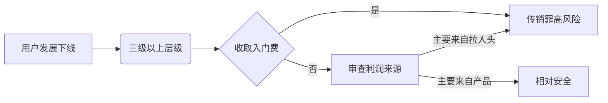

# WhitePeace

**GitHub ID:** Joe-Goldbug

**Telegram:** @null

## Self-introduction

主要技术栈包括TypeScript、React、Vite和Tailwind CSS，具备组件化开发、页面搭建、Web3钱包连接与合约交互等能力，能够独立完成前端架构设计、工程化配置和UI/UX实现，善于将新技术应用于实际项目。

## Notes

<!-- Content_START -->
# 2025-08-11

### 一、专家咨询模式的根本性矛盾（Web3改造无效性分析）
#### ⚠️ 问题1：AI对咨询行业的替代性已成定局
| 传统专家服务场景       | AI替代性               | 现实案例                     |
|------------------------|------------------------|------------------------------|
| 通用策略报告生成       | **100%可替代**         | 量化交易AI自动生成回测报告   |
| 行业基础数据分析       | **80%+可替代**         | Bloomberg GPT处理投研数据    |
| **独家内幕信息获取**   | **不可替代但需合规**   | 持牌机构的内参服务           |

➠ **关键结论**：  
普通专家服务价值已被AI挤压至“非标信息获取”领域，而该领域**依赖强人脉/持牌资质**，与Web3技术无关。

---

#### ⚠️ 问题2：链上社交名片无法解决核心痛点
| 宣称的ZK解决方案      | 实际落地障碍                     | 本质矛盾                     |
|-----------------------|----------------------------------|------------------------------|
| 链上身份认证          | 专家权威需线下背书而非链上证明  | **信任来源错配**             |
| 咨询记录上链          | 高价值咨询涉及NDA禁止公开        | **商业机密 vs 链上透明**     |
| 代币激励体系          | B端客户拒绝用代币支付服务费      | **支付合规性冲突**           |

➠ **关键结论**：  
ZK技术仅解决“信息可验证性”，但专家咨询的核心痛点在于：  
1. **高价值信息非公开性**（与区块链透明性冲突）  
2. **服务交付依赖深度人际互动**（无法被技术简化）  

---

### 二、供需匹配平台的致命缺陷
#### 🔥 冷启动悖论（数据来自GlG专家平台）
| 指标                | 行业平均水平       | 创业团队瓶颈       |
|---------------------|--------------------|--------------------|
| 专家招募周期        | 6-12个月           | 无现成资源库       |
| 单专家获客成本      | $3000+             | 无资金储备         |
| 客户决策门槛        | 需≥3位备选专家     | 难建充足专家池     |

➠ **类比验证**：  
> 滴滴早期通过**出租车公司联盟**快速获得司机资源 → 专家平台需绑定头部机构（如麦肯锡）  
> **当前团队无机构合作基础**，从0搭建专家网络需$50万+种子资金

---

### 三、Web3资方视角的否定逻辑
#### 💸 估值模型排斥人力密集型业务

# 2025-08-10

### 一、专家咨询领域的现状与挑战  
- **AI 对传统咨询的冲击**：  
  - 用户可通过 AI 直接获取专业级方案（如量化交易策略+历史回测报告），成本低、效率高。  
  - 普通专家角色被大幅替代，**除非具备以下优势**：  
    ✓ 独家内幕消息渠道  
    ✓ 持牌资质/权威背书  

---

### 二、DePIN 赛道核心模式分析  
#### 模式 1：通用数据 + AI 增值  
- **数据特征**：公开易得（如网页信息、交通流量等）  
- **关键能力要求**：  
  ✓ **持续更新**：保证数据源的实时性与稳定性  
  ✓ **AI 蒸馏价值**：通过聚合分析提升数据决策价值（原始数据非壁垒，AI 提炼才是核心）  
- **典型案例**：[Hivemapper](https://hivemapper.com/)  
  - 数据源：司机行车记录仪实时上传  
  - 处理：AI 分析路况变化 → 生成动态地图  
  - 激励：贡献者获得代币奖励  
  - 产品本质：售卖「路况情报」而非原始录像  

#### 模式 2：稀缺数据 + 垂直场景  
- **数据特征**：一手独家、高稀缺性（需硬件设备采集）  
- **关键能力要求**：  
  ✓ **锁定强需求场景**：找到明确付费方与使用场景  
  ✓ **全球通用性**：解决方案可跨地域复用  
- **典型案例**：极飞科技（XAG 等农业科技公司）  
  - 数据源：无人机/物联网设备拍摄农田  
  - 处理：AI 识别作物病害、缺水等问题  
  - 付费方：农场主订阅报告  
  - **护城河**：数据本身具备不可替代性

# 2025-08-09

# 去中心化AI数据激励网络与专家服务平台

## 1. 产品概述

### 1.1 产品愿景
致力于构建一个去中心化的AI数据集交易平台和专家服务网络，通过区块链技术、ZK隐私保护和声誉系统，连接数据集创作者、AI专家和数据消费者，打造可信、透明、高质量的数据生态系统。

### 1.2 核心价值主张
- **专家身份保护**：通过ZK技术保护专家隐私，让专家安心参与平台服务
- **多元化专家认证**：支持质押和邀请两种专家认证方式，降低参与门槛
- **数据质量保障**：专家评分系统确保数据集质量，Challenge机制维护平台可信度
- **精准专家匹配**：为项目方提供精准的专家顾问匹配服务
- **声誉激励体系**：通过NFT/DID和声誉系统激励专家持续贡献
- **DePIN生态定位**：面向投资者的去中心化物理基础设施网络项目

### 1.3 目标用户
- **数据集专家**：各领域的专业人士，通过质押或邀请成为平台认证专家
- **数据消费者**：金融机构、AI模型开发者、研究机构、个人开发者
- **项目方**：需要专家咨询服务的区块链项目和传统企业
- **投资者**：关注DePIN赛道的投资机构和个人投资者

## 2. 市场分析与项目定位

### 2.1 问题定义
- **数据质量难以保证**：现有数据集缺乏专业评估，质量参差不齐
- **专家身份暴露风险**：专家不愿公开身份参与数据标注和评估
- **专家资源匹配困难**：项目方难以找到合适的专家顾问
- **缺乏可信激励机制**：现有平台缺乏有效的专家激励和惩罚机制
- **数据交易不透明**：传统数据交易缺乏透明度和可追溯性

### 2.2 解决方案
- **ZK隐私保护**：专家可匿名参与，保护身份隐私
- **双重认证机制**：质押认证和邮件邀请两种方式
- **Challenge体系**：类似Layer2的挑战机制确保服务质量
- **声誉NFT/DID**：链上身份标识和声誉积累
- **精准匹配算法**：基于专业领域和历史表现匹配专家

### 2.3 项目定位
- **DePIN赛道**：去中心化物理基础设施网络
- **面向投资者**：团队具备VC背景，专注投资者关系
- **B2B2C模式**：服务项目方，最终惠及终端用户

## 3. 核心功能需求

### 3.1 专家认证系统

#### 3.1.1 质押认证方式
- **质押要求**：
  - BTC质押：0.1 BTC
  - ETH质押：1.5 ETH
  - 其他条件：专业背景验证、历史记录审核
- **质押管理**：智能合约自动管理质押资产
- **解锁机制**：满足条件后可申请解锁质押资产

#### 3.1.2 邮件邀请方式
- **邀请流程**：平台主动邀请行业专家
- **身份验证**：通过邮箱和专业证书验证
- **知识上传**：专家可上传专业领域知识和经验
- **ZK证明**：链下声明专业证书，TLS加密验证

#### 3.1.3 ZK隐私保护
- **身份匿名化**：专家身份通过ZK证明保护
- **证书验证**：链下声明博士毕业证等专业证书
- **TLS加密信道**：服务端验证专家可靠性
- **隐私计算**：确保专家信息不被泄露

### 3.2 数据集交易系统

#### 3.2.1 数据集上传与管理
- **多格式支持**：支持各种数据格式上传
- **元数据标注**：详细的数据集描述和标签
- **版权保护**：确保数据创作者权益
- **预览功能**：提供数据样本预览

#### 3.2.2 交易机制
- **链上支付**：用户支付Token购买数据集
- **存储方案**：
  - 中心化存储：传统云存储服务
  - 去中心化存储：Arweave等分布式存储
- **NFT权限管理**：通过NFT标识数据集URL和访问权限
- **权限控制**：
  - 中心化：后台服务器权限管理
  - 去中心化：基于NFT的权限验证

#### 3.2.3 目标客户
- **金融机构**：量化分析、风险评估数据需求
- **AI模型开发者**：特定领域（如航空）的专业数据集
- **个人用户**：量化分析、研究项目等个人需求
- **研究机构**：学术研究和实验数据

### 3.3 专家评分与声誉系统

#### 3.3.1 评分机制
- **数据集评分**：专家对数据集质量进行专业评估
- **多维度评价**：准确性、完整性、时效性、实用性
- **加权评分**：基于专家声誉的加权评分算法
- **链上记录**：所有评分记录上链存储

#### 3.3.2 声誉系统
- **声誉积累**：基于评分质量和用户反馈积累声誉
- **NFT奖励**：优秀专家获得声誉NFT
- **DID标识**：链上去中心化身份标识
- **等级体系**：专家等级划分和权益差异

#### 3.3.3 激励机制
- **Token奖励**：基于评分质量和数量的Token激励
- **声誉提升**：优质服务提升专家声誉等级
- **优先权益**：高声誉专家享有优先匹配权
- **收益分成**：参与平台收益分配

### 3.4 Challenge挑战机制

#### 3.4.1 挑战流程
- **挑战发起**：用户对专家评分提出质疑
- **证据提交**：挑战者提供反驳证据
- **仲裁机制**：多方专家参与仲裁
- **结果执行**：自动执行挑战结果

#### 3.4.2 Slash惩罚机制
- **质押削减**：挑战成功后削减专家质押资产
- **声誉惩罚**：降低专家声誉等级
- **暂停服务**：严重违规暂停专家服务权限
- **黑名单机制**：恶意行为加入黑名单

#### 3.4.3 争议解决
- **多级仲裁**：初级、高级、终极仲裁机制
- **社区治理**：重大争议由社区投票决定
- **申诉流程**：专家可对处罚结果申诉
- **补偿机制**：错误处罚的补偿方案

### 3.5 专家服务与匹配

#### 3.5.1 专家联系服务
- **付费获取联系方式**：用户支付crypto获取专家联系方式
- **专家同意机制**：需专家同意才能提供联系方式
- **隐私保护**：保护专家个人信息
- **服务费分成**：平台与专家分成服务费

#### 3.5.2 项目咨询服务
- **需求匹配**：根据项目需求匹配合适专家
- **多元化服务**：
  - 数据集评分服务
  - 项目发展咨询
  - 技术方案评估
  - 市场策略建议
- **服务定价**：基于专家等级和服务复杂度定价
- **质量保障**：服务质量评估和反馈机制

#### 3.5.3 跨平台服务
- **外部平台合作**：为其他平台提供专家评分服务
- **API接口**：标准化的专家服务API
- **白标解决方案**：为合作伙伴提供定制化解决方案
- **收益分享**：与合作平台的收益分享模式

# 2025-08-08

# 🔐 Web3打工人法律风险控制指南
## 🌐 一、行业招聘现状
- **技术岗高薪趋势**：区块链安全专家年薪达`100-200万`（资深级），智能合约开发岗薪资普遍高于传统互联网30%
- **地域差异明显**：中国内地岗位萎缩（如徐州某项目明确拒绝远程/兼职），香港及合规区（日本、新加坡）岗位量增长40%
- **核心紧缺岗位**：合规官（需熟悉FATF标准）、链上数据分析师、智能合约审计员
## ⚖️ 二、五大刑事风险罪名
| 罪名                 | 触发场景                          | 关键法律边界                  | 规避建议                     |
|----------------------|-----------------------------------|-------------------------------|------------------------------|
| **集资诈骗罪**       | ICO虚假宣传/资金挪用             | 是否构成“非法占有目的”        | 禁用保本承诺、资金托管证明   |
| **非法吸收公众存款** | 无牌照代币融资                    | 向不特定对象募集法币          | 彻底排除中国大陆用户         |
| **组织传销罪**       | 团队层级≥3级/动态收益             | 是否以“拉人头”为核心盈利模式  | 奖励设计限于两级以内         |
| **开设赌场罪**       | 合约杠杆>20倍/NFT现金盲盒         | 随机性+法币兑现机制           | 关闭法币通道、取消杠杆       |
| **非法经营罪**       | OTC场外交易/支付结算              | 是否形成规模化资金汇兑        | 申请香港MSO牌照             |
## 🚫 三、绝对红线：资金类业务
- **ICO禁令**：中国大陆境内任何形式代币发行均违法，包括变相ICO（如IEO、IDO）
- **资金池三高风险**：
  - ⚠️ 无特定目标 > 有特定目标（如NFT项目筹款）
  - ⚠️ 面向不特定公众 > 合格投资者
  - ⚠️ 涉及法币 > 纯加密货币
- **合规双要件**：
  1. 持牌经营（如香港VASP牌照）
  2. 严格地域屏蔽（GEO-Block中国大陆IP）
## 🎲 四、传销与赌博认定实践
### 传销陷阱

### 赌博边界
- **交易所**：提供>20倍杠杆合约 = 赌博性质（浙江某案例）
- **NFT项目**：`抽卡机制` + `法币回购通道` = 变相赌博
## 🔍 五、项目风险自检清单
1. **注册地**：是否在监管沙盒区（如香港Ensemble计划）
2. **牌照**：是否持有当地VASP/MSO牌照（查证编号）
3. **审计**：智能合约是否通过CertiK/OpenZeppelin审计
4. **AML**：是否实施旅行规则（Travel Rule）
5. **透明度**：项目方核心成员是否LinkedIn可查
6. **用户限制**：是否主动屏蔽高风险地区（CN/RU）
## 📌 六、刑事责任分级
| 岗位                | 风险指数 | 知情认定标准         | 证据保全建议               |
|---------------------|----------|----------------------|----------------------------|
| 创始人/CEO          | ⚡⚡⚡⚡⚡   | 事实知情（直接决策） | 留存合规顾问意见书         |
| 市场总监            | ⚡⚡⚡⚡    | 推定知情（推广文案） | 禁用“稳赚不赔”等话术       |
| 智能合约工程师      | ⚡⚡⚡     | 应当知情（技术实现） | 书面拒绝开发赌博模块       |
| 前端开发            | ⚡⚡       | 需证明主观故意       | 不接触资金相关代码         |
## 🛡️ 七、个人防护措施
- **入职三步查**：
  1. 查验公司注册信息（香港公司处查册）
  2. 检索关联地址是否涉洗钱（Chainalysis黑名单）
  3. 要求书面雇佣合同（列明职责边界）
- **在职监控**：
  - 定期扫描项目合约（CertiK监控工具）
  - 留存反对风险决策的书面记录
- **退出机制**：发现以下情况立即离职
  - 未实施KYC
  - 中国大陆用户占比>5%
  - 存在动态收益模式
## 🌍 八、合规司法区参考
| 地区   | 监管特点                  | 牌照成本      | 打工人安全指数 |
|--------|---------------------------|--------------|----------------|
| 香港   | 持牌VASP可服务零售投资者 | 200万港币起  | ★★★★★          |
| 新加坡 | 仅限合格投资者            | 50万新币     | ★★★★☆          |
| 日本   | 牌照审批极严              | 1亿日元      | ★★★★★          |
| 迪拜   | 要求实体办公室            | 100万美元    | ★★★☆☆          |
> **核心结论**：Web3打工人需建立 **“合规优先”思维**，通过**地域选择**（优先香港/日本）、**岗位避险**（远离资金模块）、**书面留痕**三层防御体系降低风险。内地从业者需特别注意2023年帮信罪新规中“二次涉诈即推定明知”条款。

# 2025-08-07

# 零知识证明（ZKPs）详解：交互式 vs 非交互式

## 核心概念
> **零知识证明（ZKP）** 是一种密码学方法，允许**证明者（Prover）** 向**验证者（Verifier）** 证明自己知道特定信息（值X），而**不泄露X本身或除知识存在外的任何信息**。

### 两大类别对比
| 特性 | 交互式ZKP | 非交互式ZKP (NIZK) |
|------|-----------|-------------------|
| **交互方式** | 需多轮对话 | 单次提交证明 |
| **验证过程** | 动态挑战-响应 | 独立验证 |
| **验证范围** | 仅限参与验证者 | 公开可验证 |
| **适用场景** | 理论验证/小范围 | 区块链/大规模系统 |
| **验证时间** | 较长（多轮交互） | 极短（单一证明） |
| **存储需求** | 高（需存储交互记录） | 低（仅存储最终证明） |

---

## 交互式零知识证明详解
### 🏰 "Patrick's Cave" 洞穴验证实例
**场景设定**：
- Patrick（验证者）拥有带A/B入口的环形洞穴
- 洞穴内有**仅凭密码开启的暗门**
- Kiera（证明者）声称知道密码

**验证过程**：
1. **初始挑战**：
   - Patrick背对洞穴
   - Kiera随机选择A或B入口进入
   - Patrick随机要求从A或B出口
   
2. **概率验证**：
   ```math
   欺骗概率 = (0.5)^n   // n=验证轮次
### 概率验证结果
- **1轮成功**：欺骗概率50%
- **5轮成功**：欺骗概率≈3% 
- **10轮成功**：欺骗概率≈0.1%

### 验证结论
- 多轮成功后，Patrick确认Kiera**确实知道密码**
- Kiera**从未透露密码内容**

---

### ⚠️ 交互式ZKP的局限性
| 问题 | 影响 | 具体表现 |
|------|------|----------|
| **耗时** | 验证效率低 | 多轮交互延长验证时间 |
| **区块链不兼容** | 无法用于分布式系统 | 难以维持跨轮次交互状态 |
| **验证者特定** | 验证结果不可转移 | 每新验证者需重复全过程 |
| **存储负担** | 资源消耗大 | 需完整记录每轮交互数据 |

---

## 非交互式零知识证明（NIZK）突破
### 🧩 "寻找威利" 验证实例

#### 方法一：剪贴证明法
1. 复印整页"寻找威利"图片
2. 精确剪下威利头像
3. 提交头像作为证明  
   → 验证者确认你知道位置但**不知具体坐标**

#### 方法二：孔洞证明法
1. 用黑纸覆盖整页图片
2. 在威利位置开小孔
3. 展示孔洞视图  
   → 验证者确认你知道位置但**看不到周围环境**

> 实际NIZK基于高级数学算法（非物理操作）

---

### 🔬 NIZK技术分类
| 类型 | 全称 | 核心优势 | 代表协议 | 适用场景 |
|------|------|----------|----------|----------|
| **SNARK** | 简洁非交互式知识论证 | 极小证明体积<br>快速验证 | Groth16<br>Plonk | 隐私交易<br>身份验证 |
| **STARK** | 可扩展透明知识论证 | 无需信任设置<br>量子安全 | StarkEx<br>StarkNet | 高频交易<br>金融系统 |
| **Bulletproofs** | 子弹证明 | 无信任设置<br>高效范围证明 | Monero应用 | 匿名支付<br>资产证明 |

---

### 💡 NIZK核心应用场景
#### 区块链领域：
- 🛡️ **隐私保护**：验证余额充足性而不泄露金额
- ⚡ **ZK-Rollups**：链下处理交易，链上提交单一证明
- 🔑 **身份验证**：证明年龄/国籍等属性而不泄露具体信息

#### 金融领域：
- 💰 **偿付能力证明**：机构证明储备达标不泄露具体资产
- 📊 **合规验证**：用户证明资金合法性不泄露来源

#### 其他领域：
- 匿名投票系统
- 医疗数据共享验证
- 知识产权证明

# 2025-08-06

# 揭开零知识证明的力量

> 想象一下，你能够证明自己知道一个秘密，比如一个复杂魔方的解法，而无需展示解出来的魔方，也无需透露解法的任何部分。这种令人着迷的可能性正是**零知识证明 (ZKP)** 带来的现实，零知识证明是现代密码学中一个引人入胜且日益重要的概念。ZKP 的核心是一种数学方法，它允许一方向另一方证明其拥有特定知识，而**无需披露知识本身**。

---

## 证明之谜：爱丽丝、鲍勃和秘密解决方案
为了理解零知识证明 (ZKP) 的核心思想，我们不妨设想一个经典场景，涉及两个人：Alice 和 Bob：
- Bob 设计了一个**极其复杂的谜题**
- Alice 设法找到了答案
- Alice 想让 Bob 相信她确实知道答案，但**不想透露真正的答案**

> 如果她直接展示答案，Bob 或任何窃听者（我们姑且称之为“傻比利”）都能轻易观察到，并声称答案是他们自己的。

这正是**零知识证明发挥作用的地方**：
- Alice 作为**证明者**，用数学方法向 Bob（**验证者**）证明她确实掌握了谜题的答案
- 整个过程**完全不会泄露任何关于答案本身的信息**
- 窃听者 Billy **什么也没得到**
- Bob **只相信 Alice 的知识**，而不是这些知识的具体内容

---

## 零知识的“魔力”：无需揭露即可定罪
**零知识证明 (ZKP) 真正非凡之处**：
- Bob 可以**完全确信** Alice 知道正确答案（数学上的确定性）
- 但 Bob **没有获得任何关于答案的额外知识**：
  - 没有学到能帮助自己解决难题的知识
  - 没有学到可以传授给他人的知识

> 这种**无需透露即可证明知识**的能力，正是零知识证明 (ZKP) 的根本“魔力”。

---

## 正式定义零知识证明
> **ZERO-KNOWLEDGE PROOF (ZKP)**  
> A cryptographic method that allows one party (the prover) to convince another party (the verifier) that they know something without revealing that information itself.

这个定义概括了本质：
- **证明者**让**验证者**相信某个事实或知识
- 验证者**除了该特定陈述的真实性之外什么也没学到**

---

## 现实世界中的零知识证明：无需过度分享的年龄验证
**传统年龄验证问题**：
向保镖出示身份证 →
证明年龄符合要求 ✓

但同时泄露：
全名
确切出生日期
家庭住址

**零知识证明解决方案**：
- 用加密方式证明“我已年满 18 岁”
- **不透露**：
  - 确切年龄
  - 出生日期
  - 任何其他敏感信息
- 保镖确信资格 ✓
- 私人信息保持私密 ✓

---

## 三大支柱：零知识证明 (ZKP) 的基本属性
任何有效的零知识证明必须满足三个基本属性：

| 属性       | 定义                                                                 | 解释                                                                                                |
|------------|----------------------------------------------------------------------|---------------------------------------------------------------------------------------------------|
| **完整性** | 如果被证明的陈述正确，诚实的证明者能说服诚实的验证者                   | 若证明者知道秘密（如Alice知道谜题解法）并正确遵循协议，验证者将始终接受证明有效                          |
| **健全性** | 如果陈述为假，任何不诚实的证明者都无法说服诚实的验证者（除概率极小情况） | 不知道秘密的证明者诱骗验证者相信其知道秘密，在计算上不可行；错误证明被接受的概率极小                     |
| **零知识** | 除证明者的陈述真实外，验证者不获得任何其他信息                         | 协议交互不泄露秘密；验证者只能确保证明者拥有其声称的知识，无法洞察知识的实际内容                         |

---

## 区块链转型及其他：零知识证明 (ZKP) 的关键用例
### 增强区块链隐私
- **问题**：公链（如比特币/以太坊）透明性导致交易详情公开可见
- **ZKP解决方案**：
  - 证明交易有效性（如有足够资金、符合规则）
  - **不透露**：
    - 确切金额
    - 发送者/接收者身份
    - 当前余额

### 提升区块链可扩展性 (ZK-Rollups)
- **问题**：区块链交易吞吐量限制
- **ZKP解决方案**：
  1. 大量交易在**主链下**处理
  2. 生成**单一紧凑的零知识证明**证明所有交易有效性
  3. 证明提交到**主链上**验证
- **效果**：
  - 交易吞吐量 ↑
  - 费用 ↓
  - 不损害底层安全性 ✓

> **技术类型**：SNARK（简洁非交互式知识论证）、STARK（可扩展透明知识论证）、Plonks等

---

## 结论：未来是私密且可验证的
> 零知识证明乍一看可能像是一种密码学魔法，某种程度上也确实如此。然而，它深深植根于**扎实的数学和先进的密码学**。

**核心价值**：
- 构建同时提供**强大验证能力**和**高度隐私保护**的系统
- 特别适用于区块链等**去中心化系统**
- 开创**私密且可验证**的数字未来

# 2025-08-05

## 1. 基础设施层 (Infrastructure Layer)
* **区块链 (Blockchain)**:  
  作为去中心化的、不可篡改的分布式账本，是所有 Web3 资产和交互的**信任根 (Root of Trust)**。  
  文章以比特币 (Bitcoin) 和以太坊 (Ethereum) 为例，阐述了其作为：
  - 价值存储
  - 智能合约平台  
  的典型应用场景。

* **加密货币 (Cryptocurrency)**:  
  作为协议的**原生代币 (Native Token)**，是访问和使用区块链网络资源的经济媒介。  
  例如，以太币 (ETH) 不仅是：
  - 价值载体
  - 执行交易和部署智能合约所需的 **Gas Fee**

---

## 2. 账户与安全 (Account & Security)
* **加密钱包 (Crypto Wallet)**:  
  作为用户与区块链交互的**入口 (Gateway)**，是管理公私钥对和链上资产的核心工具。  
  主要类型：
  - 热钱包（如 MetaMask，便于交互但风险较高）
  - 冷钱包（如 Ledger，隔离存储以增强安全性）

* **助记词/私钥 (Seed Phrase / Private Key)**:  
  用户对其链上资产拥有**绝对所有权的唯一凭证**。  
  核心原则：  
  > "Not your keys, not your crypto"  
  
  安全实践：
  - 物理备份
  - 避免数字存储
  - 防范网络钓鱼 (Phishing) 和社会工程学攻击

---

## 3. 核心应用层 (Application Layer)
* **非同质化代币 (NFT - Non-Fungible Token)**:
  * **定义**:  
    基于特定代币标准（如以太坊的 ERC-721 或 ERC-1155）创建的：
    - 具有唯一性
    - 不可分割性  
    的链上数字资产。  
    每个 NFT 的**元数据 (Metadata)** 和 **Token ID** 都是独一无二的，记录在区块链上，从而保证：
    - 可验证的所有权
    - 稀缺性
    
  * **价值捕获 (Value Capture)**:  
    NFT 的价值来源于其内在属性：
    - 社区共识
    - 文化相关性
    - 功能性效用 (Utility)
    - 特定生态系统中的可组合性 (Composability)

* **铸造 (Minting)**:  
  指在区块链上**创建（或“发行”）** 新 NFT 的过程。  
  本质：
  - 调用智能合约的**写操作 (Write Operation)**
  - 将代币与用户钱包地址绑定
  - 消耗 **Gas Fee**

* **DYOR (Do Your Own Research)**:  
  参与 NFT 项目或 dApp 交互前的**关键风险管理行为**，包括：
  - 审查项目方背景
  - 审计智能合约代码
  - 评估社区活跃度
  - 分析链上数据

# 2025-08-04

# 以太坊未来十年的三大核心趋势

## 趋势一：“野兽模式”的实现路径 — 从 L2 割据到统一的模块化生态  
**这是以太坊扩展性的终局。**

* **现状 (问题):**  
  > 正如 Panewslab 文章所指出的，L2 生态虽然繁荣，但流动性和用户被分割在不同的“孤岛”上，体验不连贯，形成了“割据危机”。

* **终局 (愿景):**  
  > “野兽模式”——实现每秒数百万笔交易。这不可能在单一区块链上完成。

* **演进路径 (如何实现):**  
  1. **L1 成为“安全结算层”**:  
     以太坊 L1 不再是应用直接交互的地方，而是像一个“全球安全法院”，只负责提供最终的安全保障、共识和数据可用性。
  2. **数据可用性革命 (Danksharding)**:  
     EIP-4844 (Proto-Danksharding) 只是第一步，它通过 "Blobs" 大幅降低了 L2 的数据发布成本。未来的完整 Danksharding 将提供海量且廉价的数据空间，这是支撑“野兽模式”的燃料。
  3. **L2 成为“执行层”**:  
     所有的应用和用户交互都发生在 L2 上，它们就像繁华的“商业区”。
  4. **互操作性解决“割据”**:  
     “超级链 (Superchain)”或“超链 (Hyperchain)”等概念将通过共享排序器、无需信任的跨链桥和统一的协议标准，将独立的 L2 连接成一张逻辑上统一的网络。届时，用户在不同 L2 之间转移资产和信息将像在同一个网络中一样无缝，彻底解决流动性割据问题。

---

## 趋势二：“堡垒模式”的实现路径 — 从 MEV 乱象到可信的中立网络  
**这是以太坊安全性的终局。**

* **现状 (问题):**  
  > Panewslab 文章深刻揭示了 MEV 如何演变成一个剥削普通用户的“黑暗森林”，以及区块构建权的中心化如何威胁到网络的中立性和去中心化。

* **终局 (愿景):**  
  > “堡垒模式”——不仅能抵抗当下的攻击，更能防御量子计算等未来威胁，成为一个真正可信、中立的全球结算层。

* **演进路径 (如何实现):**  
  1. **MEV 问题的缓解 (PBS)**:  
     “提议者-构建者分离 (Proposer-Builder Separation, PBS)”是核心解决方案。它将“提议区块”和“构建区块”的权利分开，形成一个开放的市场。这使得 MEV 的提取过程更加透明和公平，减少了对用户的直接损害，并防止了验证者的中心化。
  2. **账户抽象 (AA) 提升个人安全**:  
     AA 不仅是 UX 的革命，也是安全革命。它将用户的密钥（EOA）升级为智能合约钱包，允许设置更复杂的安全规则（如每日限额、白名单、社交恢复），从根本上提升了个人用户的资产安全水平，减少了因私钥泄露或恶意签名导致的大规模盗窃。
  3. **协议层面的密码学升级**:  
     正如“Lean Ethereum”文章所强调的，采用下一代基于哈希的密码学等技术，是为了从最底层构建对量子计算的防御。这是确保以太坊在未来数十年依然安全的“深层地基”。

---

## 趋势三：应用与经济层的演进 — 从 dApp 到“加密原生经济体”  
**这是以太坊作为全球价值互联网的终局。**

* **现状 (问题):**  
  > 监管的不确定性、机构入场带来的金融化，以及目前 dApp 糟糕的用户体验，都限制了其大规模采用。

* **终局 (愿景):**  
  > 成为一个无需许可、全球统一的价值互联网，支撑起庞大的“加密原生经济体”。

* **演进路径 (如何实现):**  
  1. **账户抽象 (AA) 破除使用壁垒**:  
     这是吸引下一个十亿用户的关键。当用户可以使用邮箱/手机号登录、用稳定币支付 Gas、忘记助记词也能恢复账户时，Web3 应用才能真正与 Web2 应用竞争。
  2. **再质押 (Restaking) 成为信任的延伸**:  
     以 EigenLayer 为代表的再质押协议，允许将以太坊的经济安全“租赁”给其他协议（如预言机、桥、数据可用性层）。这将催生一个庞大的、由以太坊信任根保护的模块化服务生态，极大地降低了新项目的创新和安全成本。
  3. **ZK 技术的无处不在**:  
     ZK（零知识证明）将成为标准。ZK-Rollups 提供可扩展性，而应用层的 ZK 技术将带来真正的隐私保护和可验证计算，催生出目前无法想象的新应用（如保护隐私的身份系统、可信的游戏引擎等）。
  4. **与现实世界的融合**:  
     监管将逐渐明朗，机构资金将持续流入。以太坊需要在这条“拥抱合规”与“坚守去中心化”的钢丝绳上找到平衡，最终成为全球金融系统不可或缺的一部分。

---


> 以太坊的未来十年，是一场从“混乱的实验场”到“精简、强大、可靠的全球基础设施”的进化。

* **扩展性:** 通过模块化和 L2 互操作性迈向“**野兽模式**”。
* **安全与公平:** 通过 PBS、账户抽象和底层密码学升级迈向“**堡垒模式**”。
* **应用生态:** 通过账户抽象、再质押和 ZK 技术为承载真正的“**加密原生经济**”做好准备。

**开发者启示:**  
必须抛弃过去的单链思维，全面拥抱一个 **模块化的、以 L2 为主、账户抽象为入口、ZK 为底层技术** 的新世界。


# 2025.07.30


<!-- Content_END -->
