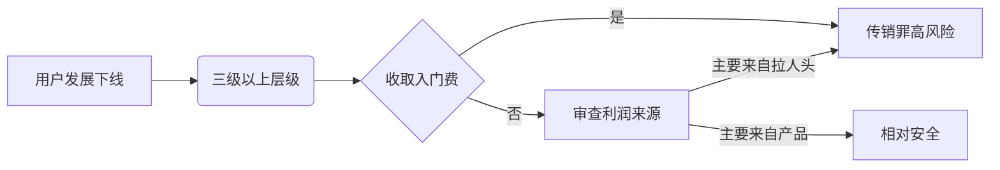

# WhitePeace

**GitHub ID:** Joe-Goldbug

**Telegram:** @null

## Self-introduction

主要技术栈包括TypeScript、React、Vite和Tailwind CSS，具备组件化开发、页面搭建、Web3钱包连接与合约交互等能力，能够独立完成前端架构设计、工程化配置和UI/UX实现，善于将新技术应用于实际项目。

## Notes

<!-- Content_START -->
# 2025-08-21

现阶段所有的股票代币化方案都面临着几个共同的、短期内难以解决的结构性障碍：

价值主张与实际流动性的矛盾: 当前所有平台都面临一个经典的“先有鸡还是先有蛋”的困境。一方面，对于已经能够便捷交易美股的用户而言，代币化股票的价值主张模糊不清。链上交易不仅未能提供更优的费率，反而因为流动性匮乏而导致更高的交易滑点，体验远逊于成熟的互联网券商。另一方面，正是因为缺乏足够强大的价值主张来吸引大规模用户和资本入场，链上流动性才迟迟无法深化，形成了一个自我强化的负反馈循环：没有用户就没有流动性，没有流动性就更吸引不来用户。除非能为存量用户提供不可替代的全新效用，否则很难打破这一僵局。
结构性缺陷: 目前的代币化股票本质上只是真实股票的“数字孪生”，但这种复制存在根本性缺陷。首先，24/7 交易的承诺很大程度上是虚幻的。当底层股票市场（如纳斯达克）休市时，链上做市商无法对冲其风险敞口，只能通过极端扩大价差或直接撤出流动性的方式来规避风险，这使得周末和盘后交易的有效性大打折扣。其次，这些代币剥离了完整的股东权利。用户获得的是对股票经济价值的索取权，而非包括投票权在内的完整所有权。
“去中心化”外衣下的中心化风险: 尽管运行在去中心化的区块链上，但这些 RWA 模型的信任根基却高度集中于一系列链下实体。无论是发行代币的 SPV、负责资产托管的第三方银行、执行交易的合作券商，还是连接法币与加密世界的桥梁，每一个环节都是一个潜在的中心化故障点。这些中心化实体一旦出现运营失败、法律纠纷、甚至破产倒闭，链上的代币都可能瞬间丧失价值支撑。
DeFi 可组合性的潜在悖论: 对于 xStocks 这类开放式模型而言，其终极愿景是成为 DeFi 世界的“金钱乐高”。然而，这种可组合性面临一个严峻的悖论。一个 DeFi 借贷协议在考虑是否接受 TSLAx 作为抵押品时，不仅要评估特斯拉股票本身的价格波动风险，还必须评估其代币化结构所带来的平台风险——即发行方 Backed Finance 或其托管方违约的风险。这种“资产风险 + 平台风险”的双重风险敞口，使得 DeFi 协议在整合这些 RWA 资产时极为谨慎。此外，这些代币模糊的法律地位也让 DeFi 协议望而却步，担心会因“非法经营证券业务”而招致监管打击。这解释了为何至今仍未有主流 DeFi 协议将它们作为核心抵押品，其通往真正可组合性的道路依然漫长。

# 2025-08-20

以太坊微策略BitMine模式分析：“以股换币”的反身性飞轮能否长期运转？

美国上市公司BitMine Immersion Technologies（BMNR）效仿MicroStrategy，通过股权融资增持以太坊（ETH），打造"ETH财库"。其股价因持仓增长和融资进展波动，但依赖"以股换币"的反身性飞轮模式，需维持市场溢价（mNAV>1）才能持续增厚每股ETH价值。核心风险包括ETH价格回调、市场承接力减弱、监管不确定性及壳公司信任危机，若溢价消失或市场预期反转，可能引发估值崩盘。该模式依赖市场信任，长期可持续性存疑。

美国上市公司 BitMine Immersion Technologies（BMNR）正试图复制 MicroStrategy 式路径 — — 用股权融资快速增持以太坊，把资产负债表打造成“ETH 财库”。转型宣布后，股价先冲高，随后大幅回落并进入一段时间的区间震荡；其后在持仓与融资进展推动下再度上攻、再现回吐。与此同时，由于持续执行 ATM 增发，流通股本不断放大，市值随发行节奏呈动态扩表。本文聚焦 BMNR 自身结构：这套“以股换币”的反身性飞轮能否长期运转？当 mNAV（EV/ETH，其中 EV = 市值 + 有息债务 − 现金）溢价收敛、二级市场承接转弱时，会不会从“每股增厚”切换为“净稀释”？下文据公开披露与链上口径系统梳理其关键风险。

核心数据：ETH 储备、股本与溢价水平
首先来看 BMNR 的基本面数据。截至 2025 年 8 月中旬，BMNR 已持有约 129.7 万枚 ETH，按当时市价价值约 57.7 亿美元。这一规模使 BMNR 成为全球第三大的加密资产储备公司，仅次于 MicroStrategy 及 MARA。流通股本约 1.735 亿股。股价方面，8 月阶段自低点 30.30 美元持续走高至阶段高点 71.74 美元（区间涨幅约 136.8%），其后回落至周五收盘 57.81 美元（较阶段低点仍上涨 90.8%，较阶段高点回撤约 19.4%），对应市值约 100.3 亿美元。按 mNAV =（市值 + 债务 − 现金）/ ETH 持仓市值并以周五收盘口径计算（市值 100.3 亿美元、债务约 188 万美元、现金约 147 万美元、ETH 持仓市值约 57.7 亿美元），mNAV 约为 1.74。

8 月初的走强主要受一系列催化驱动：7 月 23 日股票期权上市提升交易与对冲工具可达性，7 月 29 日董事会通过最高 10 亿美元回购计划，8 月 4 日披露持仓突破 83.3 万枚 ETH，8 月 11 日披露突破 115 万枚 ETH 后，市场对“以股换币”节奏的预期被持续上修。随后的回落主要由溢价（以 mNAV 衡量）阶段性过度扩张引发的估值向 NAV 的均值回归所驱动，在 ATM 供给预期上升与二级市场承接转弱的共振下加速，并叠加 ETH 回调。

结构机制：期权杠杆与 mNAV 溢价飞轮
公司于 7 月中旬披露，其约 6 万枚 ETH 持仓来自已处于价内状态的期权，并由约 2 亿美元 unencumbered cash 按 1:1 进行资产背书；但此后官方披露口径调整为以“tokens”计的总 ETH 持仓数据（如 8 月 4 日为 833,137 枚，8 月 11 日为 1,150,263 枚），未再单独列示“包括期权”项，亦未发布期权行权完成的独立公告。综合当前信息，暂无明确官方文件宣布已完成行权。不过结合披露口径的变化、对应的现金能力，以及持仓节奏判断，该 6 万枚 ETH 极有可能已于 7 月 17 日后以行权或等值现货替代方式转为现货，最终仍需等待下一份季度报告或 8-K 中的衍生品附注予以确认。

BMNR 的核心在于其 mNAV（市场净资产值倍率）驱动的反身性飞轮机制：当股价 P 高于每股净资产 NAV（即 mNAV > 1）时，公司可通过 ATM 机制在溢价区间内增发融资，并将所得资金用于购买 ETH，从而提高每股 ETH 持仓，带来账面增厚（accretion）。理论上，只要维持 P > NAV，每次融资都将推升每股资产值。然而，该模式的本质是一种结构性权益重分配：即使存在溢价，若市场对“持续换币实现增厚”的逻辑产生质疑，增发行为也可能被重新定价为稀释行为，从而压制整体估值水平。

在飞轮正向运行阶段，其路径为：mNAV 上行 → ATM 融资 → 增持 ETH（每股 ETH 上升）→ 市场叙事强化与估值抬升 → 再次融资，形成正反馈循环。反之，该机制的失效可能由以下因素触发：mNAV 收敛至 1 或低于 1、ETH 本体价格下行、二级市场承接疲软，或 ATM 增发供给预期上升等。一旦市场预期发生切换，飞轮机制将从“增厚”转向“稀释”，形成负向反馈。在此情形下，公司往往需通过回购等手段对冲稀释影响，以维持每股指标稳定，但其执行能力将受到未受限现金储备与融资到账速度的实际制约。

因此，该模式的持续性取决于三项关键因素：一是市场对其 ETH 财库逻辑与资产溢价定价基础的信任程度；二是 ETH 本体价格的持续支撑作用；三是公司在内部执行层面的协同效率，涵盖 ATM 签约与资金到账节奏、大宗 ETH 的OTC采购能力，以及质押收益的再投入机制等关键操作环节。

# 2025-08-19

行业动态——「以太坊将是华尔街与人工智能的交汇点。」

这一论断看似激进，毕竟以太坊网络目前的主要活动仍围绕加密货币用户间的代币交易展开。但在 Tom Lee 眼中，其底层逻辑不言而喻：与比特币不同，以太坊不仅是一种货币，更是可编程的分布式账本。名为「智能合约」的软件程序能在其上自动运行，无需银行介入即可完成交易处理、利息支付或贷款管理等操作。

人们用它兑换加密货币、转移稳定币或获取加密抵押借贷，每笔操作都需支付以太坊作为手续费。依赖其基础设施的企业与项目越多，对以太坊的需求便越旺盛。若悄悄囤积以太坊的企业资金管理者判断正确，他们不仅能从价格上涨中获利，更能在未来金融体系成型前抢占架构先机。

尽管按链上交易额计算，以太坊仍是最活跃的区块链，但它正面临双重挑战：一方面，Solana 等竞争对手凭借更快速度与更低成本崛起（其价格今年创下新高）；另一方面，市场始终缺乏持续入场的坚定买家。Tom Lee 与以太坊联合创始 Joe Lubin 认为，企业储备计划是解决需求问题的结构性方案—— 通过锁定供应，为市场筑牢底部支撑。

「目前流通的以太坊仍数量庞大，」Lubin 在 7 月接受彭博社采访时表示，「这就像一场竞赛：如果我们和更多项目锁定大量以太坊，将极大改善供需格局。」

然而，这一愿景正遭遇另一种阻力：金融巨头们纷纷打造私有「区块链轨道」。稳定币发行商 Circle 正构建自有网络，通过降低费用、留存客户，绕开以太坊倡导的共享基础设施模式。若这种私有化趋势持续，以太坊可能被排除在自己渴望赋能的系统之外。据彭博终端报道，支付巨头 Stripe 也在采取类似行动。

企业储备以太坊的策略，直接借鉴了比特币最知名的推广者 Michael Saylor。2020 年，Saylor 将 Strategy Inc. 转型为准比特币 ETF，累计囤积价值 720 亿美元的比特币。比特矿场的规模虽小（仅占以太坊流通量的 1%），但野心不小：锁定足够多的资产，让稀缺性成为天然护城河。Tom Lee 预测，若华尔街大举入局以太坊项目，其价格可能从当前约 4300 美元飙升至 6 万美元。不过，Saylor 的成功恰逢加密货币历史性牛市，以太坊能否复制这一路径仍存疑问。

「Strategy 的 Michael Saylor 用四年时间证明，持有底层资产价值巨大；而通过以太坊储备策略，借助流动性良好的上市公司，能为股东创造远超底层资产本身的价值。」Sharplink Gaming 的 co-CEO Joseph Chalom 在彭博电视节目中表示。这位前贝莱德高管曾助力全球最大资管公司推出以太坊 ETF（代码 ETHA），如今 SharpLink 已累计持有超 30 亿美元以太坊。

支持者认为，数据对以太坊而言颇具优势：以太坊的发行量本就较低，且每笔交易手续费的一部分会被永久销毁，长此以往，其总量甚至可能缩减；而企业的长期储备行为，将进一步加剧这种稀缺性。但持怀疑态度者则指出另一种周期性风险：企业持有者买入时有多果断，抛售时就可能有多迅速，这或将放大市场的下行波动。

「加密圈青睐储备型企业，是因为觉得它们只会持续买入持有，」哥伦比亚商学院兼职教授 Omid Malekan 分析道，「但天下没有免费的午餐。多数人忽略了一种可能：未来若遇加密熊市，这些企业或许会开始抛售。」

相较于比特币，以太坊的一大优势在于「质押」机制 —— 锁定以太坊助力网络运行，即可获取收益。这使其从静态商品转向类似分红股票的收益型资产。但目前，主流 ETF 投资者尚无法直接获取这部分收益。

据 7 月监管文件显示，贝莱德正与其他发行商共同推动为 ETHA 产品添加质押功能，这意味着散户投资者有望通过单一产品同时获取价格收益与质押回报。该基金在一年多时间内规模已达 160 亿美元。

尽管以太坊生态活跃，它尚未渗透到日常金融场景：如支付、购物或储蓄，华尔街的许多代币化项目仍处于测试阶段。但 Tom Lee 认为转变已在发生：人工智能公司、支付企业与大型金融机构正率先在以太坊上构建应用。

「我看到多重趋势正将以太坊推向未来 10 至 15 年最重要的宏观交易风口。」他说。

如今，以太坊的支持者已从银行研究部门延伸至政治领域：与特朗普阵营关联的去中心化金融企业 World Liberty Financial 今年披露购入数百万美元以太坊；美国比特币公司（American Bitcoin Corp.，一家与特朗普家族相关联的比特币矿业公司）联合创始人 Eric Trump 公开为其涨势喝彩；渣打银行将年末目标价从 4000 美元上调至 7500 美元；方舟投资管理公司也上调了长期预期。

价格涨幅真实存在，企业持仓确凿无疑，信念也足够坚定。但对以太坊的真正考验并非能否继续上涨，而是能否站稳脚跟 —— 企业能否挺过下一轮暴跌，代币能否超越投机工具的定位。

「金融机构视以太坊为自然之选，」以太坊基金会执行董事 Tomasz Stańczak 表示，「他们清楚需要构建哪些产品、可优化哪些环节，以及在哪里能实现效率跃升。」

# 2025-08-18

跳出扩容围城：ZK 的三个高潜力战场
当我们不再仅仅将 ZK 视为“压缩工具”时，其作为“信任工具”的本质便显现出来。这为我们揭示了三个亟待爆发、且更符合 Crypto 原教旨主义精神的领域：

1. 可验证计算 (Verifiable Computation)：重塑数据与计算的信任根基

想象一个场景：一个复杂的机器学习模型或一个精密的金融风险模型在云端服务器上运行，它如何向你证明其计算过程是准确无误、且未被恶意篡改的？在传统的 Web2 架构中，我们只能选择“相信”服务提供商。

ZK 技术彻底改变了这一游戏规则。通过零知识证明，计算任务的执行方可以生成一个证明，证实其完全按照预设的程序执行了计算，并将结果诚实地返回。验证方无需重新执行整个耗时耗力的计算过程，只需验证这个轻量的证明，就能对结果建立起数学级别的信任。

这不仅仅是技术上的炫技。它将解锁去中心化物理基础设施网络（DePIN）、去中心化科学（DeSci）以及更公平的数字广告市场。例如，Modulus Labs 正在探索的 ZKML（零知识机器学习）领域，允许 AI 模型的推理过程被验证，用户可以确信自己收到的 AI 生成结果并未被审查或操纵。而像 RISC Zero 这样的项目，通过构建通用 ZK 虚拟机（zkVM），让任何类型的计算都能生成 ZK 证明，为去中心化的、可验证的云计算打开了大门。 当计算过程本身变得可信且可验证时，我们就不再需要依赖于中心化的品牌或机构作为信任中介，一个真正点对点的、无需许可的计算市场才有可能形成。


2. 去中心化身份 (DID) 与链上信誉：构建你的 Web3 原生护照

在当前 Web3 世界，我们的“身份”被粗暴地简化为了一个钱包地址。这个地址记录了我们的资产和交易历史，但它无法承载我们复杂的社会关系、专业成就或信誉评分。

ZK-DID 允许用户在不泄露具体个人信息的前提下，有选择性地证明自己的属性。例如：

向 DeFi 协议证明你的信用评分高于某个阈值，从而获得更优的借贷利率，而无需暴露你的全部资产状况。
在 DAO 治理投票中证明你是一个真实、独立的用户，而无需透露你的身份。
向一个游戏平台证明你已年满 18 岁，而无需出示你的身份证号码。
这种“选择性披露”的能力，是构建一个既能保护用户隐私、又能建立复杂社会协作的 Web3 生态的关键。这并非空想，Polygon ID 已经为此构建了一整套开源框架，让开发者可以轻松集成 ZK 身份验证功能。而像 zkMe 这样的项目则专注于提供去中心化的 KYC 解决方案，用户只需验证一次，即可在整个 Web3 世界中匿名证明自己的合规身份。即便是像 Worldcoin 这样的大规模社会实验，其核心也是利用 ZK 技术来确保用户的“人格证明”与其链上行为相分离，保护个人隐私。 它将催生出原生的链上信誉系统，让我们的数字身份不再仅仅是一个冰冷的地址，而是一个丰满、立体、且由自己主权的“灵魂”。


3. 真正的链上隐私：从透明到“可控透明”

以太坊的透明性是一把双刃剑。它保证了系统的公正和可审计性，但也让所有用户的财务状况暴露在阳光之下。隐私币（如 Zcash）早已展示了 ZK 在交易隐私方面的威力，但其生态相对孤立。

未来的趋势，是将隐私功能以“可选”或“默认”的形式，无缝集成到主流的智能合约平台中。想象一下，企业可以在链上进行机密的供应链金融结算；DAO 组织可以进行匿名的薪酬发放；个人用户可以进行私密的资产转移。

在这条赛道上，Aztec Network 正是先行者，它通过构建一个加密的 ZK-Rollup，旨在为以太坊带来一个原生的隐私层，让用户可以在熟悉的 DeFi 应用中进行保密交易。此外，像 Aleo 这样的 Layer 1 公链，更是从底层架构开始就为隐私而设计，目标是打造一个默认私有的智能合约平台。 这需要我们从追求“完全透明”的思维定式，转向追求“可控透明”——即数据默认私有，但所有者可以根据需要，向特定方（如审计机构）授予查看权限，并生成相应的 ZK 证明来证实合规性。这才是 ZK 技术在金融乃至社会治理层面最深刻的变革。

ZK-Rollups 的成功，是 ZK 技术在“工具理性”层面的巨大胜利。它高效地解决了行业最紧迫的痛点。然而，Crypto 的星辰大海，最终要回归到“价值理性”的探索——我们究竟想用这些强大的工具，构建一个怎样的世界？

我坚信，ZK 技术的最终使命，是赋予个体前所未有的数字主权。它让我们有能力在不牺牲隐私的前提下参与数字经济，有能力验证我们所依赖信息的真伪，有能力构建一个不由中心化巨头定义、而是由数学和共识保障的信任互联网。

# 2025-08-16

we’re building a hormone tracker software for women with fertility challenges. She inputs results for six key hormones and sees a visual chart of what’s happening inside her body month to month. AI then analyzes the data and recommends personalized protocols — from diet and supplements to IVF drugs or even TCM — to help bring hormones into balance and improve fertility outcomes.

# 2025-08-15

“Web3底层逻辑就是金融”这一观点，结合当前“资金向美股转移”的现象，背后隐藏着Web3与传统金融融合的结构性变革机会。这既揭示了行业本质，也暗示了普通人可参与的创业切口。以下从趋势本质、创业机会、风险规避三方面展开分析：

---

1. Web3的核心是价值流动重构
   Web3的底层逻辑确实是金融，但并非传统金融的简单复制，而是通过区块链实现**资产确权透明化、交易无边界化、协作去中介化**。当前资金向美股转移（如代币化美股规模突破数亿美元），本质是Web3在寻求与传统金融的合规接口，以解决自身波动大、应用场景窄的痛点。  
   - **案例**：MyStonks平台允许用户用稳定币直接交易特斯拉股票代币，突破地域限制，24小时交易。  
   - **潜台词**：Web3需要锚定实体资产（如美股）来提升稳定性，而传统金融需要Web3的技术实现全球化流动性——两者融合是必然。

2. **资金转移的深层动因：合规收益与用户需求**  
   - **机构需求**：贝莱德等机构通过比特币ETF入场后，进一步要求“合规资产+链上收益”，代币化美股满足这一诉求；  
   - **散户需求**：新兴市场用户借道Web3避开本国资本管制，参与美股投资（如巴西用户通过Backed Finance购买苹果股票）。

---

### 🚀 二、**普通人的创业机会：聚焦“融合缝隙”**
传统金融巨头（如贝莱德）和Web3原生项目（如Ondo）主导基础设施，但**中间层服务、垂直场景工具、合规桥梁**等领域仍有平民化机会：

#### ✅ **机会1：代币化美股的“服务生态”建设**（轻资产、高需求）  
   - **痛点**：当前平台如MyStonks仅支持基础交易，缺乏税务工具、跨平台聚合器、对冲衍生品。  
   - **创业方向**：  
     - **税务合规SaaS**：自动计算不同国家用户交易代币化美股的资本利得税（如美国1099表、欧盟DAC7）；  
     - **跨平台交易终端**：聚合Ondo、Backed、MyStonks等平台的代币化股票报价，一键比价下单；  
     - **微对冲工具**：为散户提供期权合约组合，对冲美股隔夜波动风险（如利用Chainlink预言机触发自动平仓）。  

#### ✅ **机会2：RWA（真实世界资产）的“本地化入口”**（低成本获客）  
   - **案例参考**：Block Street允许用户抵押代币化美股借出稳定币，但仅支持主流资产。  
   - **创业机会**：  
     - **区域资产代币化**：聚焦本地高需求资产（如东南亚房地产REITs、拉美国债），通过合规SPV结构上链；  
     - **法币-稳定币通道**：与本地支付商合作，允许用户用印尼盾、巴西雷亚尔直接购买锚定美股的代币（类似Infini卡模式，但更垂直）。

#### ✅ **机会3：传统金融机构的Web3“技术外包”**（B端服务）  
   - **需求背景**：银行、券商需快速接入链上服务，但自研成本高（如瑞银计划推出代币化基金）。  
   - **创业方向**：  
     - **合规中间件开发**：  
       - 帮助机构生成MiCA、SEC合规报告；  
       - 集成Chainalysis反洗钱工具链上版。  
     - **流动性桥接协议**：  
       - 类似Orbiter Finance为上市公司提供跨链稳定币清算，但专注传统金融场景。

---

### ⚠️ 三、**风险与壁垒：普通人如何规避？**
| **风险类型**      | **具体挑战**                  | **规避策略**                     |
|-------------------|-----------------------------|--------------------------------|
| **合规风险**       | 代币化股票可能被认定为证券   | 选择已明确监管的地区（如瑞士、新加坡）落地，采用“非托管”架构（用户资产直连合规托管方） |
| **巨头挤压**       | Coinbase、Robinhood快速复制功能 | 聚焦垂直场景（如“巴西用户美股投资”全流程服务），建立本地化合作伙伴壁垒 |
| **技术依赖**       | 依赖公链性能（如Solana宕机影响交易） | 多链部署（Injective+Polygon），前端隐藏技术复杂性 |

---

### 💎 四、**普通人行动建议：从“生态位”切入**
1. **短期**：  
   - 开发**链上美股税务工具**（集成TurboTax API），收取SaaS订阅费；  
   - 成为**区域合规服务商**（如帮东南亚券商接入Backed Finance API）。  
2. **中期**：  
   - 与本地银行合作发行**锚定美股的稳定币储蓄卡**（借鉴Infini Card，但绑定股票代币）；  
   - 构建**RWA数据门户**，监控代币化房产、债券的链上抵押率波动。  
3. **长期**：  
   - 推动**DAO治理的地方资产代币化**（如众筹购买曼谷商圈地产并上链分红）。

---

### 🔚 总结
他试图点明：**Web3的终局不是取代传统金融，而是成为其全球化、数字化的“加速器”**。  
- 对普通人：避开底层协议（被巨头垄断）和纯C端应用（红海竞争），**抓住“合规对接、本地化服务、B端技术外包”三缝隙**；  
- 关键公式：**创业机会 = 传统金融需求 × Web3技术优势 × 合规创新**。  

> 正如代币化股票从“合成资产”升级为“实股托管”的路径，普通人创业也需从边缘实验走向合规落地——这是资金流动的方向，也是生存的必然。

# 2025-08-14

投资平权的概念与现有工具
投资平权旨在通过数字化工具消除散户与机构的差距，提供平等的数据访问、教育和决策支持。关键趋势包括：

数字化平台赋能：AI和移动应用降低门槛，帮助散户导航经济不确定性。平台如Robinhood和eToro允许散户模仿专业交易，使用AI工具实现自动化。
替代投资访问：散户正转向私募股权、债券和加密。平台如Public.com降低债券门槛，提供高达9%收益率；Schwab引入替代投资平台，门槛仅5百万美元。
AI与研究工具：AlphaSense和Philo等平台为散户提供投资研究，整合AI分析。2025年，散户使用AI工具超越基金经理。
监管与社区推动：ESMA调查显示，规则有时阻碍散户；X讨论呼吁分式所有权、加密/股票整合，以实现全球访问。

这些工具证明，平权可以通过低门槛数据和教育实现，散户分配到私募资本预计到2030年增长至2.4万亿美元。
基于TradingView的差异化开发方向
在TradingView基础上开发，可保留其核心图表功能，同时聚焦平权创新。差异化方向强调免费/低成本一手数据、简化体验和散户赋能。以下是关键方向：
1. 简化界面与教育整合（User-Friendly Onboarding）

方向：开发移动优先App，整合AI教程和模拟交易，降低学习曲线。添加一键数据访问，避免付费墙。
差异化：不同于TradingView的复杂脚本，提供预设模板和语音指导。X用户建议分式所有权和FX即时转换。
平权影响：让初学者快速获取实时数据，模拟机构分析工具。
示例竞争品：TrendSpider提供无广告高级体验；Forex Tester聚焦回测。

2. 免费/低成本实时数据访问（Data Democratization）

方向：与开源数据源或DeFi协议整合，提供免费实时股票/加密数据。开发API桥接，绕过交易所付费。
差异化：针对新兴市场散户，添加多链支持（如SuiNetwork）。避免TradingView的延迟问题。
平权影响：散户如机构般访问一手数据，减少信息滞后。X讨论强调准确定价和全球访问。
示例竞争品：Koyfin免费替代Bloomberg；VectorVest简化屏幕时间。

3. AI驱动洞察与自动化（AI-Powered Insights）

方向：嵌入AI信号生成、风险评估和自动化再平衡。开发散户专属AI投资组合，门槛低至10K美元。
差异化：超越TradingView的图表，添加预测模型和社交复制交易。针对衍生品添加冷却期和杠杆限制。
平权影响：AI帮助散户超越基金经理，2025年散户表现优异。
示例竞争品：eToro的AI组合；3Commas自动化策略。

4. 社区与社交增强（Community-Driven Features）

方向：扩展TradingView社交，添加散户专区、实时讨论和众包指标。整合加密/股票同一平台。
差异化：焦点于风险教育和阶层访问（如基于净值分级F&O）。X反馈呼吁2FA和低费用。
平权影响：社区降低孤立感，促进知识共享。
示例竞争品：Dealerify免费指标；Bluefin App简化DeFi。

5. 新兴资产与全球访问（Emerging Assets Focus）

方向：专攻债券、私募或加密，降低门槛（如微投资）。开发跨链工具，针对新兴市场。
差异化：不同于TradingView的股票焦点，提供Treasuries低门槛访问。
平权影响：散户进入机构主导领域，如私募增长。
示例竞争品：CryptoWatch加密图表；Public.com债券工具。

# 2025-08-13

# TradingView 产品调研报告

## 一、产品概述
**TradingView** 是一款全球领先的金融可视化分析平台，成立于2011年，集**多市场图表分析**、**量化策略开发**和**交易者社交网络**于一体。截至2025年，其用户量已突破3000万，覆盖股票、外汇、期货、加密货币等资产类别，核心定位是“从想法到执行，只需一屏”的一体化交易决策平台:cite[1]:cite[7]。

## 二、核心功能分析
### 1. 图表与指标系统
- **多类型图表**：支持K线图、线图、Renko、Kagi等12+图表类型，支持自定义周期与K线回放功能:cite[1]:cite[6]。
- **技术指标库**：
  - 内置100+指标（如MA、RSI、布林带等）
  - 集成超10万个社区贡献的Pine Script自定义指标:cite[1]:cite[9]。
- **高级绘图工具**：提供110+绘图工具（趋势线、斐波那契回撤、江恩角度线等），支持自动形态识别（如头肩顶）:cite[10]。

### 2. 策略开发与回测
- **Pine Script语言**：专属脚本语言，支持编写自定义指标、警报条件和量化策略，语法简洁且支持云端保存:cite[1]:cite[4]。
- **策略回测引擎**：基于历史数据模拟交易，输出盈亏比、最大回撤等绩效报告，支持参数优化:cite[1]:cite[9]。
- **机器学习整合（2025年新增）**：  
  - 止损/止盈参数优化引擎  
  - 基于scikit-learn的策略超参数优化  
  - 次日收盘价预测模型（集成多因子分析）:cite[4]

### 3. 社交与协作生态
- **观点共享**：用户可发布带图表的交易观点，支持评论、点赞和订阅:cite[2]。
- **脚本市场**：公开分享Pine Script策略，社区用户可复用或评分:cite[1]。
- **实时热力图与情绪分析**：加密货币热力图、市场恐慌指数（VIX）可视化等:cite[3]:cite[7]。

### 4. 多市场数据覆盖
| **资产类别**       | **代表品种**                                                                 | **数据来源**                              |
|---------------------|-----------------------------------------------------------------------------|------------------------------------------|
| 加密货币           | BTC/USDT, ETH/USDT（支持Binance等交易所实时数据）                          | CME, NYMEX, 交易所API                    |
| 股票               | 美股、港股、A股（部分）                                                    | 全球70+交易所                            |
| 外汇与大宗商品     | EUR/USD, 黄金, 原油                                                        | 机构级数据合作伙伴                       |
| 期权               | 支持CME, CBOT等交易所合约（2025年新增期权策略构建器）:cite[5]         | 交易所直连                               |

### 5. 交易执行与警报
- **券商集成**：支持OANDA、Alpaca、币安等券商一键下单:cite[1]。
- **智能警报系统**：支持价格、指标、Pine脚本触发，推送方式涵盖邮件、APP通知、Webhook:cite[6]:cite[9]。
- **移动端适配**：iOS/APP应用支持实时图表同步与警报接收:cite[3]。

## 三、技术架构亮点
- **云端渲染引擎**：浏览器直接访问，无需下载软件，图表设置实时同步云端:cite[1]。
- **高性能计算优化**：  
  - 向量化运算与并行处理加速回测  
  - 增量计算减少重复I/O:cite[4]。
- **跨平台支持**：Web/桌面端/移动端三端数据同步:cite[2]。

## 四、商业模式
采用**Freemium分层订阅**模式：  
| **版本**      | **免费版**       | **Pro（$14.95/月）** | **Premium（$29.95/月）** |
|---------------|------------------|----------------------|--------------------------|
| 图表数量      | 1                | 5                    | 8                        |
| 指标叠加      | ≤3个             | 无限制               | 无限制                   |
| 警报类型      | 基础价格警报     | 支持Pine脚本警报     | +Webhook通知             |
| 数据延迟      | 部分市场有延迟   | 实时数据             | 实时数据+高级数据源      |
*数据参考2025年定价:cite[1]:cite[8]*

## 五、用户群体分析
- **加密货币交易者**：占比超40%，依赖多币种K线与波动率分析:cite[3]:cite[7]。
- **量化开发者**：使用Pine Script构建策略原型，占比约15%:cite[4]。
- **社交型投资者**：活跃于观点分享，新手占比30%:cite[2]。

## 六、竞争对比
| **维度**       | **TradingView**              | **MetaTrader 4/5**         | **Thinkorswim**           |
|----------------|------------------------------|----------------------------|---------------------------|
| 适用市场       | 多资产（股票/币/外汇/期权）  | 外汇/CFD为主               | 美股为主                  |
| 技术分析扩展   | Pine Script自定义指标        | MQL脚本支持                | 有限                      |
| 社交功能       | 强（观点共享+社区脚本）      | 无                         | 弱                        |
| 部署方式       | 云端+多端同步                | 需下载本地客户端           | 桌面客户端                |
*数据综合:cite[1]:cite[2]:cite[8]*

## 七、发展趋势（2025年动态）
1. **期权策略构建器（Options Beta）**：  
   - 自定义多腿期权策略（如跨式组合）  
   - 支持波动率分析与Greeks指标:cite[5]。
2. **AI整合深化**：  
   - 策略参数自动优化（如夏普率最大化）  
   - 预测模型加入链上数据因子（加密货币专用）:cite[4]:cite[9]。
3. **券商合作扩展**：  
   - 与Spreadex合作推出点差交易，免税优势吸引欧洲用户:cite[5]。

## 八、总结与挑战
**核心优势**：  
✅ 全球最完善的图表分析生态（技术工具+社交）  
✅ Pine Script降低量化策略开发门槛  
✅ 多市场数据整合能力（尤其加密货币）  

**主要挑战**：  
❌ 免费版功能限制较多（如指标数量、数据延迟）  
❌ 期权等新功能仅支持部分交易所:cite[5]  
❌ 机器学习模块需付费订阅:cite[4]  

> **调研结论**：TradingView已成为**零售交易者的基础设施级工具**，其“分析-策略-执行-社交”闭环在2025年持续领先。未来增长点在于AI策略工具平民化与机构级数据合作深化。

# 2025-08-12

# 智能合约基础笔记
## 1. 合约地址与类型
- **地址类型**：包括合约地址、外部账户地址（EOA，即普通钱包地址）等。
- **合约组成**：
  - 包含数组、基本类型（如整数、布尔值等）及方法函数。
  - 使用函数修饰符（如`public`、`private`、`view`等）。
- **与传统开发相似性**：逻辑结构类似，但运行在去中心化环境中。
## 2. 合约结构
- 以 `contract` 关键字开头（例如：`contract MyContract { ... }`）。
- 包含：
  - **状态变量**：存储在链上的永久数据。
  - **方法函数**：修改或读取状态的函数。
  - 逻辑集中，相比Rust等语言的区块链开发（如Solana）更易学习。
## 3. Gas 机制
- **概念类比**：Gas是以太坊交易执行的“燃料”，类似汽车消耗汽油。
- **消耗场景**：每笔修改链上状态的交易都需消耗Gas。
- **计算方式（EIP1559之后）**：
  ```
  总费用 = (基础费用 + 小费) * Gas用量
  ```
  - **基础费用**：由网络自动计算（根据拥堵程度）。
  - **小费（Priority Fee）**：用户额外支付以激励矿工优先打包。
- **拥堵影响**：
  - 网络拥堵时基础费用上升。
  - 矿工优先打包高小费交易，导致小额交易成本剧增。
## 4. 存储消耗
| 存储类型       | 消耗成本 | 说明                         |
|----------------|----------|------------------------------|
| 永久存储（Storage） | 极高     | 数据永久写入区块链，修改成本高 |
| 临时存储（Memory）  | 低       | 函数执行期间临时使用           |
| 调用数据（Calldata）| 最低     | 只读的临时数据                 |
> ⚠️ 开发建议：尽量减少对永久存储的写入操作。
## 5. 合约优化与安全
- **优化重要性**：Gas优化直接影响用户使用成本。
- **安全关键性**：智能合约漏洞常导致资金被盗（如重入攻击、溢出等）。
- **典型案例**：The DAO攻击、Poly Network漏洞等。
## 6. 事件与日志
- **记录方式**：
  1. 定义事件：`event Deposit(address indexed user, uint amount);`
  2. 触发事件：`emit Deposit(msg.sender, 100);`
- **数据获取**：
  - 日志数据存储在区块中，可通过节点RPC扫描获取。
  - 前端Dapp解析日志后展示给用户。
- **索引作用**：`indexed`参数可建立索引，加速日志过滤查询。
## 7. 以太坊改进协议（EIP）
| 协议       | 类型          | 作用                          |
|------------|---------------|-------------------------------|
| EIP1559    | 费用机制      | 改革Gas费结构                 |
| ERC20      | Token标准     | 同质化代币规范                |
| ERC721     | Token标准     | 非同质化代币（NFT）规范       |
| ERC1155    | Token标准     | 多类型代币混合标准            |
| ERC4626    | DeFi标准      | 收益金库（Vault）接口         |
- **学习途径**：
  - [EIP Finder](https://eips.ethereum.org/) 查询协议详情。
  - 参考 [OpenZeppelin合约库](https://github.com/OpenZeppelin/openzeppelin-contracts)。
## 8. 金融合约示例（ERC4626金库）
```solidity
contract SimpleVault is ERC4626 {
    uint256 public constant BPS = 10000; // 基础单位（1 = 0.01%）
    uint256 public apr = 500; // 年化5% = 500 BPS
    // 存款：存入代币获取份额
    function deposit(uint assets) public {
        _deposit(msg.sender, assets);
    }
    // 取款：用份额换取代币
    function withdraw(uint shares) public {
        _withdraw(msg.sender, shares);
    }
    // 实时计算奖励（线性模型）
    function _beforeTokenTransfer(...) internal override {
        // 每次转账前更新利息
    }
}
```
## 9. 合约部署流程
1. **前置条件**：
   - RPC网络（如以太坊主网、Sepolia测试网）。
   - 私钥（用于签名交易，**切勿泄露**）。
2. **测试币获取**：
   - 测试网通过[水龙头](https://faucet.quicknode.com/)领取。
3. **部署方式**：
   - 推荐工具：[Remix IDE](https://remix.ethereum.org/)。
   - 安全提示：始终通过钱包交互部署（如MetaMask），避免私钥明文操作。
## 10. 前端交互要点
- **核心步骤**：
  1. 连接钱包（如ethers.js, web3.js）。
  2. 读取合约数据（调用`view`函数，无Gas费）。
  3. 提交交易（需支付Gas）。
- **SDK使用**：
  ```javascript
  // 示例：ethers.js读取余额
  const balance = await contract.balanceOf(userAddress);
  ```
- **ABI作用**：合约接口描述文件，前端通过ABI知道如何调用函数。
## 11. 收益计算 vs 现实场景
| 教学示例                | 真实DeFi场景               |
|-------------------------|----------------------------|
| 固定年化（如5%）        | 浮动利率（由市场供需决定） |
| 线性增长模型            | 复利/指数模型              |
| 无流动性要求            | 代币需在DEX中有深度流动性  |
## 12. 学习建议
- **入门路径**：
  1. 从DeFi协议入手（如Uniswap、Compound）。
  2. 使用VSCode + Solidity插件开发。
- **生态差异**：
  - NFT/GameFi：侧重资产所有权与交互逻辑。
  - SocialFi：结合社交行为与经济模型。

# 2025-08-11

### 一、专家咨询模式的根本性矛盾（Web3改造无效性分析）
#### ⚠️ 问题1：AI对咨询行业的替代性已成定局
| 传统专家服务场景       | AI替代性               | 现实案例                     |
|------------------------|------------------------|------------------------------|
| 通用策略报告生成       | **100%可替代**         | 量化交易AI自动生成回测报告   |
| 行业基础数据分析       | **80%+可替代**         | Bloomberg GPT处理投研数据    |
| **独家内幕信息获取**   | **不可替代但需合规**   | 持牌机构的内参服务           |

➠ **关键结论**：  
普通专家服务价值已被AI挤压至“非标信息获取”领域，而该领域**依赖强人脉/持牌资质**，与Web3技术无关。

---

#### ⚠️ 问题2：链上社交名片无法解决核心痛点
| 宣称的ZK解决方案      | 实际落地障碍                     | 本质矛盾                     |
|-----------------------|----------------------------------|------------------------------|
| 链上身份认证          | 专家权威需线下背书而非链上证明  | **信任来源错配**             |
| 咨询记录上链          | 高价值咨询涉及NDA禁止公开        | **商业机密 vs 链上透明**     |
| 代币激励体系          | B端客户拒绝用代币支付服务费      | **支付合规性冲突**           |

➠ **关键结论**：  
ZK技术仅解决“信息可验证性”，但专家咨询的核心痛点在于：  
1. **高价值信息非公开性**（与区块链透明性冲突）  
2. **服务交付依赖深度人际互动**（无法被技术简化）  

---

### 二、供需匹配平台的致命缺陷
#### 🔥 冷启动悖论（数据来自GlG专家平台）
| 指标                | 行业平均水平       | 创业团队瓶颈       |
|---------------------|--------------------|--------------------|
| 专家招募周期        | 6-12个月           | 无现成资源库       |
| 单专家获客成本      | $3000+             | 无资金储备         |
| 客户决策门槛        | 需≥3位备选专家     | 难建充足专家池     |

➠ **类比验证**：  
> 滴滴早期通过**出租车公司联盟**快速获得司机资源 → 专家平台需绑定头部机构（如麦肯锡）  
> **当前团队无机构合作基础**，从0搭建专家网络需$50万+种子资金

---

### 三、Web3资方视角的否定逻辑
#### 💸 估值模型排斥人力密集型业务

# 2025-08-10

### 一、专家咨询领域的现状与挑战  
- **AI 对传统咨询的冲击**：  
  - 用户可通过 AI 直接获取专业级方案（如量化交易策略+历史回测报告），成本低、效率高。  
  - 普通专家角色被大幅替代，**除非具备以下优势**：  
    ✓ 独家内幕消息渠道  
    ✓ 持牌资质/权威背书  

---

### 二、DePIN 赛道核心模式分析  
#### 模式 1：通用数据 + AI 增值  
- **数据特征**：公开易得（如网页信息、交通流量等）  
- **关键能力要求**：  
  ✓ **持续更新**：保证数据源的实时性与稳定性  
  ✓ **AI 蒸馏价值**：通过聚合分析提升数据决策价值（原始数据非壁垒，AI 提炼才是核心）  
- **典型案例**：[Hivemapper](https://hivemapper.com/)  
  - 数据源：司机行车记录仪实时上传  
  - 处理：AI 分析路况变化 → 生成动态地图  
  - 激励：贡献者获得代币奖励  
  - 产品本质：售卖「路况情报」而非原始录像  

#### 模式 2：稀缺数据 + 垂直场景  
- **数据特征**：一手独家、高稀缺性（需硬件设备采集）  
- **关键能力要求**：  
  ✓ **锁定强需求场景**：找到明确付费方与使用场景  
  ✓ **全球通用性**：解决方案可跨地域复用  
- **典型案例**：极飞科技（XAG 等农业科技公司）  
  - 数据源：无人机/物联网设备拍摄农田  
  - 处理：AI 识别作物病害、缺水等问题  
  - 付费方：农场主订阅报告  
  - **护城河**：数据本身具备不可替代性

# 2025-08-09

# 去中心化AI数据激励网络与专家服务平台

## 1. 产品概述

### 1.1 产品愿景
致力于构建一个去中心化的AI数据集交易平台和专家服务网络，通过区块链技术、ZK隐私保护和声誉系统，连接数据集创作者、AI专家和数据消费者，打造可信、透明、高质量的数据生态系统。

### 1.2 核心价值主张
- **专家身份保护**：通过ZK技术保护专家隐私，让专家安心参与平台服务
- **多元化专家认证**：支持质押和邀请两种专家认证方式，降低参与门槛
- **数据质量保障**：专家评分系统确保数据集质量，Challenge机制维护平台可信度
- **精准专家匹配**：为项目方提供精准的专家顾问匹配服务
- **声誉激励体系**：通过NFT/DID和声誉系统激励专家持续贡献
- **DePIN生态定位**：面向投资者的去中心化物理基础设施网络项目

### 1.3 目标用户
- **数据集专家**：各领域的专业人士，通过质押或邀请成为平台认证专家
- **数据消费者**：金融机构、AI模型开发者、研究机构、个人开发者
- **项目方**：需要专家咨询服务的区块链项目和传统企业
- **投资者**：关注DePIN赛道的投资机构和个人投资者

## 2. 市场分析与项目定位

### 2.1 问题定义
- **数据质量难以保证**：现有数据集缺乏专业评估，质量参差不齐
- **专家身份暴露风险**：专家不愿公开身份参与数据标注和评估
- **专家资源匹配困难**：项目方难以找到合适的专家顾问
- **缺乏可信激励机制**：现有平台缺乏有效的专家激励和惩罚机制
- **数据交易不透明**：传统数据交易缺乏透明度和可追溯性

### 2.2 解决方案
- **ZK隐私保护**：专家可匿名参与，保护身份隐私
- **双重认证机制**：质押认证和邮件邀请两种方式
- **Challenge体系**：类似Layer2的挑战机制确保服务质量
- **声誉NFT/DID**：链上身份标识和声誉积累
- **精准匹配算法**：基于专业领域和历史表现匹配专家

### 2.3 项目定位
- **DePIN赛道**：去中心化物理基础设施网络
- **面向投资者**：团队具备VC背景，专注投资者关系
- **B2B2C模式**：服务项目方，最终惠及终端用户

## 3. 核心功能需求

### 3.1 专家认证系统

#### 3.1.1 质押认证方式
- **质押要求**：
  - BTC质押：0.1 BTC
  - ETH质押：1.5 ETH
  - 其他条件：专业背景验证、历史记录审核
- **质押管理**：智能合约自动管理质押资产
- **解锁机制**：满足条件后可申请解锁质押资产

#### 3.1.2 邮件邀请方式
- **邀请流程**：平台主动邀请行业专家
- **身份验证**：通过邮箱和专业证书验证
- **知识上传**：专家可上传专业领域知识和经验
- **ZK证明**：链下声明专业证书，TLS加密验证

#### 3.1.3 ZK隐私保护
- **身份匿名化**：专家身份通过ZK证明保护
- **证书验证**：链下声明博士毕业证等专业证书
- **TLS加密信道**：服务端验证专家可靠性
- **隐私计算**：确保专家信息不被泄露

### 3.2 数据集交易系统

#### 3.2.1 数据集上传与管理
- **多格式支持**：支持各种数据格式上传
- **元数据标注**：详细的数据集描述和标签
- **版权保护**：确保数据创作者权益
- **预览功能**：提供数据样本预览

#### 3.2.2 交易机制
- **链上支付**：用户支付Token购买数据集
- **存储方案**：
  - 中心化存储：传统云存储服务
  - 去中心化存储：Arweave等分布式存储
- **NFT权限管理**：通过NFT标识数据集URL和访问权限
- **权限控制**：
  - 中心化：后台服务器权限管理
  - 去中心化：基于NFT的权限验证

#### 3.2.3 目标客户
- **金融机构**：量化分析、风险评估数据需求
- **AI模型开发者**：特定领域（如航空）的专业数据集
- **个人用户**：量化分析、研究项目等个人需求
- **研究机构**：学术研究和实验数据

### 3.3 专家评分与声誉系统

#### 3.3.1 评分机制
- **数据集评分**：专家对数据集质量进行专业评估
- **多维度评价**：准确性、完整性、时效性、实用性
- **加权评分**：基于专家声誉的加权评分算法
- **链上记录**：所有评分记录上链存储

#### 3.3.2 声誉系统
- **声誉积累**：基于评分质量和用户反馈积累声誉
- **NFT奖励**：优秀专家获得声誉NFT
- **DID标识**：链上去中心化身份标识
- **等级体系**：专家等级划分和权益差异

#### 3.3.3 激励机制
- **Token奖励**：基于评分质量和数量的Token激励
- **声誉提升**：优质服务提升专家声誉等级
- **优先权益**：高声誉专家享有优先匹配权
- **收益分成**：参与平台收益分配

### 3.4 Challenge挑战机制

#### 3.4.1 挑战流程
- **挑战发起**：用户对专家评分提出质疑
- **证据提交**：挑战者提供反驳证据
- **仲裁机制**：多方专家参与仲裁
- **结果执行**：自动执行挑战结果

#### 3.4.2 Slash惩罚机制
- **质押削减**：挑战成功后削减专家质押资产
- **声誉惩罚**：降低专家声誉等级
- **暂停服务**：严重违规暂停专家服务权限
- **黑名单机制**：恶意行为加入黑名单

#### 3.4.3 争议解决
- **多级仲裁**：初级、高级、终极仲裁机制
- **社区治理**：重大争议由社区投票决定
- **申诉流程**：专家可对处罚结果申诉
- **补偿机制**：错误处罚的补偿方案

### 3.5 专家服务与匹配

#### 3.5.1 专家联系服务
- **付费获取联系方式**：用户支付crypto获取专家联系方式
- **专家同意机制**：需专家同意才能提供联系方式
- **隐私保护**：保护专家个人信息
- **服务费分成**：平台与专家分成服务费

#### 3.5.2 项目咨询服务
- **需求匹配**：根据项目需求匹配合适专家
- **多元化服务**：
  - 数据集评分服务
  - 项目发展咨询
  - 技术方案评估
  - 市场策略建议
- **服务定价**：基于专家等级和服务复杂度定价
- **质量保障**：服务质量评估和反馈机制

#### 3.5.3 跨平台服务
- **外部平台合作**：为其他平台提供专家评分服务
- **API接口**：标准化的专家服务API
- **白标解决方案**：为合作伙伴提供定制化解决方案
- **收益分享**：与合作平台的收益分享模式

# 2025-08-08

# 🔐 Web3打工人法律风险控制指南
## 🌐 一、行业招聘现状
- **技术岗高薪趋势**：区块链安全专家年薪达`100-200万`（资深级），智能合约开发岗薪资普遍高于传统互联网30%
- **地域差异明显**：中国内地岗位萎缩（如徐州某项目明确拒绝远程/兼职），香港及合规区（日本、新加坡）岗位量增长40%
- **核心紧缺岗位**：合规官（需熟悉FATF标准）、链上数据分析师、智能合约审计员
## ⚖️ 二、五大刑事风险罪名
| 罪名                 | 触发场景                          | 关键法律边界                  | 规避建议                     |
|----------------------|-----------------------------------|-------------------------------|------------------------------|
| **集资诈骗罪**       | ICO虚假宣传/资金挪用             | 是否构成“非法占有目的”        | 禁用保本承诺、资金托管证明   |
| **非法吸收公众存款** | 无牌照代币融资                    | 向不特定对象募集法币          | 彻底排除中国大陆用户         |
| **组织传销罪**       | 团队层级≥3级/动态收益             | 是否以“拉人头”为核心盈利模式  | 奖励设计限于两级以内         |
| **开设赌场罪**       | 合约杠杆>20倍/NFT现金盲盒         | 随机性+法币兑现机制           | 关闭法币通道、取消杠杆       |
| **非法经营罪**       | OTC场外交易/支付结算              | 是否形成规模化资金汇兑        | 申请香港MSO牌照             |
## 🚫 三、绝对红线：资金类业务
- **ICO禁令**：中国大陆境内任何形式代币发行均违法，包括变相ICO（如IEO、IDO）
- **资金池三高风险**：
  - ⚠️ 无特定目标 > 有特定目标（如NFT项目筹款）
  - ⚠️ 面向不特定公众 > 合格投资者
  - ⚠️ 涉及法币 > 纯加密货币
- **合规双要件**：
  1. 持牌经营（如香港VASP牌照）
  2. 严格地域屏蔽（GEO-Block中国大陆IP）
## 🎲 四、传销与赌博认定实践
### 传销陷阱

### 赌博边界
- **交易所**：提供>20倍杠杆合约 = 赌博性质（浙江某案例）
- **NFT项目**：`抽卡机制` + `法币回购通道` = 变相赌博
## 🔍 五、项目风险自检清单
1. **注册地**：是否在监管沙盒区（如香港Ensemble计划）
2. **牌照**：是否持有当地VASP/MSO牌照（查证编号）
3. **审计**：智能合约是否通过CertiK/OpenZeppelin审计
4. **AML**：是否实施旅行规则（Travel Rule）
5. **透明度**：项目方核心成员是否LinkedIn可查
6. **用户限制**：是否主动屏蔽高风险地区（CN/RU）
## 📌 六、刑事责任分级
| 岗位                | 风险指数 | 知情认定标准         | 证据保全建议               |
|---------------------|----------|----------------------|----------------------------|
| 创始人/CEO          | ⚡⚡⚡⚡⚡   | 事实知情（直接决策） | 留存合规顾问意见书         |
| 市场总监            | ⚡⚡⚡⚡    | 推定知情（推广文案） | 禁用“稳赚不赔”等话术       |
| 智能合约工程师      | ⚡⚡⚡     | 应当知情（技术实现） | 书面拒绝开发赌博模块       |
| 前端开发            | ⚡⚡       | 需证明主观故意       | 不接触资金相关代码         |
## 🛡️ 七、个人防护措施
- **入职三步查**：
  1. 查验公司注册信息（香港公司处查册）
  2. 检索关联地址是否涉洗钱（Chainalysis黑名单）
  3. 要求书面雇佣合同（列明职责边界）
- **在职监控**：
  - 定期扫描项目合约（CertiK监控工具）
  - 留存反对风险决策的书面记录
- **退出机制**：发现以下情况立即离职
  - 未实施KYC
  - 中国大陆用户占比>5%
  - 存在动态收益模式
## 🌍 八、合规司法区参考
| 地区   | 监管特点                  | 牌照成本      | 打工人安全指数 |
|--------|---------------------------|--------------|----------------|
| 香港   | 持牌VASP可服务零售投资者 | 200万港币起  | ★★★★★          |
| 新加坡 | 仅限合格投资者            | 50万新币     | ★★★★☆          |
| 日本   | 牌照审批极严              | 1亿日元      | ★★★★★          |
| 迪拜   | 要求实体办公室            | 100万美元    | ★★★☆☆          |
> **核心结论**：Web3打工人需建立 **“合规优先”思维**，通过**地域选择**（优先香港/日本）、**岗位避险**（远离资金模块）、**书面留痕**三层防御体系降低风险。内地从业者需特别注意2023年帮信罪新规中“二次涉诈即推定明知”条款。

# 2025-08-07

# 零知识证明（ZKPs）详解：交互式 vs 非交互式

## 核心概念
> **零知识证明（ZKP）** 是一种密码学方法，允许**证明者（Prover）** 向**验证者（Verifier）** 证明自己知道特定信息（值X），而**不泄露X本身或除知识存在外的任何信息**。

### 两大类别对比
| 特性 | 交互式ZKP | 非交互式ZKP (NIZK) |
|------|-----------|-------------------|
| **交互方式** | 需多轮对话 | 单次提交证明 |
| **验证过程** | 动态挑战-响应 | 独立验证 |
| **验证范围** | 仅限参与验证者 | 公开可验证 |
| **适用场景** | 理论验证/小范围 | 区块链/大规模系统 |
| **验证时间** | 较长（多轮交互） | 极短（单一证明） |
| **存储需求** | 高（需存储交互记录） | 低（仅存储最终证明） |

---

## 交互式零知识证明详解
### 🏰 "Patrick's Cave" 洞穴验证实例
**场景设定**：
- Patrick（验证者）拥有带A/B入口的环形洞穴
- 洞穴内有**仅凭密码开启的暗门**
- Kiera（证明者）声称知道密码

**验证过程**：
1. **初始挑战**：
   - Patrick背对洞穴
   - Kiera随机选择A或B入口进入
   - Patrick随机要求从A或B出口
   
2. **概率验证**：
   ```math
   欺骗概率 = (0.5)^n   // n=验证轮次
### 概率验证结果
- **1轮成功**：欺骗概率50%
- **5轮成功**：欺骗概率≈3% 
- **10轮成功**：欺骗概率≈0.1%

### 验证结论
- 多轮成功后，Patrick确认Kiera**确实知道密码**
- Kiera**从未透露密码内容**

---

### ⚠️ 交互式ZKP的局限性
| 问题 | 影响 | 具体表现 |
|------|------|----------|
| **耗时** | 验证效率低 | 多轮交互延长验证时间 |
| **区块链不兼容** | 无法用于分布式系统 | 难以维持跨轮次交互状态 |
| **验证者特定** | 验证结果不可转移 | 每新验证者需重复全过程 |
| **存储负担** | 资源消耗大 | 需完整记录每轮交互数据 |

---

## 非交互式零知识证明（NIZK）突破
### 🧩 "寻找威利" 验证实例

#### 方法一：剪贴证明法
1. 复印整页"寻找威利"图片
2. 精确剪下威利头像
3. 提交头像作为证明  
   → 验证者确认你知道位置但**不知具体坐标**

#### 方法二：孔洞证明法
1. 用黑纸覆盖整页图片
2. 在威利位置开小孔
3. 展示孔洞视图  
   → 验证者确认你知道位置但**看不到周围环境**

> 实际NIZK基于高级数学算法（非物理操作）

---

### 🔬 NIZK技术分类
| 类型 | 全称 | 核心优势 | 代表协议 | 适用场景 |
|------|------|----------|----------|----------|
| **SNARK** | 简洁非交互式知识论证 | 极小证明体积<br>快速验证 | Groth16<br>Plonk | 隐私交易<br>身份验证 |
| **STARK** | 可扩展透明知识论证 | 无需信任设置<br>量子安全 | StarkEx<br>StarkNet | 高频交易<br>金融系统 |
| **Bulletproofs** | 子弹证明 | 无信任设置<br>高效范围证明 | Monero应用 | 匿名支付<br>资产证明 |

---

### 💡 NIZK核心应用场景
#### 区块链领域：
- 🛡️ **隐私保护**：验证余额充足性而不泄露金额
- ⚡ **ZK-Rollups**：链下处理交易，链上提交单一证明
- 🔑 **身份验证**：证明年龄/国籍等属性而不泄露具体信息

#### 金融领域：
- 💰 **偿付能力证明**：机构证明储备达标不泄露具体资产
- 📊 **合规验证**：用户证明资金合法性不泄露来源

#### 其他领域：
- 匿名投票系统
- 医疗数据共享验证
- 知识产权证明

# 2025-08-06

# 揭开零知识证明的力量

> 想象一下，你能够证明自己知道一个秘密，比如一个复杂魔方的解法，而无需展示解出来的魔方，也无需透露解法的任何部分。这种令人着迷的可能性正是**零知识证明 (ZKP)** 带来的现实，零知识证明是现代密码学中一个引人入胜且日益重要的概念。ZKP 的核心是一种数学方法，它允许一方向另一方证明其拥有特定知识，而**无需披露知识本身**。

---

## 证明之谜：爱丽丝、鲍勃和秘密解决方案
为了理解零知识证明 (ZKP) 的核心思想，我们不妨设想一个经典场景，涉及两个人：Alice 和 Bob：
- Bob 设计了一个**极其复杂的谜题**
- Alice 设法找到了答案
- Alice 想让 Bob 相信她确实知道答案，但**不想透露真正的答案**

> 如果她直接展示答案，Bob 或任何窃听者（我们姑且称之为“傻比利”）都能轻易观察到，并声称答案是他们自己的。

这正是**零知识证明发挥作用的地方**：
- Alice 作为**证明者**，用数学方法向 Bob（**验证者**）证明她确实掌握了谜题的答案
- 整个过程**完全不会泄露任何关于答案本身的信息**
- 窃听者 Billy **什么也没得到**
- Bob **只相信 Alice 的知识**，而不是这些知识的具体内容

---

## 零知识的“魔力”：无需揭露即可定罪
**零知识证明 (ZKP) 真正非凡之处**：
- Bob 可以**完全确信** Alice 知道正确答案（数学上的确定性）
- 但 Bob **没有获得任何关于答案的额外知识**：
  - 没有学到能帮助自己解决难题的知识
  - 没有学到可以传授给他人的知识

> 这种**无需透露即可证明知识**的能力，正是零知识证明 (ZKP) 的根本“魔力”。

---

## 正式定义零知识证明
> **ZERO-KNOWLEDGE PROOF (ZKP)**  
> A cryptographic method that allows one party (the prover) to convince another party (the verifier) that they know something without revealing that information itself.

这个定义概括了本质：
- **证明者**让**验证者**相信某个事实或知识
- 验证者**除了该特定陈述的真实性之外什么也没学到**

---

## 现实世界中的零知识证明：无需过度分享的年龄验证
**传统年龄验证问题**：
向保镖出示身份证 →
证明年龄符合要求 ✓

但同时泄露：
全名
确切出生日期
家庭住址

**零知识证明解决方案**：
- 用加密方式证明“我已年满 18 岁”
- **不透露**：
  - 确切年龄
  - 出生日期
  - 任何其他敏感信息
- 保镖确信资格 ✓
- 私人信息保持私密 ✓

---

## 三大支柱：零知识证明 (ZKP) 的基本属性
任何有效的零知识证明必须满足三个基本属性：

| 属性       | 定义                                                                 | 解释                                                                                                |
|------------|----------------------------------------------------------------------|---------------------------------------------------------------------------------------------------|
| **完整性** | 如果被证明的陈述正确，诚实的证明者能说服诚实的验证者                   | 若证明者知道秘密（如Alice知道谜题解法）并正确遵循协议，验证者将始终接受证明有效                          |
| **健全性** | 如果陈述为假，任何不诚实的证明者都无法说服诚实的验证者（除概率极小情况） | 不知道秘密的证明者诱骗验证者相信其知道秘密，在计算上不可行；错误证明被接受的概率极小                     |
| **零知识** | 除证明者的陈述真实外，验证者不获得任何其他信息                         | 协议交互不泄露秘密；验证者只能确保证明者拥有其声称的知识，无法洞察知识的实际内容                         |

---

## 区块链转型及其他：零知识证明 (ZKP) 的关键用例
### 增强区块链隐私
- **问题**：公链（如比特币/以太坊）透明性导致交易详情公开可见
- **ZKP解决方案**：
  - 证明交易有效性（如有足够资金、符合规则）
  - **不透露**：
    - 确切金额
    - 发送者/接收者身份
    - 当前余额

### 提升区块链可扩展性 (ZK-Rollups)
- **问题**：区块链交易吞吐量限制
- **ZKP解决方案**：
  1. 大量交易在**主链下**处理
  2. 生成**单一紧凑的零知识证明**证明所有交易有效性
  3. 证明提交到**主链上**验证
- **效果**：
  - 交易吞吐量 ↑
  - 费用 ↓
  - 不损害底层安全性 ✓

> **技术类型**：SNARK（简洁非交互式知识论证）、STARK（可扩展透明知识论证）、Plonks等

---

## 结论：未来是私密且可验证的
> 零知识证明乍一看可能像是一种密码学魔法，某种程度上也确实如此。然而，它深深植根于**扎实的数学和先进的密码学**。

**核心价值**：
- 构建同时提供**强大验证能力**和**高度隐私保护**的系统
- 特别适用于区块链等**去中心化系统**
- 开创**私密且可验证**的数字未来

# 2025-08-05

## 1. 基础设施层 (Infrastructure Layer)
* **区块链 (Blockchain)**:  
  作为去中心化的、不可篡改的分布式账本，是所有 Web3 资产和交互的**信任根 (Root of Trust)**。  
  文章以比特币 (Bitcoin) 和以太坊 (Ethereum) 为例，阐述了其作为：
  - 价值存储
  - 智能合约平台  
  的典型应用场景。

* **加密货币 (Cryptocurrency)**:  
  作为协议的**原生代币 (Native Token)**，是访问和使用区块链网络资源的经济媒介。  
  例如，以太币 (ETH) 不仅是：
  - 价值载体
  - 执行交易和部署智能合约所需的 **Gas Fee**

---

## 2. 账户与安全 (Account & Security)
* **加密钱包 (Crypto Wallet)**:  
  作为用户与区块链交互的**入口 (Gateway)**，是管理公私钥对和链上资产的核心工具。  
  主要类型：
  - 热钱包（如 MetaMask，便于交互但风险较高）
  - 冷钱包（如 Ledger，隔离存储以增强安全性）

* **助记词/私钥 (Seed Phrase / Private Key)**:  
  用户对其链上资产拥有**绝对所有权的唯一凭证**。  
  核心原则：  
  > "Not your keys, not your crypto"  
  
  安全实践：
  - 物理备份
  - 避免数字存储
  - 防范网络钓鱼 (Phishing) 和社会工程学攻击

---

## 3. 核心应用层 (Application Layer)
* **非同质化代币 (NFT - Non-Fungible Token)**:
  * **定义**:  
    基于特定代币标准（如以太坊的 ERC-721 或 ERC-1155）创建的：
    - 具有唯一性
    - 不可分割性  
    的链上数字资产。  
    每个 NFT 的**元数据 (Metadata)** 和 **Token ID** 都是独一无二的，记录在区块链上，从而保证：
    - 可验证的所有权
    - 稀缺性
    
  * **价值捕获 (Value Capture)**:  
    NFT 的价值来源于其内在属性：
    - 社区共识
    - 文化相关性
    - 功能性效用 (Utility)
    - 特定生态系统中的可组合性 (Composability)

* **铸造 (Minting)**:  
  指在区块链上**创建（或“发行”）** 新 NFT 的过程。  
  本质：
  - 调用智能合约的**写操作 (Write Operation)**
  - 将代币与用户钱包地址绑定
  - 消耗 **Gas Fee**

* **DYOR (Do Your Own Research)**:  
  参与 NFT 项目或 dApp 交互前的**关键风险管理行为**，包括：
  - 审查项目方背景
  - 审计智能合约代码
  - 评估社区活跃度
  - 分析链上数据

# 2025-08-04

# 以太坊未来十年的三大核心趋势

## 趋势一：“野兽模式”的实现路径 — 从 L2 割据到统一的模块化生态  
**这是以太坊扩展性的终局。**

* **现状 (问题):**  
  > 正如 Panewslab 文章所指出的，L2 生态虽然繁荣，但流动性和用户被分割在不同的“孤岛”上，体验不连贯，形成了“割据危机”。

* **终局 (愿景):**  
  > “野兽模式”——实现每秒数百万笔交易。这不可能在单一区块链上完成。

* **演进路径 (如何实现):**  
  1. **L1 成为“安全结算层”**:  
     以太坊 L1 不再是应用直接交互的地方，而是像一个“全球安全法院”，只负责提供最终的安全保障、共识和数据可用性。
  2. **数据可用性革命 (Danksharding)**:  
     EIP-4844 (Proto-Danksharding) 只是第一步，它通过 "Blobs" 大幅降低了 L2 的数据发布成本。未来的完整 Danksharding 将提供海量且廉价的数据空间，这是支撑“野兽模式”的燃料。
  3. **L2 成为“执行层”**:  
     所有的应用和用户交互都发生在 L2 上，它们就像繁华的“商业区”。
  4. **互操作性解决“割据”**:  
     “超级链 (Superchain)”或“超链 (Hyperchain)”等概念将通过共享排序器、无需信任的跨链桥和统一的协议标准，将独立的 L2 连接成一张逻辑上统一的网络。届时，用户在不同 L2 之间转移资产和信息将像在同一个网络中一样无缝，彻底解决流动性割据问题。

---

## 趋势二：“堡垒模式”的实现路径 — 从 MEV 乱象到可信的中立网络  
**这是以太坊安全性的终局。**

* **现状 (问题):**  
  > Panewslab 文章深刻揭示了 MEV 如何演变成一个剥削普通用户的“黑暗森林”，以及区块构建权的中心化如何威胁到网络的中立性和去中心化。

* **终局 (愿景):**  
  > “堡垒模式”——不仅能抵抗当下的攻击，更能防御量子计算等未来威胁，成为一个真正可信、中立的全球结算层。

* **演进路径 (如何实现):**  
  1. **MEV 问题的缓解 (PBS)**:  
     “提议者-构建者分离 (Proposer-Builder Separation, PBS)”是核心解决方案。它将“提议区块”和“构建区块”的权利分开，形成一个开放的市场。这使得 MEV 的提取过程更加透明和公平，减少了对用户的直接损害，并防止了验证者的中心化。
  2. **账户抽象 (AA) 提升个人安全**:  
     AA 不仅是 UX 的革命，也是安全革命。它将用户的密钥（EOA）升级为智能合约钱包，允许设置更复杂的安全规则（如每日限额、白名单、社交恢复），从根本上提升了个人用户的资产安全水平，减少了因私钥泄露或恶意签名导致的大规模盗窃。
  3. **协议层面的密码学升级**:  
     正如“Lean Ethereum”文章所强调的，采用下一代基于哈希的密码学等技术，是为了从最底层构建对量子计算的防御。这是确保以太坊在未来数十年依然安全的“深层地基”。

---

## 趋势三：应用与经济层的演进 — 从 dApp 到“加密原生经济体”  
**这是以太坊作为全球价值互联网的终局。**

* **现状 (问题):**  
  > 监管的不确定性、机构入场带来的金融化，以及目前 dApp 糟糕的用户体验，都限制了其大规模采用。

* **终局 (愿景):**  
  > 成为一个无需许可、全球统一的价值互联网，支撑起庞大的“加密原生经济体”。

* **演进路径 (如何实现):**  
  1. **账户抽象 (AA) 破除使用壁垒**:  
     这是吸引下一个十亿用户的关键。当用户可以使用邮箱/手机号登录、用稳定币支付 Gas、忘记助记词也能恢复账户时，Web3 应用才能真正与 Web2 应用竞争。
  2. **再质押 (Restaking) 成为信任的延伸**:  
     以 EigenLayer 为代表的再质押协议，允许将以太坊的经济安全“租赁”给其他协议（如预言机、桥、数据可用性层）。这将催生一个庞大的、由以太坊信任根保护的模块化服务生态，极大地降低了新项目的创新和安全成本。
  3. **ZK 技术的无处不在**:  
     ZK（零知识证明）将成为标准。ZK-Rollups 提供可扩展性，而应用层的 ZK 技术将带来真正的隐私保护和可验证计算，催生出目前无法想象的新应用（如保护隐私的身份系统、可信的游戏引擎等）。
  4. **与现实世界的融合**:  
     监管将逐渐明朗，机构资金将持续流入。以太坊需要在这条“拥抱合规”与“坚守去中心化”的钢丝绳上找到平衡，最终成为全球金融系统不可或缺的一部分。

---


> 以太坊的未来十年，是一场从“混乱的实验场”到“精简、强大、可靠的全球基础设施”的进化。

* **扩展性:** 通过模块化和 L2 互操作性迈向“**野兽模式**”。
* **安全与公平:** 通过 PBS、账户抽象和底层密码学升级迈向“**堡垒模式**”。
* **应用生态:** 通过账户抽象、再质押和 ZK 技术为承载真正的“**加密原生经济**”做好准备。

**开发者启示:**  
必须抛弃过去的单链思维，全面拥抱一个 **模块化的、以 L2 为主、账户抽象为入口、ZK 为底层技术** 的新世界。


# 2025.07.30


<!-- Content_END -->
